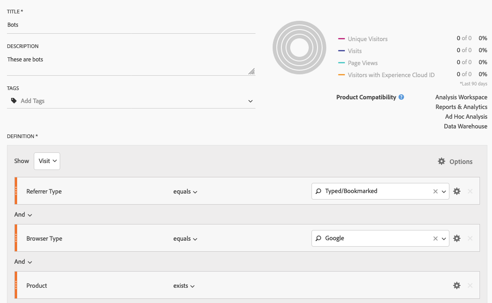
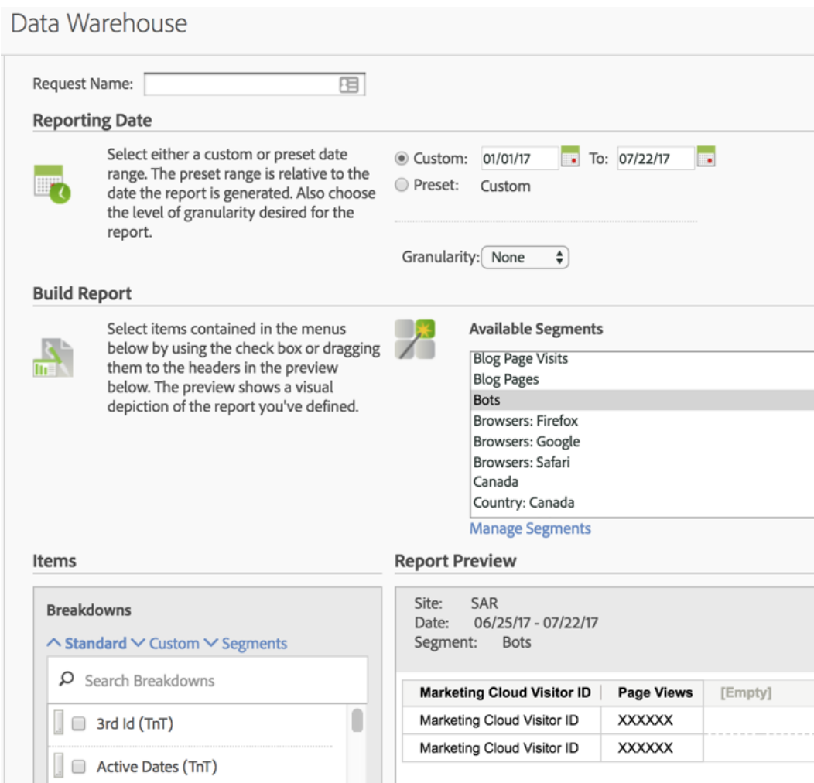
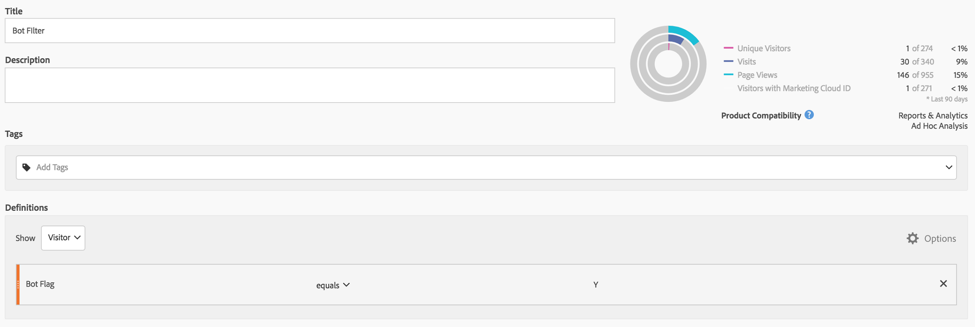
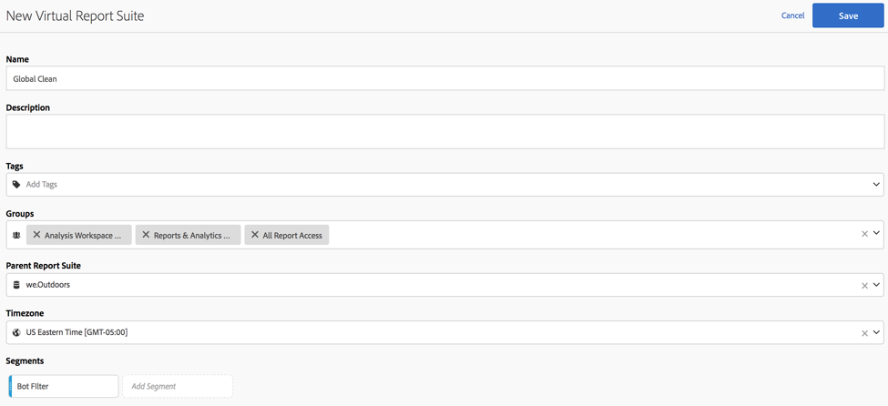

# Rimozione dei bot in Adobe Analytics

In Adobe Analytics, hai diverse opzioni per rimuovere il traffico da bot dai rapporti:

## Usa regole bot

I metodi di filtro bot standard e personalizzati sono supportati in **[!UICONTROL Analytics]** > **[!UICONTROL Admin]** > **[!UICONTROL Report Suites]** > **[!UICONTROL Edit Settings]** > **[!UICONTROL General]** > **[!UICONTROL Bot Rules]**:

| Tipo di regola | Descrizione |
|--- |--- |
| Regole bot standard IAB | Selezionando **[!UICONTROL Enable IAB Bot Filtering Rules]** si utilizza l’ [elenco internazionale dei ragni e dei bot di IAB](https://www.iab.com/) (International Advertising Bureau) per rimuovere il traffico da bot. La maggior parte dei clienti seleziona questa opzione al minimo. |
| Regole bot personalizzate | Puoi definire e aggiungere regole bot personalizzate in base agli agenti utente, agli indirizzi IP o agli intervalli IP. |

Per ulteriori dettagli, consulta [Panoramica delle regole del bot](/help/admin/admin/bot-removal/bot-rules.md).

## Usa il plug-in [!UICONTROL websiteBot] per identificare i bot

Il plug-in webBot consente di identificare dinamicamente se i visitatori del desktop sono bot. Puoi utilizzare questi dati per ottenere una maggiore precisione in tutti i tipi di reporting, che ti offre un modo migliore per misurare il traffico del sito legittimo.

Questo plug-in esegue due verifiche:

* In primo luogo, determina se il dispositivo è un dispositivo desktop o mobile utilizzando la variabile navigator.UserAgent . I dispositivi mobili vengono ignorati.
* Se si tratta di un dispositivo desktop, aggiunge un listener di eventi per il movimento del mouse.

Per ulteriori informazioni, consulta la [Guida all’implementazione di Adobe Analytics](https://experienceleague.adobe.com/docs/analytics/implementation/vars/plugins/websitebot.html).

## Utilizzare una combinazione di strumenti di Adobe

Inoltre, dal momento che i bot si stanno evolvendo rapidamente, l&#39;Adobe offre diverse altre potenti caratteristiche che, quando combinati correttamente e su base regolare, possono aiutare a guidare la rimozione di questi nemici di qualità dei dati. Tali funzioni sono: Servizio ID di Experience Cloud, segmentazione, Data Warehouse, attributi cliente e suite di rapporti virtuali. Ecco una panoramica su come sfruttare questi strumenti.

### Passaggio 1: Passa l&#39;ID Experience Cloud dei visitatori in un nuovo ID dichiarato

Per iniziare, devi creare un nuovo ID dichiarato nel [Servizio core Persone](https://docs.adobe.com/content/help/it-IT/core-services/interface/audiences/audience-library.html). Devi trasmettere l’ID Experience Cloud del visitatore a questo nuovo ID dichiarato, che può essere fatto in modo rapido e semplice con [Adobe Experience Platform Launch](https://docs.adobe.com/content/help/en/launch/using/implement/solutions/idservice-save.html). Usiamo il nome &quot;ECID&quot; per l’ID dichiarato.


Questo è il modo in cui questo ID può essere acquisito tramite Data Element. Accertati di aver popolato correttamente l’ID organizzazione Experience Cloud nell’elemento dati.

```return Visitor.getInstance("REPLACE_WITH_YOUR_ECORG_ID@AdobeOrg").getExperienceCloudVisitorID();```

Una volta configurato questo elemento dati, segui [queste istruzioni](https://docs.adobe.com/content/help/en/launch/using/implement/solutions/idservice-save.html) per passare gli ID dichiarati nello strumento ECID in Launch.

### Passaggio 2: Utilizzare la segmentazione per identificare i bot

Ora che l’ECID del visitatore è passato in un ID dichiarato, puoi utilizzare la [segmentazione in Analysis Workspace](https://docs.adobe.com/content/help/en/analytics/analyze/analysis-workspace/components/t-freeform-project-segment.html) per identificare i visitatori che si comportano come bot. I robot sono spesso definiti dal loro comportamento: visite a accesso singolo, agenti utente insoliti, informazioni sconosciute su dispositivi/browser, senza referrer, nuovi visitatori, pagine di destinazione insolite, ecc. Utilizza i poteri di drill-down e segmentazione di Workspace per identificare i bot che hanno evitato il filtro IAB e le regole bot della suite di rapporti. Ad esempio, ecco una schermata di un segmento che puoi utilizzare:



### Passaggio 3: Esporta tutto [!DNL Experience Cloud IDs] dal segmento tramite Data Warehouse

Dopo aver identificato i bot utilizzando i segmenti, il passaggio successivo consiste nell’utilizzare la Data Warehouse per estrarre tutti gli ID Experienci Cloud associati a questo segmento. Imposta la richiesta [Data Warehouse](https://docs.adobe.com/content/help/it-IT/analytics/export/data-warehouse/data-warehouse.html) in questo modo:



Ricorda di utilizzare Experience Cloud Visitor ID come dimensione e di applicare il segmento Bots.

### Passaggio 4: Ripristina l&#39;Adobe di questo elenco come attributo del cliente

Una volta ricevuto il rapporto Data Warehouse, avrai a disposizione un elenco di ECID che devono essere filtrati dai dati storici. Copia e incolla questi ECID in un file .CSV vuoto con solo due colonne, ECID e Bot Flag.

* **ECID**: Assicurati che l&#39;intestazione di colonna corrisponda al nome assegnato al nuovo ID dichiarato sopra.
* **Contrassegno** bot: Aggiungi questa come dimensione dello schema dell&#39;attributo del cliente.

Usa questo file .CSV come file di importazione dell&#39;attributo cliente, quindi abbonati alla/e suite di rapporti per l&#39;attributo cliente come descritto in questo [post di blog](https://theblog.adobe.com/link-digital-behavior-customers).


### Passaggio 5: Crea un segmento che sfrutta il nuovo attributo cliente

Una volta elaborato e integrato il set di dati in Analysis Workspace, crea un altro segmento che sfrutta la nuova dimensione dell’attributo del cliente &quot;Flag bot&quot; e un contenitore [!UICONTROL Exclude]:



### Passaggio 6: Utilizza questo segmento come filtro della suite di rapporti virtuale

Infine, devi creare una [Suite di rapporti virtuali](/help/components/vrs/vrs-about.md) che sfrutti questo segmento per filtrare i bot identificati:



Questa nuova suite di rapporti virtuali segmentata darà luogo a un set di dati significativamente più pulito, con i bot identificati completamente rimossi.

### Passaggio 7: Ripeti regolarmente i passaggi 2, 3 e 4

Imposta almeno un promemoria mensile per identificare e filtrare i nuovi bot, forse prima di un’analisi pianificata regolarmente.
