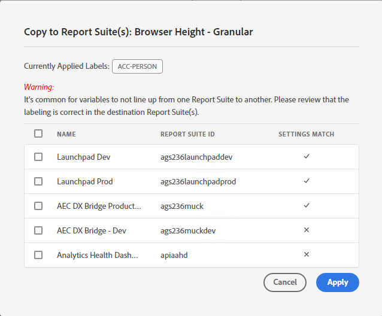

# Visualizzazione/gestione delle etichette sulla privacy per la governance dei dati

La finestra di dialogo **[!UICONTROL Privacy Labeling for Data Governance]** fornisce una panoramica delle etichette per la privacy e degli spazi dei nomi di una suite di rapporti. Da qui è possibile esportare le impostazioni in un file .csv.

## Visualizza etichette privacy {#view-privacy}

1. Accedi ad Adobe Experience Cloud.
2. Passa a **[!UICONTROL Analytics]** > **[!UICONTROL Admin]** > **[!UICONTROL All admin]** > **[!UICONTROL Data configuration & collection]** > **[!UICONTROL Data Governance]**.

   >[!NOTE]
   >
   >Se questa voce di menu non viene visualizzata, devi essere aggiunto a un profilo di prodotto [in Admin Console](https://experienceleague.adobe.com/docs/analytics/admin/admin-console/permissions/product-profile.html?lang=it) con autorizzazioni per questa funzionalità o hai ottenuto l&#39;accesso a una suite di rapporti all&#39;interno dell&#39;Admin Console.

3. In alto a destra, seleziona una suite di rapporti di cui desideri visualizzare o gestire le etichette sulla privacy.

   

| Impostazione | Descrizione |
| --- | --- |
| **[!UICONTROL Component Name]** | In questa colonna sono elencati tutti i componenti (dimensioni, metriche) che fanno parte di questa suite di rapporti. |
| **[!UICONTROL Identity]** | Le etichette &quot;I&quot; dei dati di identità sono utilizzate per categorizzare i dati che possono identificare o contattare una persona specifica. [Ulteriori informazioni](https://experienceleague.adobe.com/docs/analytics/admin/data-governance/data-labels/gdpr-labels.html#data-privacy-identity-labels) |
| **[!UICONTROL Sensitivity]** | Le etichette “S” per i dati sensibili vengono usate per organizzare in categorie i dati sensibili, come i dati geografici. In futuro saranno introdotte etichette aggiuntive per i dati sensibili per identificare altri tipi di informazioni sensibili. [Ulteriori informazioni](https://experienceleague.adobe.com/docs/analytics/admin/data-governance/data-labels/gdpr-labels.html#sensitive-data-labels) |
| **[!UICONTROL GDPR Access]** | Le etichette per la governance dei dati consentono agli utenti di classificare i dati che riflettono considerazioni relative alla privacy e condizioni contrattuali conformi alle normative e alle politiche aziendali. [Ulteriori informazioni](https://experienceleague.adobe.com/docs/analytics/admin/data-governance/data-labels/gdpr-labels.html#data-privacy-access-labels) |
| **[!UICONTROL GDPR Delete]** | L’etichetta Elimina è necessaria solo per i campi che contengono un valore che consentirebbe l’associazione di un hit all’interessato (ovvero che consentirebbe l’identificazione dell’interessato). [Ulteriori informazioni](https://experienceleague.adobe.com/docs/analytics/admin/data-governance/data-labels/gdpr-labels.html#data-privacy-delete-labels) |
| **[!UICONTROL Namespace]** | Quando si applica un’etichetta ID-DEVICE o ID-PERSON a una variabile, viene richiesto di fornire un namespace. Puoi utilizzare uno spazio dei nomi definito in precedenza o definirne uno nuovo. [Ulteriori informazioni](https://experienceleague.adobe.com/docs/analytics/admin/data-governance/data-labels/gdpr-labels.html#provide-namespace) |
| **[!UICONTROL Category]** | Riferisce il tipo di componente, ad esempio Componente standard, Variabile di conversione e così via. |

{style="table-layout:auto"}

## Copiare le etichette di privacy in una suite di rapporti  {#copy-to-rs}

Se desideri applicare le stesse impostazioni di Privacy dei dati a più di una suite di rapporti, effettua le seguenti operazioni:

1. Seleziona la variabile da copiare. Tieni presente che puoi copiare le etichette solo per una variabile alla volta.
1. Fare clic su **[!UICONTROL Copy to Report Suite(s)]** nella parte inferiore della finestra di dialogo Governance dei dati.

   

1. La schermata risultante mostra il nome della variabile, le etichette attualmente applicate su cui stai tentando di copiare, le suite di rapporti e i relativi ID e se le impostazioni nelle suite di rapporti di destinazione corrispondono.

   

   >[!IMPORTANT]
   >
   >Tieni presente che tutte le suite di rapporti selezionate devono essere mappate nell’organizzazione Experience Cloud.

   Quando copi le etichette per una variabile o per un set di variabili in una suite di rapporti diversa, la copia passa alla variabile nella posizione corrispondente nella suite di rapporti di destinazione. Per i componenti standard, le variabili elenco e gli eventi di successo, le etichette verranno copiate nella variabile con **lo stesso nome** nella suite di rapporti di destinazione.

   Tuttavia, per le variabili di conversione (eVar) e i Dimension di traffico (prop) la copia viene inviata alla variabile con **lo stesso numero** nella suite di rapporti di destinazione. Ad esempio, eVar12 verrà copiata in eVar12 in tutte le suite di rapporti di destinazione. I nomi di queste variabili verranno ignorati durante la determinazione della destinazione della copia. Se la variabile corrispondente non è abilitata nella suite di rapporti di destinazione, la copia non potrà essere eseguita per tale variabile.

   Durante la copia delle etichette per le classificazioni definite per una variabile, le etichette verranno copiate in una classificazione nella variabile corrispondente nella suite di rapporti di destinazione (ad esempio da eVar7 a eVar7) che ha un nome identico alla classificazione da copiare. Altrimenti, la copia delle etichette della classificazione non verrà eseguita.

1. Seleziona la casella accanto a una o più suite di rapporti in cui le impostazioni corrispondono.
1. Fai clic su **[!UICONTROL Apply]**.

   Dopo l&#39;applicazione di un&#39;etichetta viene visualizzato un messaggio di stato. Il messaggio di stato includerà i nomi delle variabili o delle classificazioni di destinazione e le relative suite di rapporti per cui la copia non è riuscita.

   >[!IMPORTANT]
   >
   >Controlla sempre le suite di rapporti di destinazione per assicurarti che le etichette siano state copiate correttamente. Questo è molto importante soprattutto per le variabili che hanno le etichette ID o DEL.

## Esporta in un file .csv {#export-csv}

Puoi scaricare un file CSV contenente tutte le definizioni delle etichette correnti per tutte le variabili per le suite di rapporti selezionate. Consigliamo al team legale di esaminare le scelte di etichettatura; questa opzione facilita la revisione. Invece di dover eseguire la revisione quando sei autenticato nell’interfaccia utente della governance dei dati, puoi condividere il file .CSV.

1. Fai clic su **[!UICONTROL Export CSV]** in alto a destra per visualizzare questa finestra di dialogo:

   

1. Seleziona una o più suite di rapporti per le quali desideri esportare tutte le impostazioni di governance dei dati.

## Modifica etichette privacy {#edit}

Consulta [Assegnare o modificare le etichette per la privacy della suite di rapporti](/help/admin/admin/c-data-governance/data-labeling/gdpr-setup-reportsuite.md).
