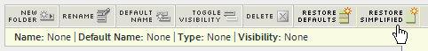

# Personalizzare i menu

Puoi personalizzare i menu dei rapporti visualizzati da un utente in Reports &amp; Analytics. Puoi mostrare o nascondere i rapporti, nonché spostarli in diverse cartelle per tutti gli utenti. Questa funzione è particolarmente utile se l’organizzazione utilizza solo alcuni rapporti e non desidera riempire il menu a sinistra con dati inutilizzati o irrilevanti.

Le modifiche al menu si applicano a tutti gli utenti che accedono alla suite di rapporti. Tuttavia, gli utenti possono ripristinare la configurazione predefinita di un menu mentre utilizzano la suite di rapporti.

>[!NOTE]
>
>Qualsiasi modifica nella struttura del menu non influisce sul Report Builder. La ridenominazione di un rapporto si riflette tuttavia in questo strumento.

Per personalizzare i menu visualizzati dagli utenti in Reports &amp; Analytics:

1. Accedi a **[!UICONTROL Analytics]** > **[!UICONTROL Admin]** > **[!UICONTROL Report Suites]** per aprire Report Suite Manager.
1. Seleziona la suite di rapporti per la quale desideri implementare la struttura di menu semplificata.
1. Vai a **[!UICONTROL Edit settings]** > **[!UICONTROL General]** > **[!UICONTROL Customize Menus]**.

   

1. Seleziona tra le seguenti opzioni di menu:

   | Opzione | Descrizione |
   |--- |--- |
   | Nuova cartella | Aggiunge una nuova cartella sopra l&#39;elemento attualmente selezionato. È necessario aggiungere almeno un report a una cartella prima che questa sia visibile. |
   | Rinomina | Consente di modificare il nome dell&#39;elemento attualmente selezionato. |
   | Nome predefinito | Ripristina il nome predefinito dell&#39;elemento attualmente selezionato. |
   | Attiva/Disattiva visibilità | Nasconde (visualizza) l&#39;elemento attualmente selezionato. Gli elementi nascosti vengono visualizzati con una linea grigia nella pagina Personalizzazione menu. |
   | Eliminazione | Rimuove dal menu l&#39;elemento attualmente selezionato. |
   | Ripristina valori predefiniti | Ripristina lo stato originale del menu. |
   | Ripristino semplificato | 
Implementa il menu dei rapporti semplificati.

Tenete presente che l&#39;applicazione del menu semplificato rimuove tutte le personalizzazioni eventualmente apportate alla struttura di menu di default. Implementa inoltre la struttura di menu semplificata per tutti gli utenti marketing reports and analytics dell’organizzazione. Prima di implementare questo nuovo menu, considera attentamente le ramificazioni (ad esempio la formazione sviluppata sulla struttura del menu esistente), in quanto non puoi ripristinare alcuna personalizzazione nella struttura del menu esistente.
 |
