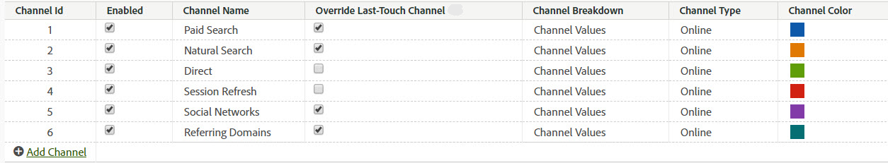

# Gestire i canali di marketing

>[!NOTE]
>
> Per informazioni generali sui canali di marketing, vedi [Introduzione ai canali di marketing](/help/components/c-marketing-channels/c-getting-started-mchannel.md).
>
> Per massimizzare l’efficacia dei canali di marketing per Attribution IQ e Customer Journey Analytics, abbiamo pubblicato alcune [best practice](/help/components/c-marketing-channels/mchannel-best-practices.md).

**[!UICONTROL Analytics]** > **[!UICONTROL Admin]** > **[!UICONTROL Report Suites]** > **[!UICONTROL Edit Settings]** > **[!UICONTROL Marketing Channels]** > **[!UICONTROL Marketing Channel Manager]**.

Aggiungi o abilita i canali di marketing in Marketing Channel Manager. Per le suite di rapporti prive di canali di marketing, una configurazione automatica ti consente di creare diversi canali per te, insieme alle relative regole. Puoi modificare i canali predefiniti in base alle tue esigenze oppure crearne di nuovi (fino a un totale di 25).

Aggiunta di canali al [!UICONTROL Marketing Channels] la pagina viene eseguita indipendentemente dalla creazione di regole [Regole di elaborazione del canale di marketing](/help/admin/admin/c-manage-report-suites/c-edit-report-suites/marketing-channels/c-rules.md) pagina. Puoi associare le regole ai canali al momento della creazione della regola.

Di seguito sono riportate le linee guida per la creazione di canali:

* Pianifica in anticipo creando un elenco di tutti i tuoi canali, in modo che tutti gli hit visitatore siano suddivisi in categorie in base al canale giusto.
* Includi canali per le categorie di [Interno](/help/admin/admin/c-manage-report-suites/c-edit-report-suites/marketing-channels/c-rules.md) hit.
* Includi un canale catch-all &quot;Altre campagne&quot;, da inserire dopo i canali a pagamento e prima dei canali biologici.

## Prerequisiti {#prereqs}

* Imposta l&#39;accesso alle dimensioni del canale di marketing.

   Vedi [Autorizzazioni dei canali di marketing](/help/components/c-marketing-channels/c-channel-report-access.md).

## Aggiungi canali di marketing {#add-mktg-channels}

Aggiungi canali di marketing in Marketing Channel Manager.

>[!NOTE]
>
>Non è possibile eliminare un canale. Se non desideri utilizzare un canale, puoi disattivarlo o rinominarlo e conservarlo per un uso successivo.

1. Fai clic su **[!UICONTROL Analytics]** > **[!UICONTROL Admin]** > **[!UICONTROL Report Suites]**.
1. Sulla [!UICONTROL Report Suite Manager] seleziona una suite di rapporti.

   Se selezioni più suite di rapporti, seleziona un modello che copia le impostazioni dal modello alle suite di rapporti selezionate.

   Vedi [Applicare le impostazioni suite di rapporti a più suite di rapporti](/help/components/c-marketing-channels/c-getting-started-mchannel.md).

1. Fai clic su **[!UICONTROL Edit Settings]** > **[!UICONTROL Marketing Channels]** > **[!UICONTROL Marketing Channel Manager]**.

   Se la suite di rapporti non dispone di canali definiti, la [Configurazione automatica](/help/components/c-marketing-channels/c-getting-started-mchannel.md) viene visualizzata la pagina .

1. Nella pagina [!UICONTROL Marketing Channel Manager] fai clic su **[!UICONTROL Add Channel]**.

   Questa opzione non è disponibile quando sono definiti 25 canali.

1. Fai clic su **[!UICONTROL Save.]**
1. Per configurare le regole per il canale, fai clic su **[!UICONTROL Marketing Channel Processing Rules]**.

   Vedi [Creare regole di elaborazione per il canale di marketing](/help/admin/admin/c-manage-report-suites/c-edit-report-suites/marketing-channels/c-rules.md).

## Applicare le impostazioni del canale {#mktg-channel-mgr}

Sono disponibili varie impostazioni che possono essere applicate a ogni canale [!UICONTROL Marketing Channel Manager] pagina.

| Campo | Definizione |
|--- |--- |
| Abilitata | Abilita o disabilita questo canale di marketing. |
| Nome canale | Nome descrittivo del canale di marketing. |
| Ignora canale ultimo contatto | Consente di scegliere se ignorare un canale di ultimo contatto esistente e persistente con il canale selezionato. Se selezioni questa casella di controllo, qualsiasi canale (inclusi Diretto e Interno) sovrascriverà un canale di ultimo contatto esistente. Il risultato è che la conversione viene attribuita a un canale che potrebbe non meritare credito. Ad esempio, questa opzione può garantire che il canale Direct non riceva credito per la conversione se l’utente era stato precedentemente acquisito tramite il canale di ricerca naturale. |
| Suddivisione dei canali | Consente di suddividere un canale in base a questo valore. Puoi aggiungere possibili suddivisioni dei canali (sottocanali) durante la creazione [classificazioni dei canali di marketing](/help/admin/admin/c-manage-report-suites/c-edit-report-suites/marketing-channels/classifications-mchannel.md). |
| Tipo | Specifica il modo in cui l&#39;utente è arrivato al sito. È possibile selezionare Online o Offline. Utilizza i canali online per i visitatori che passano attraverso un motore di ricerca o una campagna e-mail. I canali offline si applicano ai visitatori che hanno trovato il tuo sito tramite coupon di giornale o annunci pubblicitari di riviste. I canali offline solitamente includono dati importati tramite Origini dati di reporting. Vedi [Origini dati](https://experienceleague.adobe.com/docs/analytics/import/data-sources/datasrc-home.html). Vedi [Aggiungi dati offline](/help/components/c-marketing-channels/c-getting-started-mchannel.md). |
| Colore | Solo Reporting e analisi: Il colore associato a questo canale di marketing. Questo colore rappresenta il canale nel rapporto Canale marketing. |

### Ignora best practice

È consigliabile deselezionare l’opzione di sostituzione dell’ultimo contatto per i canali diretti e interni, in modo che non possano ricevere credito da altri canali di ultimo contatto persistenti (o da altri).

## Definire le regole del canale

Prima che i dati dei canali e dei canali possano essere visualizzati nel rapporto, crea i canali e le regole sottostanti che elaborano i dati. È inoltre possibile specificare per quanto tempo la [periodo di coinvolgimento del visitatore](/help/admin/admin/c-manage-report-suites/c-edit-report-suites/marketing-channels/visitor-engagement.md) a durare.

Adobe fornisce diversi canali predefiniti durante un [configurazione automatica](/help/components/c-marketing-channels/c-getting-started-mchannel.md) che puoi modificare in base alle tue esigenze. Inoltre, puoi modificare questa configurazione e definire regole personalizzate all&#39;interno di [Regole di elaborazione per il canale di marketing](/help/admin/admin/c-manage-report-suites/c-edit-report-suites/marketing-channels/c-rules.md).

>[!NOTE]
>
>Adobe consiglia di impostare il rapporto in una suite di rapporti che può essere utilizzata come modello a scopo di test. Puoi utilizzare il modello per applicare i set di canali e regole a livello globale a una o più suite di rapporti di produzione.
>
>Vedi [Applicare le impostazioni della suite di rapporti di modelli a più suite di rapporti](/help/components/c-marketing-channels/c-getting-started-mchannel.md).
