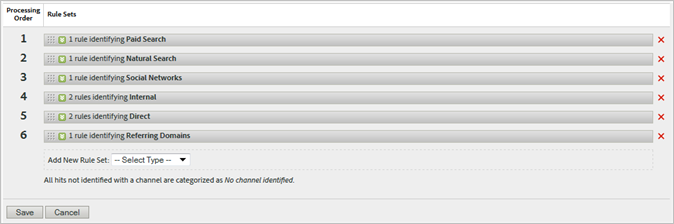

# Regole di elaborazione per i canali di marketing

Le regole di elaborazione del canale di marketing determinano se un hit del visitatore soddisfa i criteri assegnati a un canale elaborando ogni hit registrato da un visitatore sul sito. Le regole vengono elaborate nell&#39;ordine specificato e, quando una regola viene soddisfatta, il sistema non elabora più le regole rimanenti.

**[!UICONTROL Analytics]** > **[!UICONTROL Admin]** > **[!UICONTROL Report Suites]** > **[!UICONTROL Edit Settings]** > **[!UICONTROL Marketing Channels]** > **[!UICONTROL Marketing Channel Processing Rules]**.

Note aggiuntive sull&#39;elaborazione:

* I dati raccolti con queste regole sono permanenti. Le regole modificate dopo la raccolta dei dati non sono retroattive. L’Adobe consiglia vivamente di esaminare e considerare tutte le circostanze prima di salvare [!UICONTROL Marketing Channel Processing Rules] per limitare i dati raccolti in canali non corretti.
* Puoi configurare fino a 25 canali di marketing separati.
* Le regole possono accedere alle variabili impostate da VISTA, ma non ai dati eliminati da VISTA.
* Due canali di marketing non ricevono mai crediti per lo stesso evento (ad esempio acquisti o clic). In questo modo, i canali di marketing differiscono dalle eVar (dove due eVar potrebbero ricevere credito per lo stesso evento).
* Se le tue regole sono coperte da uno spazio vuoto, potresti notare che [Nessun canale identificato.](/help/components/c-marketing-channels/c-faq.md)

## Prerequisiti

* Rivedi le informazioni concettuali in [Introduzione ai canali di marketing](/help/components/c-marketing-channels/c-getting-started-mchannel.md).
* Crea uno o più canali in modo da poter assegnare loro regole. Consulta [Aggiungere canali di marketing](/help/admin/admin/c-manage-report-suites/c-edit-report-suites/marketing-channels/c-channels.md).
* Rivedi le best practice per l’utilizzo di [!UICONTROL Marketing Channels] con [!UICONTROL Attribution].

## Creare regole di elaborazione per il canale di marketing

Crea regole di elaborazione per il canale di marketing, che determinano se un hit del visitatore soddisfa i criteri assegnati a un canale.

1. Fai clic su **[!UICONTROL Analytics]** > **[!UICONTROL Admin]** > **[!UICONTROL Report Suites]**.
2. Seleziona una suite di rapporti.

   Se nella suite di rapporti non sono definiti canali, il [!UICONTROL Marketing Channels: Auto Setup] viene visualizzata la pagina.

   Consulta [Eseguire l&#39;installazione automatica](/help/components/c-marketing-channels/c-getting-started-mchannel.md).

3. Clic **[!UICONTROL Edit Settings]** > **[!UICONTROL Marketing Channels]** > **[!UICONTROL Marketing Channel Processing Rules]**. Se esegui la configurazione automatica, viene automaticamente definito un set di canali e regole.

   

4. Se desideri aggiungere una regola, seleziona dall’ **[!UICONTROL Add New Rule Set]** menu. Se selezioni un canale, riceverai un modello di regola e, se selezioni Personalizzato, inizierai da una lavagna vuota. Entrambe le opzioni consentono di modificare il set di regole in base alle esigenze.

   

5. Per continuare a creare le regole, fai clic su **[!UICONTROL Add New Rule SetRule]**.
6. Per assegnare la priorità alle regole, trascinale nella posizione desiderata.
7. Fai clic su **[!UICONTROL Save.]**

### Imposta il valore del canale di marketing

**[!UICONTROL Set the channel's value]** definisce la dimensione di dettaglio del canale di marketing disponibile per tale canale.

### Criteri delle regole

Questa tabella di riferimento definisce i campi, le opzioni e gli attributi hit che è possibile utilizzare per definire le regole di elaborazione del canale di marketing.

>[!NOTE]
>
>Tutti i campi di testo definiti, ad esempio i parametri della stringa di query o gli elenchi di valori con cui confrontare, vengono valutati come **senza distinzione tra maiuscole e minuscole** valori. Ad esempio, se disponi di una regola in cui il parametro della stringa query `cmp = abc123`, tutte le varianti maiuscole e minuscole di entrambi `cmp` e `abc123` corrisponde a.

| Termine | Definizione |
|--- |--- |
| Tutto | Attiva questo canale solo quando tutti i criteri nella regola sono true. |
| Qualsiasi | Attiva questo canale quando uno qualsiasi dei criteri della regola è true. Questa opzione è disponibile solo se nella regola sono presenti più criteri. |
| ID AMO | Il codice di tracciamento principale utilizzato dalle integrazioni Advertising Cloud e Advertising Analytics. Quando una di queste integrazioni è abilitata, è possibile utilizzare il prefisso del codice di tracciamento per identificare i canali specifici di Advertising Cloud. L’utilizzo di &quot;AMO ID&quot; inizia con &quot;AL&quot; per la ricerca, &quot;AC&quot; per la visualizzazione o &quot;AO&quot; per Social. Quando l’AMO ID viene utilizzato nei canali di marketing, le metriche di clic/costo/impression possono essere attribuite al canale corretto (se non configurate, vengono indirizzate a Diretto o Nessuno). |
| AMO ED ID | Il codice di tracciamento secondario utilizzato da Advertising Cloud. Lo scopo principale di questo codice di tracciamento è quello di fungere da chiave per inviare nuovamente i dati ad Ad Cloud. Tuttavia, può essere utilizzato anche per identificare i ClickThrough di visualizzazione rispetto ai ViewThroughs di visualizzazione, se si desidera visualizzare questi canali come due canali di marketing separati. Questo può essere fatto impostando la logica del canale di marketing per &quot;AMO EF ID&quot; che termina con `:d` per visualizzare ClickThrough o &quot;AMO EF ID&quot; termina con `:i` per visualizzare ViewThrough. Se non desideri dividere la visualizzazione in due canali, utilizza la dimensione AMO ID. |
| Variabili di conversione | È costituito da eVar abilitate per questa suite di rapporti e si applica solo quando queste variabili sono impostate tramite il codice di Adobe sulla pagina. |
| Esiste | Sono disponibili diverse opzioni, tra cui:<ul><li>**Non esiste**: specifica che l’attributo hit non esiste nella richiesta. Ad esempio, in un dominio di riferimento, se l’utente digita un URL o fa clic su un segnalibro, l’attributo del dominio di riferimento non esiste.</li><li>**È vuoto**: specifica l’esistenza di un attributo hit, in genere un parametro di eVar o una stringa di query, ma non è presente alcun valore associato all’attributo hit.</li><li>**Does Not Contain**: consente di specificare, ad esempio, che un dominio di riferimento non contiene un valore specifico (anziché utilizzare la selezione &quot;Contiene&quot;).</li></ul> |
| Identifica il canale come | Associa la regola a un canale di marketing aggiunto alla pagina Marketing Channel Manager. |
| Corrisponde alle regole di rilevamento ricerca a pagamento | Ricerca a pagamento rilevata dall’Adobe. Le ricerche a pagamento si verificano quando le aziende pagano una tariffa per il motore di ricerca per elencare il proprio sito. Le ricerche a pagamento vengono in genere visualizzate nella parte superiore o destra dei risultati di ricerca. |
| Corrisponde alle regole di rilevamento della ricerca naturale | Ricerca non a pagamento rilevata dal reporting Adobe. |
| Il referrer corrisponde ai filtri URL interni | Una visita in cui l’URL della pagina corrisponde a un filtro URL interno, come definito per la suite di rapporti in Strumenti di amministrazione. |
| Il referrer non corrisponde ai filtri URL interni | L’URL di riferimento non corrisponde a un filtro URL interno, come definito per la suite di rapporti in Strumenti di amministrazione. Puoi utilizzare questa impostazione con URL pagina ed Esiste per impostare una regola onnicomprensiva, in modo che non arrivino visite nella sezione Nessun canale identificato del rapporto. |
| Ignora gli hit che corrispondono ai filtri URL interni | (Per i referenti) Tiene traccia solo degli hit provenienti da siti con riferimenti esterni. In genere, lascia attiva questa impostazione a meno che non desideri includere il traffico interno. |
| È la prima pagina della visita | La prima pagina di una visita rilevata dai rapporti di Adobe. |
| Pagina | La dimensione [Pagina](/help/components/dimensions/page.md). |
| Dominio pagina | Il dominio della pagina in cui il visitatore arriva, ad esempio `products.example.com`. |
| Dominio e percorso della pagina | Il dominio e il percorso, ad esempio `products.example.com/mens/pants/overview.html` . |
| Dominio principale pagina (TLD+1) | Il dominio principale della pagina in cui il visitatore arriva, ad esempio example.co.uk . |
| URL della pagina | L’URL di una pagina web sul sito. |
| Dominio di riferimento | Il [Dominio di riferimento](/help/components/dimensions/referring-domain.md) dimensione |
| Parametro stringa di query | Utilizza un singolo parametro di stringa di query. È possibile specificare un solo parametro di stringa di query per criterio. Per aggiungere parametri di stringa di query aggiuntivi, utilizza `ANY` come operatore, quindi aggiungi i parametri della stringa di query alla regola. |
| Destinatario che inoltra | La posizione della pagina web (URL completo) in cui si trovavano i visitatori prima di arrivare al sito. Un referente esiste al di fuori del dominio definito. |
| Dominio e percorso di riferimento | Una concatenazione del dominio di riferimento e del percorso URL. Alcuni esempi:    `www.example.com/products/id/12345` o `ad.example.com/foo` |
| Parametro di riferimento | Un parametro stringa query sull’URL del referente. Ad esempio, se i visitatori provengono da `example.com/?page=12345&cat=1`, page e cat sono i parametri di riferimento. |
| Dominio principale di riferimento | Il dominio principale del referente. Un referente esiste al di fuori del dominio definito. |
| Motore di ricerca | Un motore di ricerca come Google o Yahoo! che ha portato i visitatori al tuo sito. |
| Parole chiave di ricerca | Parola utilizzata per eseguire una ricerca utilizzando un motore di ricerca. |
| Motore di ricerca + Parole chiave | Concatenazione della parola chiave di ricerca e del motore di ricerca per identificare in modo univoco il motore di ricerca. Ad esempio, se si cerca la parola computer, il motore di ricerca e la parola chiave vengono identificati come segue: `Search Tracking Code = "<search_type>:<search engine>:<search keyword>" where    search_type = "n" or "p", search_engine = "Google", and search_keyword = "computer"`**Nota:** n = naturale; p = pagato |
| Imposta il valore del canale su | Imposta il [Dettagli canale di marketing](/help/components/dimensions/marketing-detail.md) dimensione. Puoi determinare quale valore sarebbe meglio nel contesto della regola. Alcuni esempi includono l’ID dell’annuncio del banner, la parola chiave di ricerca o la campagna e-mail. |

## Ordine e definizioni delle regole del canale di marketing {#channel-rules}

Le regole del canale vengono elaborate nell’ordine specificato. L’Adobe consiglia di inserire prima i canali gestiti o a pagamento (ad esempio, ricerca a pagamento, ricerca naturale, visualizzazione o e-mail) in modo che ricevano credito sui canali organici (come diretti, interni, domini di riferimento).

Di seguito è riportato l’ordine consigliato per le regole del canale e le definizioni di esempio:

### Ricerca a pagamento {#paid-search}

La ricerca a pagamento è una parola o una frase che viene pagata da un motore di ricerca per essere inserita nei risultati di ricerca. Questo canale è in genere definito in base al parametro della stringa di query (vedi Esempio di canale di visualizzazione) o alle regole di rilevamento di ricerche a pagamento.

#### Rilevamento di ricerca a pagamento

Per rispettare le regole di rilevamento di ricerche a pagamento, il canale di marketing utilizza le impostazioni configurate sul [!UICONTROL Paid Search Detection] pagina. ( **[!UICONTROL Admin]** > **[!UICONTROL Report Suites]** > **[!UICONTROL Edit Settings]** > **[!UICONTROL General]** > **[!UICONTROL Paid Search Detection]**). L’URL di destinazione corrisponde alla regola di rilevamento ricerca a pagamento esistente per quel motore di ricerca.

Per la regola del canale di marketing, [!UICONTROL Paid Search] Le impostazioni sono le seguenti:

Consulta [Rilevamento ricerca a pagamento](../general/paid-search-detection/paid-search-detection.md) per ulteriori informazioni.

### Ricerca naturale {#natural-search}

La ricerca naturale si verifica quando i visitatori trovano il tuo sito web tramite un motore di ricerca e il motore di ricerca classifica il sito senza che tu paghi per l’inserzione.

Questo Adobe determina il traffico di ricerca in base a una ricerca interna dei motori di ricerca. Se un referrer corrisponde ai criteri di un motore di ricerca, determina se è pagato o naturale utilizzando [Rilevamento ricerca a pagamento](../general/paid-search-detection/paid-search-detection.md) regole configurate dall&#39;utente. Un hit è considerato ricerca naturale quando non corrisponde ad alcuna regola di rilevamento di ricerche a pagamento.

Per la regola del canale di marketing, le impostazioni di Ricerca naturale sono le seguenti:

### Visualizzazione {#display}

Questa regola identifica i visitatori provenienti da banner pubblicitari. È identificato da un parametro della stringa di query nell’URL di destinazione, in questo caso *`Ad_01`*. Il parametro della stringa di query e i valori cercati vengono valutati come valori senza distinzione tra maiuscole e minuscole.

### E-mail {#email}

Questa regola identifica i visitatori provenienti da campagne e-mail. È identificato da un parametro della stringa di query nell’URL di destinazione, in questo caso *`eml`*:

### Affiliate {#afilliates}

Questa regola identifica i visitatori provenienti da un set specificato di domini di riferimento. Nella regola, elenca i domini delle affiliate di cui desideri tenere traccia, come segue:

### Altre campagne {#other-campaigns}

Una best practice consiste nell’includere un canale &quot;Altre campagne&quot; seguendo tutte le regole del canale a pagamento. Questo canale funge da onnicomprensivo per il traffico a pagamento non categorizzato.

### Social Network {#social-networks}

Questa regola identifica i visitatori provenienti da un social network, ad esempio Facebook. Il canale è spesso rinominato Organic Social. Le impostazioni possono essere le seguenti:

### Canale interno (aggiornamento sessione) {#internal}

Questa regola si applica ai visitatori il cui URL di riferimento corrisponde a quello impostato nell’Admin Console Filtri per URL interni, il che significa che il visitatore proviene dal sito per iniziare la visita. Questo canale viene spesso rinominato in Aggiornamento sessione.

Consulta [Motivi dell’interno (aggiornamento sessione)](https://experienceleague.adobe.com/docs/analytics/components/marketing-channels/c-faq.html#internal) per ulteriori informazioni sul motivo per cui si verifica questo canale.

### Diretto {#direct}

Questa regola identifica i visitatori che non hanno un dominio di riferimento, che include i visitatori che arrivano direttamente sul tuo sito, ad esempio da un collegamento Preferiti o incollando un collegamento nel browser. Questo canale viene spesso rinominato in Direct Typed/Bookmarked (Digitato diretto/Contrassegnato con segnalibro).

### Canale domini di riferimento {#referring-domains}

Il canale Domini di riferimento identifica i visitatori che hanno un dominio di riferimento. Insieme, i canali dei domini Interno, Diretto e di Riferimento fungono da catch-all per tutti gli hit rimanenti che non sono ancora stati categorizzati in un canale.

