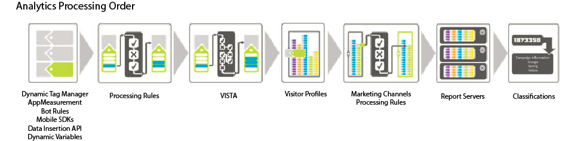

# Ordine di elaborazione

Per utilizzare in modo efficace le regole di elaborazione è essenziale capire quando vengono applicate durante la raccolta dei dati.

Nelle tabelle seguenti sono elencati i dati generalmente disponibili prima e dopo l’applicazione delle regole di elaborazione:

## Prima delle regole di elaborazione

| Dimensione | Descrizione |
|--- |--- |
| Ricerca variabile dinamica | Le variabili vengono compilate dinamicamente estraendo informazioni dalle intestazioni HTTP o da altre variabili. Ad esempio, `s.eVar5="D=c1"` inserirà il valore di prop1 in eVar5. |
| AppMeasurement | Le funzioni e i plug-in utilizzati in AppMeasurement vengono eseguiti nel browser o nell’applicazione client. |
| Gestione tag | Le regole definite in Adobe Launch o Dynamic Tag Management vengono eseguite come definito. |
| Regole bot | [Le ](/help/admin/admin/bot-removal/bot-rules.md) regole dei bot consentono di rimuovere il traffico generato da ragni e bot noti dalla suite di rapporti. |

## Dopo le regole di elaborazione

| Dimensione | Descrizione |
|--- |--- |
| Dati aggiunti da VISTA | Le regole di elaborazione vengono applicate prima di VISTA. |
| Visita numero pagina | Come regola generale, le regole di elaborazione sono consapevoli dei dati contenuti solo nell&#39;hit corrente. Il numero di pagina della visita viene compilato dopo l’applicazione delle regole di elaborazione. |
| L’URL pulito viene aggiunto come nome della pagina se non è impostato | Dopo aver applicato le regole di elaborazione e VISTA, l’URL pulito viene aggiunto come nome della pagina se non è impostato alcun nome di pagina. Poiché questo si verifica dopo l’applicazione delle regole di elaborazione, è consigliabile aggiungere una condizione per verificare se il nome della pagina è vuoto.  Se esegui il rapporto Contenuto sito > Pagine e vedi https:// valori per i nomi di pagina, è probabile che il nome della pagina sia vuoto e che l’URL sia in uso.  È possibile impostare una condizione per verificare la presenza di un nome di pagina vuoto o per verificare se il nome della pagina o l’URL della pagina contiene un valore specifico. Il nome della pagina può quindi essere impostato in base alle esigenze. |
| Regole di elaborazione del canale di marketing | Puoi utilizzare le regole di elaborazione per preparare i dati per l’elaborazione da parte di [Regole di elaborazione del canale di marketing](https://docs.adobe.com/content/help/en/analytics/components/marketing-channels/c-rules.html). |
| Ricerca GEO | Questo include i valori dello stato del visitatore e del codice postale/ZIP del visitatore. |
| Persistenza eVar | Le eVar contenute in un hit precedente non vengono mantenute in ogni hit durante l&#39;elaborazione delle regole. Sono disponibili solo le eVar impostate sull&#39;hit corrente in fase di elaborazione. |

## Modalità di applicazione delle regole di elaborazione durante la copia degli hit tramite VISTA {#section_576EE8C240A24CBA979BD614E8D5338D}

Se disponi di una regola VISTA configurata per copiare gli hit in un’altra suite di rapporti, gli hit vengono inviati tramite qualsiasi regola di elaborazione definita nell’altra suite di rapporti.

Se nella suite di rapporti originale sono definite regole di elaborazione, queste possono essere applicate o meno in base alla configurazione della regola VISTA da parte di Engineering Services. Per informazioni, puoi chiedere al tuo specialista dell’implementazione se la regola VISTA copia i valori &quot;pre&quot; o &quot;post&quot; nella suite di rapporti aggiuntiva. Se il valore &quot;pre&quot; viene copiato, le regole di elaborazione definite nella suite di rapporti originale non vengono applicate. Se il valore &quot;post&quot; viene copiato, le regole di elaborazione vengono applicate prima che l&#39;hit venga copiato.
