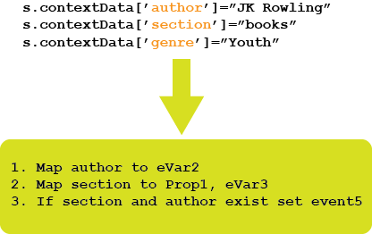

# Panoramica sulle regole di elaborazione

Le regole di elaborazione semplificano la raccolta dei dati e gestiscono il contenuto durante l&#39;invio ai report. Le regole di elaborazione semplificano l&#39;interazione con i gruppi IT e gli sviluppatori Web fornendo un&#39;interfaccia per:

* Impostare un evento nella pagina della panoramica del prodotto
* Compilare una campagna con un parametro stringa di query
* Concatenate la categoria e il nome della pagina in una prop per una generazione di rapporti più semplice
* Copiare un eVar  in una prop per vedere i percorsi
* Pulizia delle sezioni di sito errate
* Estrarre i termini di ricerca interni o un ID campagna dalla stringa di query in un eVar 

>[!VIDEO](https://video.tv.adobe.com/v/26124/?quality=12&learn=on)

## Autorizzazioni delle regole di elaborazione {#section_8A4846688050453784DAE4D89355169A}

Administrators have rights to use processing rules **by default**. Gli amministratori possono concedere questo diritto anche ai non amministratori utilizzando l&#39;interfaccia Strumenti di amministrazione. Per le istruzioni del caso, consulta []

>[!IMPORTANT]
>
>Poiché le regole di elaborazione influiscono in modo permanente sui dati di Analytics,  Adobe consiglia vivamente agli amministratori delle regole di elaborazione di ricevere formazione sulla certificazione in  Adobe Analytics e di avere familiarità con tutte le origini di dati per le suite di rapporti (siti Web standard, siti mobili, app mobili, API di inserimento dati e così via). La conoscenza delle variabili di dati contestuali e delle variabili standard popolate in varie piattaforme contribuirà a prevenire l’eliminazione o l’alterazione accidentale dei dati.

## Utilizzare i dati contestuali per semplificare la raccolta dei dati {#section_09EEA03612D24C15839631AA9E9668D8}

Le variabili di dati di contesto sono un tipo di variabile disponibile solo per le regole di elaborazione. Per utilizzare le variabili di dati di contesto, le coppie di dati chiave/valore vengono inviate dall&#39;implementazione e le regole di elaborazione vengono utilizzate per acquisire questi valori in variabili Analytics standard. Questo consente ai programmatori di capire esattamente quale prop e/o  eVar deve contenere tale valore.

Consulta Variabili [di dati di](https://docs.adobe.com/content/help/en/analytics/implementation/vars/page-vars/contextdata.html) contesto nella guida all&#39;implementazione.

## Utilizzare le regole di elaborazione per trasformare gli eventi Hit e Triggers {#section_8284E72E999244E091CD7FB1A22342B6}

Le regole di elaborazione possono monitorare i valori in arrivo per trasformare gli errori di battitura comuni e impostare gli eventi in base ai dati segnalati. Le proprietà possono essere copiate nelle eVar. I valori possono essere concatenati per i rapporti e gli eventi possono essere impostati.

## Utilizzo delle variabili di dati contestuali nei rapporti {#section_BD098BC503024A0B8703596628071134}

Una volta definite le variabili di dati di contesto all&#39;interno dell&#39;implementazione, queste devono essere copiate in variabili quali eVar da utilizzare nei report.

Per maggiori informazioni, vai [qui](/help/admin/admin/c-processing-rules/processing-rules-examples/processing-rules-copy-context-data.md) e [qui](/help/admin/admin/c-processing-rules/processing-rules-examples/processing-rules-copy-context-data-event.md).
