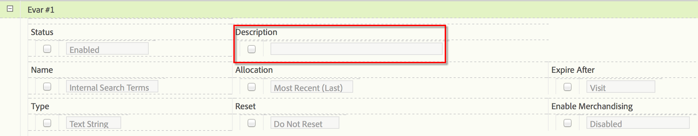

# Descrizioni report personalizzati

Puoi fornire descrizioni personalizzate dei rapporti per eVar, prop, classificazioni ed eventi. Le descrizioni sono visibili a tutti gli utenti finali.

**[!UICONTROL Analytics]** >  **[!UICONTROL Admin]** >  **[!UICONTROL Report Suites]** >  **[!UICONTROL Edit Settings]** >  **[!UICONTROL *variabile *]**

>[!NOTE]
>
>L’aggiunta di descrizioni è disponibile per la maggior parte delle classificazioni tradizionali, ma al momento non per le classificazioni per dispositivi mobili.

1. Fornisci una descrizione del rapporto. Il numero massimo di caratteri è 255.
1. Fai clic su **[!UICONTROL Save]**.

La descrizione è visibile in due posizioni:

* Nella barra del titolo del rapporto:

   

* Come suggerimento quando passi il cursore del mouse sul rapporto nella barra di navigazione a sinistra:

   
