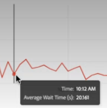

# Reporting Activity Manager

>[!NOTE]
>
>Questa funzionalità è attualmente in fase di beta testing.

Reporting Activity Manager consente di visualizzare la capacità di reporting per ogni suite di rapporti dell&#39;organizzazione. In qualità di Amministratore, offre una visibilità dettagliata sul consumo dei rapporti e ti aiuta a diagnosticare e risolvere facilmente i problemi di capacità durante i periodi di picco dei rapporti.

Quando la tua organizzazione raggiunge la capacità di richiesta di reporting e si verifica un peggioramento delle prestazioni di reporting, ora puoi diagnosticare autonomamente i problemi di reporting senza l’intervento dell’assistenza clienti o dell’ingegneria Adobe. Puoi gestire facilmente le code di reporting all’interno di un’unica interfaccia e agire immediatamente &#x200B; &#x200B; per migliorare l’esperienza degli utenti. Questo strumento:

* Ti informa in tempo reale della tua capacità di reporting corrente nelle suite di rapporti.
* Fornisce informazioni dettagliate sulle query dei report sulle richieste di reporting correnti, sia in coda che in corso.
* Consente di ottimizzare la coda dei rapporti dando priorità ad alcune richieste di reporting e annullandone altre per liberare la capacità. In altre parole, potete chiedere in tempo reale: la relazione è necessaria in questo momento o posso cancellarla a favore di relazioni più urgenti?

## Accedere a Reporting Activity Manager

In Adobe Analytics, gli amministratori accedono a **[!UICONTROL Admin]** > **[!UICONTROL Reporting Activity Manager]**.

## Autorizzazioni

Per gestire le attività di reporting è necessario disporre delle autorizzazioni di amministratore di sistema di Analytics. L&#39;accesso dell&#39;amministratore del prodotto non è sufficiente.

## Visualizza la coda dei report

Quando si apre la pagina di panoramica di Reporting Activity Manager, viene visualizzato un elenco delle suite di rapporti di base abilitate.

| Elemento nell’interfaccia utente | Descrizione |
| --- | --- |
| **[!UICONTROL Report Suite]** | La suite di rapporti di base di cui stai monitorando l’attività di reporting. |
| **[!UICONTROL Virtual Report Suite]** | Mostra tutte le suite di rapporti virtuali che si inseriscono in questa suite di rapporti di base. Le suite di rapporti virtuali aggiungono complessità alle richieste di reporting a causa di ulteriori livelli di filtro e segmentazione applicati. Tutte le richieste provenienti dalle suite di rapporti virtuali vengono combinate e vengono ridotte alla suite di rapporti di base.
Ad esempio, se hai 10 richieste provenienti da 5 VRS, sono 50 le richieste nella suite di rapporti a livello di base. In questo modo, si può raggiungere molto rapidamente la capacità. |
| **[!UICONTROL Usage Capacity]** | In percentuale, quanta capacità di reporting della suite di rapporti viene utilizzata in tempo reale. |
| **[!UICONTROL Status]** | Quattro possibili indicatori di stato: <ul><li>**Rosso -[!UICONTROL At Capacity]**: La suite di rapporti è composta in termini di capacità di reporting. (95% - 100%) </li><li>**Giallo -[!UICONTROL Nearing capacity]**: Questa suite di rapporti rischia di raggiungere la sua massima capacità. (90% - 94%)</li><li>**Verde -[!UICONTROL All good]**: La capacità di segnalazione è abbondante. (0% - 90%)</li><li>**Grigio -[!UICONTROL Status pending]**: ?</li></ul> |

{style=&quot;table-layout:auto&quot;}

### Altre azioni dell’attività di reporting

* Fai clic su **[!UICONTROL Refresh]** in alto a destra per aggiornare i risultati.
* Fai clic sulla stella a sinistra del nome della suite di rapporti per preferire questa suite di rapporti.
* Controlla **[!UICONTROL Favorites]** in alto a sinistra per mostrare i tuoi preferiti.
* Cerca le suite di rapporti per nome o per ID nella barra di ricerca.
* Filtrare le suite di rapporti in base al loro stato.

## Visualizzare l’attività di reporting per le singole suite di rapporti

Fai clic sul collegamento del titolo di una suite di rapporti per la quale vuoi visualizzare i dettagli.

### Grafico a linee

Il grafico a linee mostra l’attività di reporting per la suite di rapporti selezionata nelle ultime 2 ore.

* L’asse x mostra i dati della capacità di reporting nelle ultime 2 ore.
* L’asse y mostra il tempo medio di attesa di una query, in secondi.
* Puoi passare il cursore del mouse sul grafico a linee per visualizzare i punti nel tempo e nel tempo medio di attesa per quell’istante.

   

### Filtro

È possibile filtrare la tabella per applicazione (vedere l’elenco nella tabella seguente), per utente e per progetto.

### Numeri di riepilogo

I numeri di riepilogo mostrano le seguenti informazioni:

| Numero di riepilogo | Descrizione |
| --- | --- |
| Utenti | Quanti utenti stanno attualmente inviando richieste di reporting a questa suite di rapporti. |
| Progetti | Progetti Workspace, cartelle di lavoro di Report Builder, ecc. |
| Query | Numero di query attualmente in esecuzione. |
| Tempo medio di attesa | Tempo medio di attesa per tutte le query in esecuzione. |
| Capacità di utilizzo | La capacità di utilizzo corrente per questa suite di rapporti. |

{style=&quot;table-layout:auto&quot;}

### Tabella

La tabella dettagliata seguente mostra i dettagli sulla suite di rapporti.

| Colonna | Descrizione |
| --- | --- |
| ID query | Può essere utilizzato per la risoluzione dei problemi. |
| Tempo di esecuzione | Per quanto tempo la query è in esecuzione. |
| Tempo di attesa | Tempo di attesa della query prima dell’elaborazione. Generalmente a &quot;0&quot; quando c&#39;è abbastanza capacità. |
| Ora di inizio | Quando la query ha iniziato l’elaborazione (ora locale dell’amministratore). |
| Applicazione | Le applicazioni supportate da Reporting Activity Manager sono: <ul><li>Interfaccia utente di Analysis Workspace</li><li>Progetti pianificati in Workspace</li><li>Report Builder</li><li>Interfaccia utente di Builder: Segmento, metriche calcolate, annotazioni, pubblico, ecc.</li><li>Chiamate API da API 1.4 o 2.0 (5 richieste simultanee)</li><li>Avvisi intelligenti</li></ul> |
| Utente | Utente che ha avviato la query. |
| Progetto | Progetti Workspace, cartelle di lavoro di Report Builder, ecc. |
| Limiti del mese | Quanti confini mensili attraversa una richiesta. Questo aggiunge la complessità della richiesta. |
| Colonne | Il numero di metriche e suddivisioni in Workspace per misurare la complessità della richiesta. |
| Segmenti  | Quanti segmenti vengono applicati a questa richiesta. Questo aggiunge la complessità della richiesta. |
| Stato | Quattro possibili indicatori di stato: <ul><li>**Rosso -[!UICONTROL At Capacity]**: La suite di rapporti è composta in termini di capacità di reporting. (95% e superiore)</li><li>**Giallo -[!UICONTROL Nearing capacity]**: Questa suite di rapporti rischia di raggiungere la sua capacità massima (90% - 95%).</li><li>**Verde -[!UICONTROL All good]**: La capacità di segnalazione è abbondante.</li><li>**[!UICONTROL Status pending]**: Stato non disponibile.</li></ul> |

{style=&quot;table-layout:auto&quot;}

## Annullare le richieste di reporting

Per annullare una richiesta

1. Seleziona la casella a sinistra di uno o più **[!UICONTROL Query ID]** nella tabella e fai clic su **[!UICONTROL Cancel requests]** in basso.
1. In **[!UICONTROL Cancel x query]** Se necessario, puoi modificare il messaggio di cancellazione.
1. Fai clic su **[!UICONTROL Continue]**.

   

Gli utenti di applicazioni in Workspace, ad esempio, vedranno il seguente avviso comparire nei loro progetti:

## Domande frequenti

| Domanda | Risposta |
| --- | --- |
| Posso acquistare una capacità di reporting aggiuntiva? | Questa funzionalità sarà disponibile a breve. |
| Altre domande? |  |

{style=&quot;table-layout:auto&quot;}
