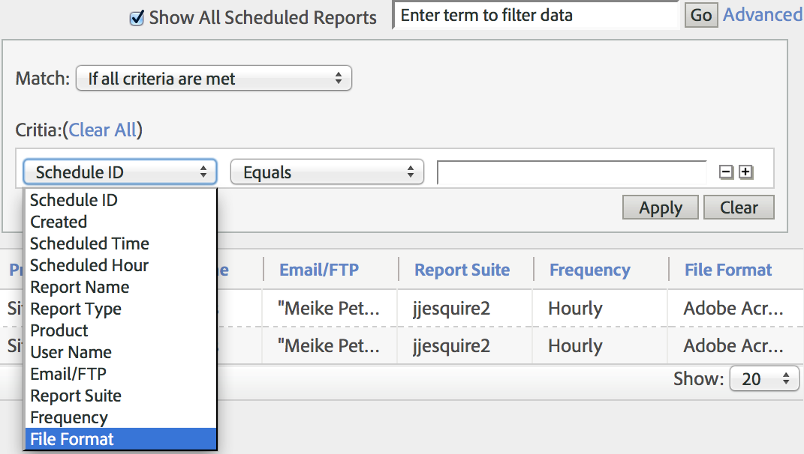
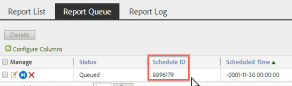

# Coda dei report pianificati

Consente agli utenti a livello di amministratore di visualizzare e gestire i rapporti pianificati in tutta l’organizzazione.

**[!UICONTROL Analytics]** > **[!UICONTROL Components]** > **[!UICONTROL All components]** > **[!UICONTROL Scheduled Reports]**

Le funzionalità a livello di amministratore in Scheduled Reports Manager includono:

* L&#39;opzione per [Mostra tutti i report pianificati](/help/admin/admin/scheduled-reports-admin.md#section_3F167CAAEEC24140B476CF95B7402690) nella tua organizzazione.
* [Funzionalità di filtro avanzate ](/help/admin/admin/scheduled-reports-admin.md#section_206A52A85DE84947AAB3AD082FBF6275) per tutta l’organizzazione.
* Nuova scheda [Coda report](/help/admin/admin/scheduled-reports-admin.md#section_03C866115D354BB182E90BF4D52F1E0B) che elenca tutti i report in coda per l&#39;esecuzione sui server di reporting.
* Esposizione di [ID pianificazione](/help/admin/admin/scheduled-reports-admin.md#section_568B70F4228C4229977CB85D2DCD53A1) nell&#39;interfaccia Coda report.

## Mostra tutti i report pianificati {#section_3F167CAAEEC24140B476CF95B7402690}

Nella scheda **[!UICONTROL Report List]** puoi **[!UICONTROL Show All Scheduled Reports]** all’interno della tua organizzazione, oltre a quelli che hai pianificato personalmente.

>[!NOTE]
>
>La colonna **[!UICONTROL Report Name]** visualizza il nome del rapporto in corso di pianificazione e la colonna **[!UICONTROL File Name]** visualizza eventuali nomi di file personalizzati impostati da te in Opzioni di consegna avanzate. Di conseguenza, se si pianificano più rapporti dello stesso tipo e si specificano nomi personalizzati per ciascuno di essi, in Gestione rapporti programmati verranno visualizzate più voci con lo stesso nome del rapporto ma con nomi di file diversi. Questo perché il report di back end programmato è lo stesso, quindi la colonna Nome report avrebbe gli stessi nomi di report per tutti i nomi di file eccetto quelli personalizzati (come impostato).

## Funzionalità di filtro avanzate {#section_206A52A85DE84947AAB3AD082FBF6275}

Ad esempio, se desideri filtrare tutti i rapporti pianificati ogni ora, specifica **[!UICONTROL Frequency equals Hourly]** nel filtro **[!UICONTROL Advanced]** e fai clic su **[!UICONTROL Apply]**:

## Coda report {#section_03C866115D354BB182E90BF4D52F1E0B}

Questa coda ti consente di gestire e potenzialmente eliminare tutti i rapporti pianificati che si stanno &quot;bloccando&quot; la coda. In genere, i rapporti scadono dopo 4 ore.

La coda dei report consente inoltre di &quot;saltare un report pianificato una volta&quot;. Fai clic sull’icona blu nella colonna **[!UICONTROL Manage]** .

## ID pianificazione {#section_568B70F4228C4229977CB85D2DCD53A1}

L’esposizione di **[!UICONTROL Schedule ID]** nell’interfaccia della coda dei rapporti aiuta a contattare l’Assistenza clienti di Adobe per la risoluzione di un problema di rapporti pianificati.

