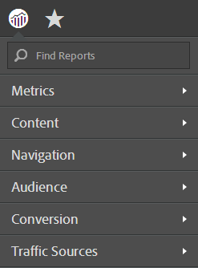

# Menu dei rapporti semplificati

Passaggi per implementare il menu dei rapporti semplificati in Reporting e  Analytics.

Il menu semplificato di Adobe Reports &amp;  Analytics consente di applicare un menu alternativo e semplificato con cartelle ristrutturate al di sotto. Nel menu semplificato sono visualizzate le seguenti opzioni per impostazione predefinita:

>[!NOTE]
>
>Tenete presente che l’applicazione del menu semplificato rimuove tutte le personalizzazioni eventualmente effettuate alla struttura di menu predefinita. Implementa inoltre la struttura del menu semplificata per tutti gli utenti di marketing reports and analytics nell’organizzazione. Prima di implementare questo nuovo menu, è necessario considerare attentamente le ramificazioni (come ad esempio la formazione sviluppata intorno alla struttura esistente), poiché non è possibile ripristinare alcuna personalizzazione nella struttura del menu esistente.

1. Andate a **[!UICONTROL Analytics]** > **[!UICONTROL Admin]** > **[!UICONTROL Report Suites]** per aprire Gestione suite di rapporti.
1. Selezionate la suite di rapporti per la quale desiderate implementare la struttura di menu semplificata.
1. Vai a **[!UICONTROL Edit settings]** > **[!UICONTROL General]** > **[!UICONTROL Customize Menus]**.
1. Fare clic **[!UICONTROL Restore Simplified]** per implementare la struttura del menu semplificata.

   

1. Per tornare al menu predefinito (non personalizzato), fate clic **[!UICONTROL Restore Defaults]**.
