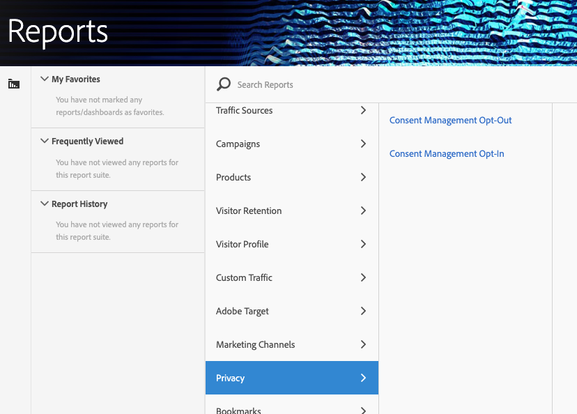

# Variabili di gestione del consenso

Per fornire ulteriore assistenza nella gestione dei dati sulla privacy, è disponibile una serie di variabili riservate da utilizzare insieme a variabili di dati di contesto specifiche.
Queste variabili di gestione del consenso forniscono un framework di facile utilizzo per l'acquisizione dello stato del consenso su ogni hit di analisi.

## Variabili

* Gestione del consenso Opt-Out
   * Variabile riservata: Prop elenco
   * Tipo: Stringa delimitata da virgole
   * Contiene:
      * `contextData.['cm.ssf']=1` visualizzato come SSF
      * `contextData.['opt.dmp']=N` visualizzato come DMP
      * `contextData.['opt.sell']=N` visualizzato come SELL

* Gestione del consenso Opt-in
   * Variabile riservata: Prop elenco
   * Tipo: Stringa delimitata da virgole
   * Contiene:
      * `contextData.['opt.dmp']=Y` visualizzato come DMP
      * `contextData.['opt.sell']=Y` visualizzato come SELL

## Generazione di rapporti  

Puoi abilitare le variabili di gestione del consenso tramite una nuova impostazione Privacy disponibile nell’Admin Console di Analytics.

Ogni suite di rapporti può essere configurata come segue:
1. In Reporting e analisi fare clic su **[!UICONTROL Admin > Report Suites.]**
1. Selezionate le suite di rapporti in cui state raccogliendo i dati multimediali e fate clic su **[!UICONTROL Edit Settings > Privacy Management.]**

   

1. Click the **[!UICONTROL Enable Data Privacy Reports]** button. **** Nota: Una volta abilitate queste variabili non possono essere disattivate.

   

1. Una volta attivato, verrà visualizzato un messaggio di conferma.

   

1. Le variabili riservate ora sono disponibili per il reporting.  Consulta Consent Management Opt-Out and Consent Management Opt-In (Rifiuto e consenso della gestione del consenso).

   

## Implementazione

Sono state predefinite tre variabili di dati di contesto per l’utilizzo delle variabili riservate per la gestione del consenso.  È compito di ogni tecnico dell'implementazione determinare come gestire e mantenere l'impostazione di queste variabili.

Consulta Variabili [di dati](https://docs.adobe.com/help/en/analytics/implementation/javascript-implementation/variables-analytics-reporting/context-data-variables.html) contestuali per informazioni generali sull'implementazione delle variabili di dati di contesto.

### SSF

* Dati contestuali: contextData.['cm.ssf']
* Valori accettati:
   * 1 - Quando si invia il valore "1", ciò indica che l'inoltro lato server è in stato di rifiuto. Il valore "1" associato a questa variabile bloccherà la condivisione dell’hit con Adobe Audience Manager. Consulta Conformità [AAM ePrivacy.](https://docs.adobe.com/help/en/analytics/integration/audience-analytics/audience-analytics-workflow/ssf-gdpr.html)
   * Nessun altro valore è accettato per questo parametro.

### DMP

* Dati contestuali: contextData.['opt.dmp']
* Valori accettati:
   * N - Quando si invia il valore "N", ciò indica che il consumatore sta rinunciando alla condivisione sulle piattaforme di gestione dei dati. **** Nota: L'impostazione di questa variabile su "N" al momento non blocca la condivisione su AAM, tuttavia, il blocco delle chiamate alla funzionalità AAM verrà aggiunto all'inizio del 2020. Per il momento Adobe consiglia di impostare `c.cm.ssf=1` e `c.opt.dmp=N` bloccare l’invio degli hit ad AAM.
   * Y - Quando si invia il valore "Y", ciò indica che il consumatore sta optando per la condivisione su piattaforme di gestione dati.

### VENDITA

* Dati contestuali: contextData.['opt.sell']
* Valori accettati:
   * N - Quando si invia il valore "N", ciò indica che il consumatore rinuncia alla condivisione o alla vendita dei dati a terzi.
   * Y - Quando si invia il valore "Y", ciò indica che il consumatore sta optando per la condivisione o la vendita dei dati a terzi.
