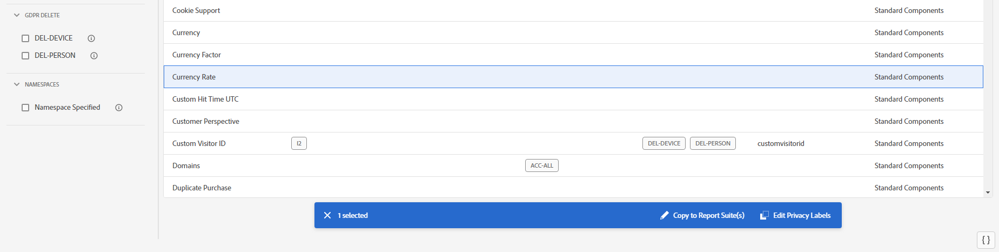

# Visualizzare/gestire le etichette sulla privacy per la governance dei dati

>[!NOTE]
>
>Questa interfaccia utente aggiornata è attualmente in fase di test.

La **[!UICONTROL Privacy Labeling for Data Governance]** fornisce una panoramica delle etichette di privacy e dei namespace di una suite di rapporti. Puoi anche esportare le impostazioni in un file .csv da qui.

## Visualizza etichette privacy {#view-privacy}

1. Accedi ad Adobe Experience Cloud.
1. Passa a  **[!UICONTROL Analytics]** > **[!UICONTROL Admin]** > **[!UICONTROL All admin]** > **[!UICONTROL Data configuration & collection]** > **[!UICONTROL Data Governance]**.

   >[!NOTE]
   >
   >Se questa voce di menu non viene visualizzata, è necessario aggiungerla a un [profilo di prodotto in Admin Console](https://experienceleague.adobe.com/docs/analytics/admin/admin-console/permissions/product-profile.html?lang=it) con autorizzazioni per questa funzionalità.

1. In alto a destra, seleziona una suite di rapporti le cui etichette di privacy si desidera visualizzare o gestire.

   

| Impostazione | Descrizione |
| --- | --- |
| **[!UICONTROL Component Name]** | In questa colonna sono elencati tutti i componenti (dimensioni, metriche) che fanno parte di questa suite di rapporti. |
| **[!UICONTROL Identity]** | Le etichette “I” per i dati di identità sono usate per organizzare in categorie i dati che possono identificare o consentono di contattare una persona specifica. [Ulteriori informazioni](https://experienceleague.adobe.com/docs/analytics/admin/data-governance/gdpr-labels.html?lang=en#identity-data-labels) |
| **[!UICONTROL Sensitivity]** | Le etichette “S” per i dati sensibili vengono usate per organizzare in categorie i dati sensibili, come i dati geografici. Per identificare altri tipi di informazioni riservate, verranno introdotte etichette di dati riservati aggiuntive. [Ulteriori informazioni](https://experienceleague.adobe.com/docs/analytics/admin/data-governance/gdpr-labels.html?lang=en#sensitive-data-labels) |
| **[!UICONTROL GDPR Access]** | Le etichette per la governance dei dati consentono agli utenti di classificare i dati che riflettono considerazioni relative alla privacy e condizioni contrattuali conformi alle norme e ai criteri aziendali. [Ulteriori informazioni](https://experienceleague.adobe.com/docs/analytics/admin/data-governance/gdpr-labels.html?lang=en#data-privacy-access-labels) |
| **[!UICONTROL GDPR Delete]** | L’etichetta di cancellazione è necessaria solo per i campi che contengono un valore che consentirebbe l’associazione di un risultato alla persona interessata (ovvero che consentirebbe di identificare la persona interessata). Non è necessario cancellare altre informazioni personali (preferiti, cronologia di navigazione/acquisto, condizioni di salute e così via) perché l’associazione alla persona interessata verrà impedita. [Ulteriori informazioni](https://experienceleague.adobe.com/docs/analytics/admin/data-governance/gdpr-labels.html?lang=en#data-privacy-delete-labels) |
| **[!UICONTROL Namespace]** | Quando si applica un’etichetta ID-DEVICE o ID-PERSON a una variabile, viene richiesto di fornire un namespace. Puoi usare il namespace definito in precedenza o puoi definirne uno nuovo. [Ulteriori informazioni](https://experienceleague.adobe.com/docs/analytics/admin/data-governance/gdpr-labels.html?lang=en#section_F0A47AF8DA384A26BD56032D0ABFD2D7) |
| **[!UICONTROL Category]** | Fa riferimento al tipo di componente, ad esempio Componente standard, Variabile di conversione, ecc. |

{style=&quot;table-layout:auto&quot;}

## Copiare le etichette di privacy in una suite di rapporti  {#copy-to-rs}

Se desideri applicare le stesse impostazioni DULE/Privacy dei dati a più di una suite di rapporti, segui questi passaggi:

1. Seleziona la variabile da copiare. Puoi copiare le etichette solo per una variabile alla volta.
1. Fai clic su **[!UICONTROL Copy to Report Suite(s)]** nella parte inferiore della finestra di dialogo Governance dei dati.

   

1. La schermata risultante mostra il nome della variabile, le etichette attualmente applicate su cui stai tentando di copiare , le suite di rapporti e i relativi ID e se le impostazioni nelle suite di rapporti di destinazione corrispondono.

   

   >[!IMPORTANT]
   >
   >Ricorda che tutte le suite di rapporti selezionate devono essere mappate nell’organizzazione Experience Cloud.

   Quando copi le etichette per una variabile o per un set di variabili in una suite di rapporti diversa, la copia passa alla variabile nella posizione corrispondente nella suite di rapporti di destinazione. Per i componenti standard, le variabili elenco e gli eventi di successo, le etichette verranno copiate nella variabile con la **stesso nome** nella suite di rapporti di destinazione.

   Tuttavia, per Variabili di conversione (eVar) e Dimension di traffico (prop) la copia sarà nella variabile con il **stesso numero** nella suite di rapporti di destinazione. Ad esempio, eVar12 verrà copiata in eVar12 in tutte le suite di rapporti di destinazione. I nomi di queste variabili verranno ignorati durante la determinazione della destinazione della copia. Se la variabile corrispondente non è abilitata nella suite di rapporti di destinazione, la copia non potrà essere eseguita per tale variabile.

   Quando copi le etichette per le classificazioni definite per una variabile, le etichette verranno copiate in una classificazione nella variabile corrispondente nella suite di rapporti di destinazione (ad esempio da eVar7 a eVar7) con un nome identico alla classificazione da copiare. Altrimenti, la copia delle etichette della classificazione non verrà eseguita.

1. Seleziona la casella accanto a una o più suite di rapporti in cui le impostazioni corrispondono.
1. Fai clic su **[!UICONTROL Apply]**.

   Dopo aver applicato le etichette viene visualizzato un messaggio di stato. Il messaggio di stato includerà i nomi delle variabili o delle classificazioni di destinazione e le relative suite di rapporti per cui la copia non è riuscita.

   >[!IMPORTANT]
   >
   >Devi sempre controllare la suite di rapporti di destinazione per accertarti che le etichette siano state copiate correttamente. Questo è molto importante soprattutto per le variabili che hanno le etichette ID o DEL.

## Esportare in un file .csv {#export-csv}

Puoi scaricare un file CSV contenente tutte le definizioni delle etichette correnti per tutte le variabili per le suite di rapporti selezionate. È consigliabile che il team legale esamini le scelte di etichettatura e questa opzione facilita la revisione. Invece di dover eseguire la revisione quando sei autenticato nell’interfaccia utente della governance dei dati, puoi condividere il file .CSV.

1. Fai clic su **[!UICONTROL Export CSV]** in alto a destra e viene visualizzata questa finestra di dialogo:

   

1. Seleziona una o più suite di rapporti per le quali desideri esportare tutte le impostazioni di governance dei dati.

## Modificare le etichette della privacy {#edit}

Fai riferimento a [Assegnare o modificare le etichette di privacy della suite di rapporti](/help/admin/c-data-governance/data-labeling/gdpr-setup-reportsuite.md).
