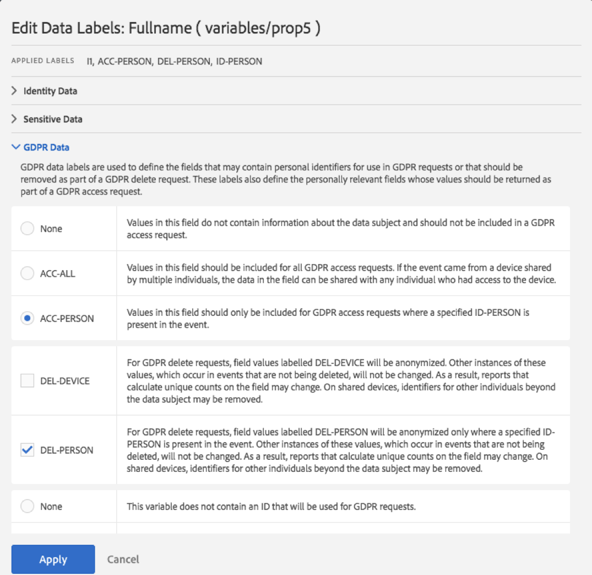

# Etichettare i dati della suite di rapporti

Etichettare i dati della suite di rapporti significa che puoi assegnare etichette di identità, sensibilità e governance dei dati a ciascuna variabile di una determinata suite di rapporti. Assicuratevi innanzitutto di acquisire familiarità con le etichette e le relative definizioni.

>[!NOTE] Ricorda che l&#39;etichettatura deve essere rivista ogni volta che viene creata una nuova suite di rapporti o quando viene abilitata una nuova variabile all&#39;interno di una suite di rapporti. Potrebbe inoltre essere necessario rivedere l&#39;etichettatura quando sono abilitate nuove integrazioni di soluzioni, in quanto possono esporre nuove variabili che potrebbero richiedere l&#39;etichettatura. Una reimplementazione delle app mobili o dei siti Web potrebbe modificare il modo in cui vengono utilizzate le variabili esistenti, e questo potrebbe richiedere anche aggiornamenti delle etichette.

## Assegnare o modificare le etichette della suite di rapporti {#section_39F829F35A274EACA532E2F6FF392996}

**Esempio**: in qualità di titolare del trattamento dei dati, pianifica di raccogliere gli indirizzi e-mail e gli ID cookie delle persone interessate per elaborare le loro richieste di Privacy dei dati. Questi cookie ID sono memorizzati in una suite di rapporti in Adobe Analytics. Per creare un&#39;etichetta per gli indirizzi e-mail e gli ID dei cookie, devi usare il framework DUE (Data Usage Labeling &amp; Enforcement, Etichettatura e applicazione dell&#39;uso dei dati) della piattaforma Adobe Cloud in Analytics.

1. In Analytics, passa a **[!UICONTROL Admin]** > **[!UICONTROL Data Governance]** > **[!UICONTROL (select report suite)]** 

1. Selezionare il gruppo di variabili da etichettare.

   

   * **Dimensioni** standard (dimensioni pronte all’uso di Adobe Analytics)
   * **Metriche** standard (metriche predefinite di Adobe Analytics)
   * **Eventi di conversione** (eventi di successo personalizzati)
   * **Dimensioni di conversione di merchandising** (Merchandising eVars)
   * **Dimensioni** conversione (eVar non merchandising)
   * **Dimensioni** traffico personalizzate (prop)
   * **Dimensioni ed eventi** della soluzione (dimensioni/eventi relativi a soluzioni come Mobile, Video, Activity Map, ecc., e integrazioni con soluzioni come Adobe Campaign, Adobe Experience Manager, Advertising Cloud, ecc.)
   * **Dimensioni di elaborazione dei dati** (variabili non esposte direttamente nel rapporto tramite l&#39;interfaccia utente di Adobe Analytics, ma disponibili tramite le richieste di feed dei dati e/o Data Warehouse)

1. (Facoltativo) Fai clic sull&#39;icona delle informazioni (i) accanto a ciascuna variabile per avere maggiori informazioni sui valori più comuni oltre i 90 giorni. Questa funzionalità non è disponibile per le dimensioni di elaborazione dati, perché non sono disponibili nell’interfaccia utente di Analytics.

   

1. Seleziona una o più variabili facendo clic sulle relative caselle di controllo, quindi seleziona l’icona **[!UICONTROL Edit]** (a destra) per modificare una o più variabili.

   

1. Viene visualizzata automaticamente la finestra di dialogo delle etichette **Dati** identità. Queste etichette classificano i dati che possono essere utilizzati da soli o in combinazione con altri dati per identificare o abilitare il contatto diretto con un individuo. Per altre informazioni su queste opzioni, fai riferimento alle [etichette dei dati di identità (DULE).](/help/admin/c-data-governance/gdpr-labels.md#identity-data-labels)

   >[!NOTE]
   >
   >Il framework DULE (Data Usage Labeling &amp; Enforcement, etichettatura e applicazione dell’uso dei dati) è progettato per fornire un metodo uniforme per soluzioni/servizi/piattaforme al fine di acquisire, comunicare e usare i metadati sui dati in Adobe Experience Cloud. I metadati consentono ai titolari del trattamento di indicare i dati che si riferiscono a informazioni personali, dati sensibili e vincoli di contratto associati a questi.

   

1. Apri la sezione **Sensitive Data** (Dati sensibili) per impostare le etichette dei dati sensibili, che organizzano in categorie i dati di geolocalizzazione. Per altre informazioni su queste opzioni, fai riferimento alle [etichette per i dati sensibili (DULE).](/help/admin/c-data-governance/gdpr-labels.md#sensitive-data-labels)

   

1. Apri la sezione Dati Privacy dei dati per impostare le etichette di **governance dei dati**. Usa questa sezione per dare istruzioni ad Adobe su come gestire le variabili per le richieste di accesso e di cancellazione della Privacy dei dati, nonché per definire le variabili da esaminare per trovare gli ID delle persone interessate per queste richieste. Per altre informazioni su queste opzioni, fai riferimento alle [Etichette di governance dei dati (Privacy dei dati).](/help/admin/c-data-governance/gdpr-labels.md#data-governance-labels)

   

1. Una volta terminata l’etichettatura fai clic su **[!UICONTROL Apply]**.

## Copiare le etichette nelle suite di rapporti {#section_7C6FDAFF049F4126B84F6261F72668EE}

Se vuoi applicare le stesse impostazioni DULE/Privacy dei dati a più di una suite di rapporti, puoi seguire questi passaggi:

1. Selezionare il gruppo di variabili (Dimensioni standard, Dimensioni conversione, ecc.) contenente la variabile da copiare. È possibile copiare le etichette per un solo gruppo di variabili alla volta.
1. Selezionate alcune o tutte le variabili del gruppo.
1. Fai clic su **[!UICONTROL Copy Labels to Report Suite(s)]** nella parte in alto a destra della finestra di dialogo Governance dei dati.

   

1. Oppure spunta **[!UICONTROL Select All]** per copiare le etichette per le variabili selezionate in tutte le suite di rapporti oppure seleziona le singole suite di rapporti in di cui desideri copiare le etichette.

   >[!IMPORTANT]
   >
   >Ricorda che tutte le suite di rapporti selezionate devono essere mappate nell’organizzazione Experience Cloud.

   Quando copi le etichette per una variabile o per un set di variabili in una suite di rapporti diversa, la copia passa alla variabile nella posizione corrispondente nella suite di rapporti di destinazione. Per dimensioni standard, metriche standard, dimensioni della soluzione, eventi e dimensioni elaborazione dati, le etichette verranno copiate nella variabile con lo **stesso nome** nella suite di rapporti di destinazione.

   Tuttavia, per le variabili di conversione (eVar), le dimensioni di conversione del merchandising e le dimensioni di traffico personalizzate (prop) la copia sarà nella variabile con lo **stesso numero** nella suite di rapporti di destinazione. Ad esempio, eVar12 verrà copiata in eVar12 in tutte le suite di rapporti di destinazione. I nomi di queste variabili verranno ignorati durante la determinazione della destinazione della copia. Se la variabile corrispondente non è abilitata nella suite di rapporti di destinazione, la copia non riuscirà per quella variabile.

   Durante la copia delle etichette per le classificazioni definite per una variabile, le etichette verranno copiate in una classificazione nella variabile corrispondente nella suite di rapporti di destinazione (ad esempio da eVar7 a eVar7) che ha un nome identico alla classificazione da copiare. In caso contrario, la copia per le etichette di quella classificazione avrà esito negativo.

   Dopo aver applicato un set di etichette verrà visualizzato un messaggio di stato. Il messaggio di stato includerà i nomi delle variabili o classificazioni di destinazione e delle relative suite di rapporti per le quali la copia non è riuscita.

   >[!IMPORTANT]
   >
   >Devi sempre controllare la suite di rapporti di destinazione per accertarti che le etichette siano state copiate correttamente. Questo è molto importante soprattutto per le variabili che hanno le etichette ID o DEL.

1. Fai clic su **[!UICONTROL Apply]**.

