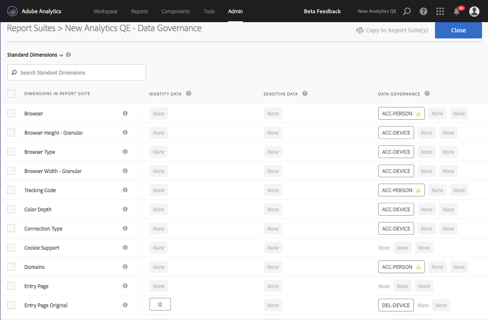
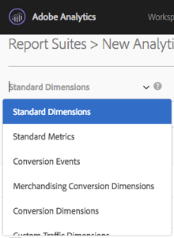
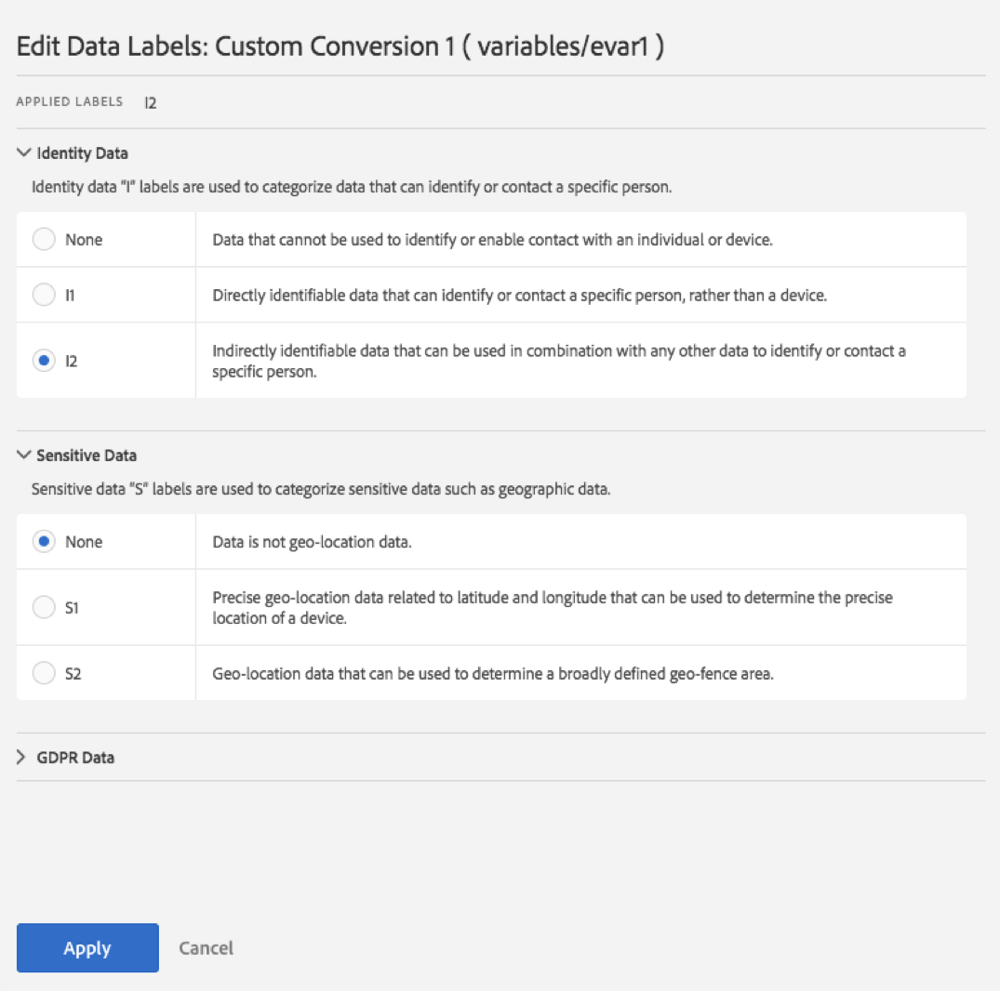

# Etichettare i dati delle suite di rapporti

Etichettare i dati della suite di rapporti significa assegnare etichette di identità, riservatezza e governance dei dati a ciascuna variabile in una determinata suite di rapporti. Assicurati innanzitutto di conoscere bene le etichette e le relative definizioni.

>[!NOTE]
>
>Ricorda che l'etichetta deve essere rivista ogni volta che viene creata una nuova suite di rapporti o quando una nuova variabile viene attivata all'interno di una suite di rapporti esistente. Potrebbe essere necessario rivedere l'etichettatura anche quando vengono abilitate nuove integrazioni della soluzione, perché queste potrebbero esporre nuove variabili che potrebbero richiedere le etichette. Una nuova implementazione delle app mobili o dei siti web potrebbe cambiare il modo in cui vengono usate le variabili esistenti. Anche per queste potrebbe essere necessario aggiornare le etichette.

## Assegnare o modificare le etichette della suite di rapporti {#section_39F829F35A274EACA532E2F6FF392996}

**Esempio**: in qualità di titolare del trattamento dei dati, pianifica di raccogliere gli indirizzi e-mail e gli ID cookie delle persone interessate per elaborare le loro richieste RGPD. Gli ID cookie vengono archiviati in una suite di rapporti in Adobe Analytics. Per creare un'etichetta per gli indirizzi e-mail e gli ID cookie, devi usare il framework DULE (Data Usage Labeling &amp; Enforcement, Etichettatura e applicazione dell'uso dei dati) di Adobe Cloud Platform in Analytics.

1. In Analytics, navigate to **[!UICONTROL Admin]** &gt; **[!UICONTROL Data Governance]** &gt; **[!UICONTROL[select report suite].]** 

1. Seleziona il gruppo di variabili che vuoi etichettare.

   

   * **Standard Dimensions (Dimensioni standard)** (dimensioni predefinite per Adobe Analytics)
   * **Standard Metrics (Metriche standard)** (metriche predefinite per Adobe Analytics)
   * **Eventi di conversione** (eventi di successo personalizzati)
   * **Dimensioni di conversione di merchandising** (variabili di merchandising)
   * **Dimensioni conversione** (eVar non merchandising)
   * **Dimensioni del traffico personalizzate** (proprietà)
   * **Eventi e dimensioni della soluzione** (Dimensioni/eventi correlati a soluzioni quali Dispositivi mobili, Video, Activity Map e così via, e integrazioni con soluzioni quali Adobe Campaign, Adobe Experience Manager, Advertising Cloud e così via)
   * **Dimensioni di elaborazione dei dati** (variabili non esposte direttamente nel rapporto tramite l'interfaccia utente di Adobe Analytics, ma disponibili tramite le richieste di feed dei dati e/o data warehouse)

1. (Facoltativo). Fai clic sull'icona delle informazioni (i) accanto a ciascuna variabile per avere maggiori informazioni sui valori più comuni oltre i 90 giorni. (Questa funzionalità non è disponibile per le dimensioni di elaborazione dei dati, perché queste non sono disponibili nell'interfaccia utente di Analytics).

   

1. Select one or more variables by clicking their checkbox, then select the **[!UICONTROL Edit]** icon (to the right) to edit one or more variable(s).

   

1. Si apre automaticamente la finestra di dialogo delle etichette **dati di identità**. Queste etichette classificano i dati che possono essere usati da soli o in combinazione con altri dati per identificare o consentire un contatto diretto con una persona. Per altre informazioni su queste opzioni, fai riferimento alle [etichette dei dati di identità (DULE)](../../admin/c-data-governance/gdpr-labels.md#section_B2E78130957647338495EF37DE21D6BC).

   >[!NOTE]
   >
   >Il framework Utilizzo dati e applicazione (DULE) è pensato per fornire un modo uniforme tra Soluzioni/Servizi/Piattaforme per acquisire, comunicare e utilizzare metadati sui dati in Adobe Experience Cloud. I metadati consentono ai titolari del trattamento di indicare i dati che si riferiscono a informazioni personali, i dati sensibili e i vincoli del contratto associati a questi.

   

1. Apri la sezione **Sensitive Data** (Dati sensibili) per impostare le etichette dei dati sensibili, che organizzano in categorie i dati di geolocalizzazione. Per altre informazioni su queste opzioni, fai riferimento alle [etichette per i dati sensibili (DULE)](../../admin/c-data-governance/gdpr-labels.md#section_533E1406F3F24A01B51D94139B94CAEC).

   

1. Apri la sezione RGPD Data (Dati RGPD) per impostare le etichette di **governance dei dati**. Usa questa sezione per dare istruzioni ad Adobe su come gestire le variabili per le richieste di accesso e di cancellazione del RGPD, nonché per definire le variabili da esaminare per trovare gli ID delle persone interessate per queste richieste. Per altre informazioni su queste opzioni, fai riferimento alle [etichette per la governance dei dati (RGPD)](../../admin/c-data-governance/gdpr-labels.md#section_0C7F9EC4BB414A6D915C69F1D3259F1B).

   

1. Click **[!UICONTROL Apply]** once you have completed all labeling.

## Copiare le etichette nelle suite di rapporti{#section_7C6FDAFF049F4126B84F6261F72668EE}

Se vuoi applicare le stesse impostazioni DULE/RGPD a più di una suite di rapporti, puoi seguire questi passaggi:

1. Seleziona il gruppo di variabili (Dimensioni standard, Dimensioni di conversione e così via) contenente la variabile da copiare. Nota che è possibile copiare solo le etichette per un gruppo di variabili alla volta.
1. Seleziona alcune o tutte le variabili del gruppo.
1. Click **[!UICONTROL Copy Labels to Report Suite(s)]** at the top right of the Data Governance dialog.

   

1. Either check **[!UICONTROL Select All]** to copy labels for the selected variables to all report suites or select the individual report suites that you want to copy the labels to.

   >[!IMPORTANT]
   >
   >Tieni presente che tutte le suite di rapporti selezionate devono essere mappate sulla tua organizzazione Experience Cloud.

   Quando copi le etichette per una variabile o per un set di variabili in una suite di rapporti diversa, la copia passa alla variabile nella posizione corrispondente nella suite di rapporti di destinazione. Per Dimensioni standard, Metriche standard, Dimensioni della soluzione e Eventi e dimensioni di elaborazione dei dati, le etichette verranno copiate nella variabile con lo **stesso nome** nella suite di rapporti di destinazione.

   Tuttavia per le Variabili di conversione (eVars), Dimensioni di conversione del merchandising e Dimensioni del traffico personalizzate (proprietà) la copia verrà inserita nella variabile con lo **stesso numero** nella suite di rapporti di destinazione. Ad esempio, eVar12 verrà copiata in eVar12 in tutte le suite di rapporti di destinazione. I nomi di queste variabili verranno ignorati durante la determinazione della destinazione della copia. Se la variabile corrispondente non è abilitata nella suite di rapporti di destinazione, la copia non potrà essere eseguita per tale variabile.

   Durante la copia delle etichette per le classificazioni definite per una variabile, le etichette verranno copiate in una classificazione nella variabile corrispondente nella suite di rapporti di destinazione (ad esempio da eVar7 a eVar7) che ha un nome identico alla classificazione da copiare. Altrimenti, la copia delle etichette della classificazione non verrà eseguita.

   Dopo aver applicato un set di etichette verrà visualizzato un messaggio di stato. Il messaggio di stato includerà i nomi delle variabili o delle classificazioni di destinazione e le relative suite di rapporti per cui la copia non è riuscita.

   >[!IMPORTANT]
   >
   >Controlla sempre le suite di rapporti di destinazione per accertarti che le etichette siano copiate correttamente. Questo è molto importante soprattutto per le variabili che hanno le etichette ID o DEL.

1. Fai clic su **[!UICONTROL Apply]**.

