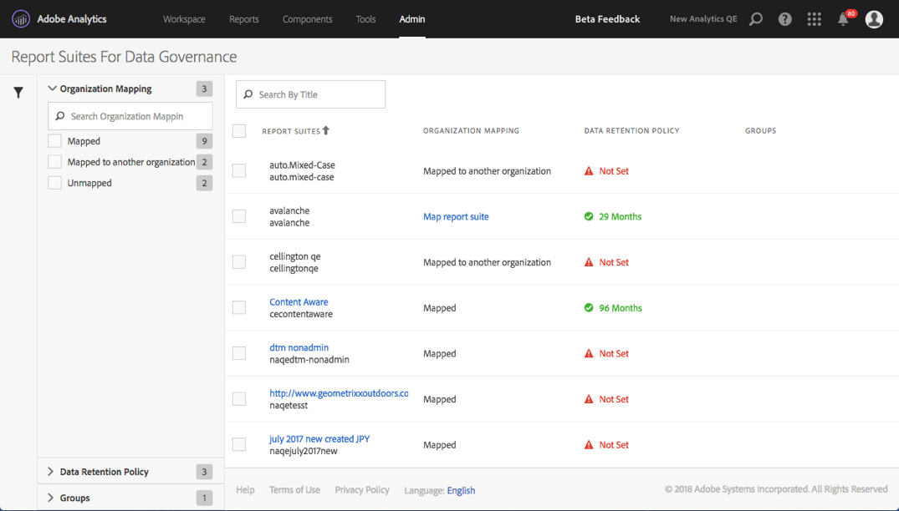

# Visualizzare/gestire le impostazioni di governance dei dati della suite di rapporti

La finestra di dialogo Data Governance (Governance dei dati) negli strumenti dell’amministratore offre una panoramica delle suite di rapporti configurate per la governance dei dati, indica se sono state mappate in un’organizzazione Experience Cloud e se per essa sono stati impostati i criteri di conservazione dei dati.

1. Accedi ad Adobe Experience Cloud.
1. Passa a  **[!UICONTROL Analytics]** > **[!UICONTROL Admin]** > **[!UICONTROL Data Governance]**.

   Visualizzerai tutte le suite di rapporti che fanno parte della società di accesso:

   

<table id="table_448292730FF0475E9DCB731882F9A29B"> 
 <thead> 
  <tr> 
   <th colname="col1" class="entry"> Impostazione </th> 
   <th colname="col2" class="entry"> Descrizione </th> 
  </tr> 
 </thead>
 <tbody> 
  <tr> 
   <td colname="col1"> 
Suite di rapporti 
 </td> 
   <td colname="col2"> 
La prima riga elenca il nome descrittivo della suite di rapporti. La seconda riga contiene il nome interno della suite di rapporti. Se ti è consentito impostare le etichette per una suite di rapporti, la prima riga sarà un collegamento cliccabile che ti porta alla pagina di etichettatura. 
 </td> 
  </tr> 
  <tr> 
   <td colname="col1"> 
Organization Mapping (Mappatura dell’organizzazione) 
 </td> 
   <td colname="col2"> 
    <ul id="ul_EF8F613B0C5E42D19DB60BD0C89C114B"> 
     <li id="li_B35EE88555F547EFBF55ADE9D0C9EC3B"><b>Mappata</b>: questa suite di rapporti è già stata mappata nella stessa organizzazione Experience Cloud della società di accesso di Analytics in cui hai effettuato l’accesso. È possibile etichettare solo le suite di rapporti che hanno questa impostazione. </li> 
     <li id="li_4E800BF80CFF477BAA091EF272D9071C"><b>Map Report Suite (Mappa suite di rapporti)</b>: facendo clic su questo collegamento potrai <a href="https://docs.adobe.com/content/help/it-IT/core-services/interface/about-core-services/report-suite-mapping.html"> mappare una suite di rapporti </a> in un’organizzazione Experience Cloud. 
In questo modo, verrai reindirizzato alla pagina di amministrazione Mappatura di suite di rapporti per un’organizzazione Experience Cloud dove dovrai individuare la suite di rapporti e assegnarla all’organizzazione appropriata. Dopo aver eseguito questa operazione, torna a questa schermata Data Governance (Governance dei dati). 
 </li> 
     <li id="li_FF825A65D089487BBF5FCB0D74D41CD7"><b>Mapped to Another Organization (Mappata in un’altra organizzazione)</b>: un’altra organizzazione ha già mappato questa suite di rapporti al proprio interno. </li> 
    </ul> </td> 
  </tr> 
  <tr> 
   <td colname="col1"> 
Data Retention Policy (Criteri di conservazione dei dati) 
 </td> 
   <td colname="col2"> 
Per implementare la Privacy dei dati in Analytics è necessario aver impostato i criteri di conservazione dei dati. 
 
Questa impostazione consente di vedere se: 
 
    <ul> 
     <li>sono stati impostati i criteri di conservazione dei dati per questa suite di rapporti; e </li> 
     <li>per quanto tempo i dati vengono conservati da Adobe prima di essere eliminati. Il periodo di conservazione dei dati predefinito è di 25 mesi. </li> 
    </ul> 
Nota: in Adobe Analytics non è possibile ricevere assistenza per elaborare le richieste per l’API Privacy dei dati, ovvero per elaborare le richieste di accesso o di cancellazione ricevute dagli utenti finali, se non è stato impostato il periodo di conservazione dei dati. Contatta il tuo Customer Success Manager per impostare il periodo di conservazione dei dati. 
 </td> 
  </tr> 
  <tr> 
   <td colname="col1"> 
Groups (Gruppi) 
 </td> 
   <td colname="col2"> 
La funzionalità di raggruppamento al momento non è implementata. 
 </td> 
  </tr> 
  <tr> 
   <td colname="col1"> 
Barra laterale a sinistra 
 </td> 
   <td colname="col2"> 
Fai clic sull’icona dell’imbuto per aprire o chiudere la barra laterale. 
 
La sezione Organization Mapping (Mappatura dell’organizzazione) mostra il numero di suite di rapporti che rientrano in ognuna delle categorie descritte. 
 
La sezione Data Retention Policy (Criteri di conservazione dei dati) mostra tutti i criteri univoci di conservazione dei dati e il numero di suite di rapporti assegnate ai criteri di conservazione dei dati. 
 </td> 
  </tr> 
  <tr> 
   <td colname="col1"> 
Export to CSV (Esporta in CSV) 
 </td> 
   <td colname="col2"> 
Se indichi il segno di spunta accanto a una o più suite di rapporti, viene visualizzata l’opzione Esporta in CSV. Questa opzione ti consente di scaricare un file CSV contenente tutte le definizioni delle etichette attuali per tutte le variabili per tutte le suite di rapporti selezionate. 
 
Consigliamo al team legale di esaminare le scelte di etichettatura; questa opzione facilita la revisione. Invece di dover eseguire la revisione quando sei autenticato nell’interfaccia utente della governance dei dati, puoi condividere il file .CSV. 
 
 
 </td> 
  </tr> 
 </tbody> 
</table>

