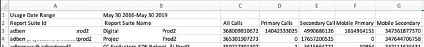

# Visualizzazione dell&#39;utilizzo della suite di rapporti

La scheda Utilizzo suite di rapporti fornisce i dati di utilizzo del server per ogni suite di rapporti in tutte le società di accesso associate alla società di fatturazione, per il periodo di utilizzo corrente.

**[!UICONTROL Analytics]** > **[!UICONTROL Admin]** > **[!UICONTROL Server Call Usage]** > **[!UICONTROL Report Suite Usage]**

>[!IMPORTANT]
>
>Se una suite di rapporti non è [collegata a un&#39;organizzazione Experience Cloud](https://experienceleague.adobe.com/docs/core-services/interface/about-core-services/report-suite-mapping.html), i relativi dati di utilizzo non verranno riportati in questo dashboard. Inoltre, un ID di fatturazione potrebbe essere associato a più organizzazioni di Experience Cloud; non esiste sempre una relazione 1:1 tra un’organizzazione e un ID di fatturazione.

Dashboard di utilizzo della suite di rapporti

* Mostra l&#39;utilizzo della chiamata al server del periodo di utilizzo corrente (Tutte le chiamate, Primaria, Secondaria, Mobile Principale, Mobile Secondaria) per ogni suite di rapporti nell&#39;organizzazione Experience Cloud.
* Mostra la percentuale di utilizzo complessivo per categoria di chiamate al server.
* Viene aggiornato ogni giorno.
* È scaricabile.
* Consente di accedere all’ interfaccia utente **[!UICONTROL Manage Alerts]** .

| Colonna | Definizione |
|--- |--- |
| Nome suite di rapporti | Nome descrittivo della suite di rapporti |
| Tutte le chiamate (% del totale) | Tutte le chiamate server effettuate nel periodo di utilizzo corrente. |
| Chiamate principali (%) | Tutte le chiamate server principali (e la loro percentuale del totale) effettuate nel periodo di utilizzo corrente. |
| Chiamate secondarie (%) | Tutte le chiamate server secondarie (e la loro percentuale del totale) effettuate nel periodo di utilizzo corrente. |
| Mobile Primary (%) | Tutte le chiamate al server primario mobile (e la loro percentuale del totale) effettuate nel periodo di utilizzo corrente. |
| Secondaria mobile (%) | Tutte le chiamate al server secondario mobile (e la loro percentuale del totale) effettuate nel periodo di utilizzo corrente. |

## Download del rapporto di utilizzo {#section_D7345660B5E043CD8850954216509A3D}

Questa opzione consente di scaricare i dati di utilizzo correnti e i dati relativi ai periodi precedenti al periodo di utilizzo corrente (da gennaio 2015). Il rapporto viene scaricato come file .csv .

1. Seleziona almeno una suite di rapporti.
1. Fai clic su **[!UICONTROL Download Report]**.

   

| Elemento report | Descrizione |
|--- |--- |
| Nome file | Nome codificato: Rapporto utilizzo `day and time of report creation.csv` |
| Suite di rapporti incluse | Tutte le suite di rapporti selezionate nella pagina Utilizzo server di rapporto sono incluse in questo elenco. |
| Tipi di chiamate inclusi | Specifica una combinazione di queste:  Tutte Le Chiamate (Predefinito), Primarie, Secondarie, Mobile Primary, Mobile Secondary. |
| Intervallo di tempo | Puoi scegliere il periodo di utilizzo corrente o specificare un intervallo personalizzato.  Per un intervallo personalizzato, specificate Start intervallo e Fine intervallo.  **Nota:** non è possibile scaricare i dati di utilizzo prima di gennaio 2015   . |

1. Fai clic su **[!UICONTROL Download]**.

Ecco una schermata dell’aspetto del file .csv scaricato. Include una colonna per l’ID suite di rapporti. L&#39;ID suite di rapporti specifica un ID univoco che può contenere solo caratteri alfanumerici. Questo ID non può essere modificato dopo la creazione di una suite di rapporti.

