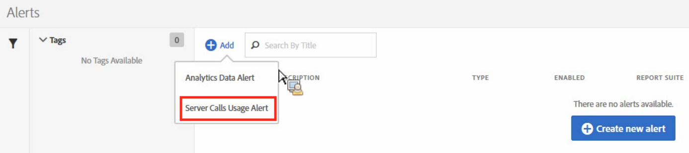
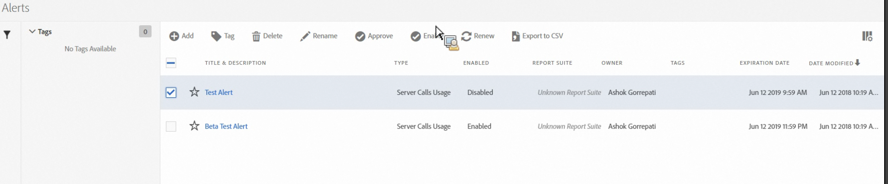

# Avvisi di utilizzo delle chiamate server

Quando imposti un avviso, questo si applica a tutte le suite di rapporti in tutte le società di accesso di una società di fatturazione.

## Panoramica

Una nuova categoria di avvisi denominata **[!UICONTROL Server Calls Usage Alert]** fa parte dell&#39;interfaccia utente [Gestione avvisi](https://experienceleague.adobe.com/docs/analytics/analyze/analysis-workspace/virtual-analyst/intelligent-alerts/intellligent-alerts.html) esistente.

Viene precompilato con **1 avviso predefinito** visualizzato all&#39;interno di qualsiasi società di accesso che dispone dell&#39;accesso alla funzione Server Call Usage (Utilizzo chiamate al server). Gli avvisi attivano una notifica indirizzata a tutti gli amministratori della società di accesso se uno dei seguenti criteri è soddisfatto:

* &quot;Qualsiasi&quot; utilizzo di chiamate server che &quot;è superiore o uguale a&quot; 100% per qualsiasi tipo di chiamata server a cui hai diritto, OR
* &quot;Qualsiasi&quot; utilizzo di chiamate server che &quot;è superiore o uguale a&quot; 90% per qualsiasi tipo di chiamata server a cui hai diritto, OR
* &quot;Qualsiasi&quot; utilizzo di chiamate server che &quot;è superiore o uguale a&quot; 75% per qualsiasi tipo di chiamata server a cui hai diritto, E &quot;Il periodo di utilizzo trascorso&quot; &quot;è inferiore o uguale a&quot; 75% del periodo di utilizzo.

È possibile accedere agli avvisi di utilizzo delle chiamate server in due modi:

* Fai clic su **[!UICONTROL Manage Alerts]** nell’angolo in alto a destra nella scheda Utilizzo corrente o nella scheda Utilizzo suite di rapporti, oppure
* Passa a **[!UICONTROL Components]** > **[!UICONTROL Alerts]** in Adobe Analytics.

## Creare avvisi sull’utilizzo delle chiamate server {#section_2A2882C6D48D47C1944D52FB7C766BEC}

Per creare avvisi aggiuntivi,

1. Fare clic su **[!UICONTROL + Add]** e selezionare **[!UICONTROL Server Call Usage Alert]**.

   

1. Definisci l’avviso.

   

   * **Titolo**: Specifica un nome descrittivo. Impossibile salvare l&#39;avviso senza un nome.
   * **Granularità** del tempo: Indica la frequenza con cui verrà controllato l’avviso. *Al momento è supportata solo la granularità settimanale.* Ciò significa che l’avviso verrà controllato settimanalmente e riguarderà i dati del periodo di utilizzo corrente.
   * **Destinatari**: Specifica gli utenti dell’organizzazione che devono ricevere un’e-mail quando l’avviso attiva la soglia specificata.
   * **Data** di scadenza: Per impostazione predefinita, la data di scadenza è di un anno dalla data di creazione dell’avviso.
   * **Invia un avviso quando**:

      * Uno qualsiasi di questi attivatori di metriche
Aggiungi il tipo di chiamate server come metrica e specifica la soglia di avviso selezionando il modificatore e la soglia:
         * is above or equals (è superiore o uguale a)
         * is below or equals (è inferiore o uguale a)
      * Con
Specifica la soglia e la condizione (è superiore o uguale a o inferiore o uguale a) per il periodo di utilizzo trascorso.

1. Fai clic su **[!UICONTROL Save]**.

## Gestire gli avvisi di utilizzo delle chiamate server {#section_8FF98170763C4B5CBEC6DD43F893177A}

Per gestire gli avvisi:

1. Seleziona la casella di controllo accanto a uno o più avvisi. Le azioni di gestione degli avvisi vengono visualizzate nella parte superiore.
1. Completa una o più delle seguenti azioni:

   | Azione | Definizione |
   |--- |--- |
   | + Add | Accedi al [Generatore di avvisi](/help/admin/c-server-call-usage/scu-alerts.md) facendo clic su [!UICONTROL + Add]. |
   | Tag | Assegna tag agli avvisi per organizzarli in modo semplice e intuitivo. |
   | Elimina | È possibile eliminare tutti gli avvisi ad eccezione degli avvisi predefiniti. |
   | Rinomina | È possibile rinominare tutti gli avvisi ad eccezione degli avvisi predefiniti. |
   | Approva | Approva gli avvisi per renderli &quot;ufficiali&quot;. |
   | Attiva/Disattiva | Puoi abilitare o disabilitare tutti gli avvisi, anche quelli predefiniti. |
   | Rinnova | Se sono selezionati uno o più avvisi, è possibile rinnovarli. Questa funzione sposta le rispettive date di scadenza a 1 anno dal giorno in cui l’utente ha fatto clic su [!UICONTROL Renew] , indipendentemente dalla data di scadenza originale. |
   | Export to CSV (Esporta in CSV) | Consulta [Download del rapporto sull&#39;utilizzo](/help/admin/c-server-call-usage/report-suite-usage.md) |

