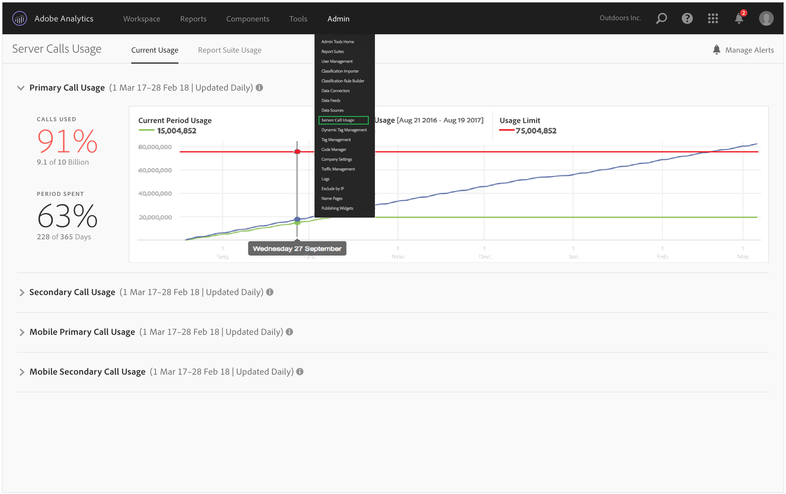

# Visualizzazione dell&#39;utilizzo della chiamata server corrente

**[!UICONTROL Analytics]** > **[!UICONTROL Admin]** > **[!UICONTROL Server Call Usage]** > **[!UICONTROL Current Usage]**

>[!IMPORTANT]
>
>I numeri di utilizzo e di impegno visualizzati sono cumulativi tra tutte le società di accesso e le suite di rapporti.

Pannello Utilizzo corrente

* Mostra un resoconto dettagliato del consumo e dell’impegno delle chiamate server in tutti i tipi di chiamate server. Questa vista può essere diversa per i diversi clienti ed è coerente con quanto il contratto include. Ad esempio, potete aver effettuato la registrazione per 4 tipi distinti di chiamate server, Primaria e Secondaria per Web e Primaria e Secondaria per Mobile. In tal caso, questa visualizzazione includerebbe 4 schede, una per ciascun tipo. All&#39;interno di ciascuna scheda, sarà possibile visualizzare il consumo per il periodo di utilizzo corrente.
* Confronta l’utilizzo corrente (linea verde) con il limite di utilizzo contrattuale (linea rossa).

   

* Confronta l&#39;utilizzo del periodo corrente con quello dello scorso anno (linea blu). Ovviamente, la linea blu verrà visualizzata solo se la società dispone di dati sull’utilizzo delle chiamate server dall’anno precedente.

   >[!NOTE]
   >
   >Per visualizzare l&#39;utilizzo per un periodo di tempo precedente, è necessario andare alla scheda [Uso suite di rapporti](/help/admin/c-server-call-usage/report-suite-usage.md) e scaricare i dati di utilizzo per un periodo precedente.

* Elenca la percentuale di chiamate utilizzate (in percentuali e dati non elaborati) e la percentuale del periodo di utilizzo trascorso (in percentuale e dati non elaborati).
* Per impostazione predefinita, viene aggiornato ogni giorno, con una latenza di elaborazione di 5 giorni.
* Consente di comprimere ed espandere tutti i minirapporti.

| Termine interfaccia utente | Definizione |
| --- | --- |
| Utilizzo periodo corrente (verde) | Il periodo corrente è basato sul periodo di [utilizzo](/help/admin/c-server-call-usage/overage-overview.md). |
| Utilizzo periodo precedente (blu) | Il periodo precedente è definito come periodo di utilizzo corrente meno 1 anno. |
| Limite utilizzo (rosso) | Limite di utilizzo contrattuale per questo periodo di utilizzo. |
