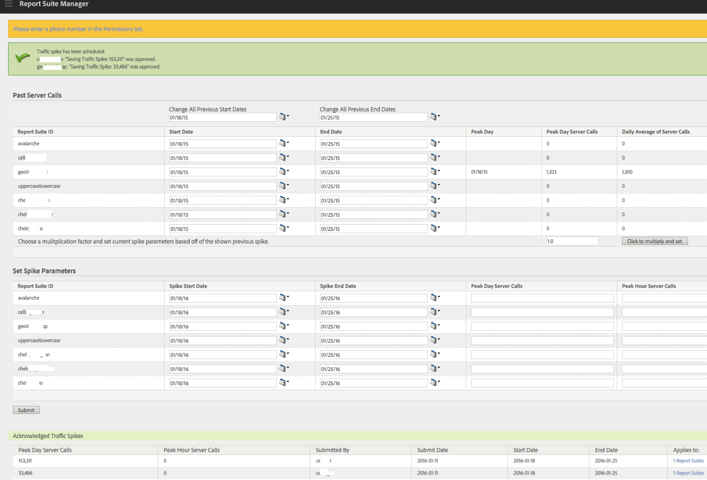

# Stimare chiamate server passate e pianificare un picco di traffico

È possibile ottenere, ad esempio, la media delle chiamate server giornaliere dello scorso anno durante un intervallo di tempo specifico, più un aumento previsto del volume di chiamate server per quest&#39;anno. Puoi quindi pianificare i picchi di traffico in base a questo fattore di moltiplicazione.

1. Accedi ad Analytics come Amministratore e vai a **[!UICONTROL Admin]** > **[!UICONTROL All admin]** > **[!UICONTROL Traffic management]**.

1. Fai clic su **[!UICONTROL Expand]** per espandere l’elenco delle suite di rapporti e fai clic su **[!UICONTROL Select Report Suites]** per selezionare più suite di rapporti.

1. Fai clic su **[!UICONTROL Schedule Spikes]**.
1. In **[!UICONTROL Past Server Calls]**, seleziona una data di inizio e una data di fine per le suite di rapporti selezionate.

   Viene generato l&#39;importo per le chiamate al server del giorno di picco, del giorno di picco e della media giornaliera delle chiamate al server.

1. Immetti un valore per il fattore di moltiplicazione e fai clic su **[!UICONTROL Click to multiply and set]**.

   Il valore di ciascuna colonna viene moltiplicato per ogni suite di rapporti.

1. In **[!UICONTROL Set Spike Parameters]**, invia i parametri di picco per le suite di rapporti selezionate.

   Il picco è ora pianificato per ogni suite di rapporti selezionata.

