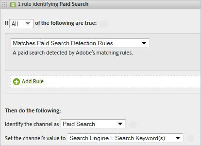
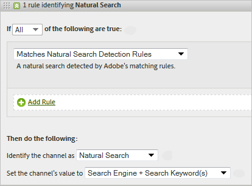
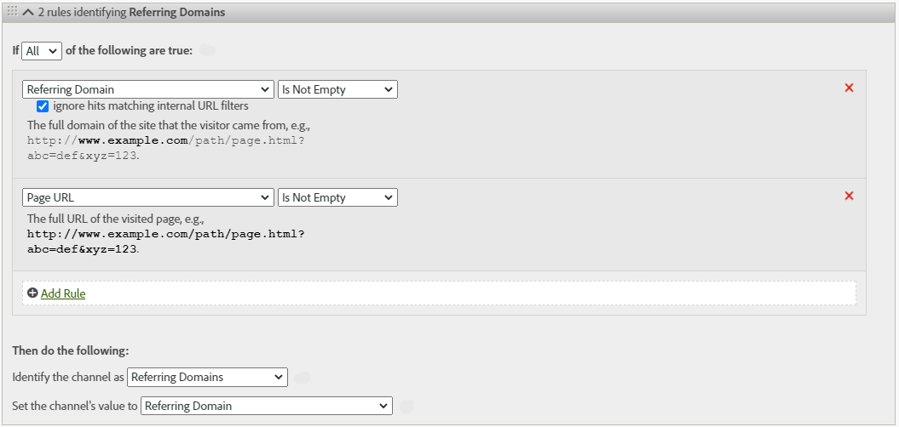

# Regole di elaborazione per i canali di marketing

Le regole di elaborazione per il canale di marketing determinano se un hit visitatore soddisfa i criteri assegnati a un canale elaborando ogni hit effettuato da un visitatore sul sito. Le regole vengono elaborate nell’ordine specificato e, quando una regola viene soddisfatta, il sistema non elabora più le regole rimanenti.

**[!UICONTROL Analytics]** > **[!UICONTROL Admin]** > **[!UICONTROL Report Suites]** > **[!UICONTROL Edit Settings]** > **[!UICONTROL Marketing Channels]** > **[!UICONTROL Marketing Channel Processing Rules]**.

Note aggiuntive sull’elaborazione:

* I dati raccolti con queste regole sono permanenti. Le regole modificate dopo la raccolta dei dati non sono retroattive. Adobe consiglia vivamente di esaminare e prendere in considerazione tutte le circostanze prima di salvare le [!UICONTROL Marketing Channel Processing Rules] per limitare i dati raccolti nei canali non corretti.
* Puoi configurare fino a 25 canali di marketing separati.
* Le regole possono accedere alle variabili impostate da VISTA, ma non ai dati eliminati da VISTA.
* Due canali di marketing non ricevono mai merito per lo stesso evento (ad esempio acquisti o clic). In questo modo, i canali di marketing differiscono dalle eVar (dove due eVar potrebbero ricevere merito per lo stesso evento).
* Se nelle tue regole è presente uno spazio vuoto, potresti visualizzare [Nessun canale identificato.](/help/components/c-marketing-channels/c-faq.md)

## Prerequisiti

* Rivedi le informazioni concettuali in [Introduzione ai canali di marketing](/help/components/c-marketing-channels/c-getting-started-mchannel.md).
* Crea uno o più canali in modo da poter assegnarli le regole. Consulta [Aggiungere canali di marketing](/help/admin/tools/manage-rs/edit-settings/marketing-channels/c-channels.md).
* Rivedi le best practice per l’utilizzo di [!UICONTROL Marketing Channels] con [!UICONTROL Attribution].

## Creare regole di elaborazione per il canale di marketing

Crea regole di elaborazione per il canale di marketing, che determinano se un hit visitatore soddisfa i criteri assegnati a un canale.

1. Fai clic su **[!UICONTROL Analytics]** > **[!UICONTROL Admin]** > **[!UICONTROL Report Suites]**.
2. Seleziona una suite di rapporti.

   Se nella suite di rapporti non sono definiti canali, viene visualizzata la pagina [!UICONTROL Marketing Channels: Auto Setup].

   Consulta [Eseguire l’installazione automatica](/help/components/c-marketing-channels/c-getting-started-mchannel.md).

3. Fai clic su **[!UICONTROL Edit Settings]** > **[!UICONTROL Marketing Channels]** > **[!UICONTROL Marketing Channel Processing Rules]**. Se esegui la configurazione automatica, viene automaticamente definito un set di canali e regole.

   

4. Se desideri aggiungere una regola, selezionala dal menu **[!UICONTROL Add New Rule Set]**. Se selezioni un canale, ricevi un modello di regola e, se selezioni Personalizza, inizierai da zero. Entrambe le opzioni consentono di modificare il set di regole in base alle esigenze.

   

5. Per continuare a creare le regole, fai clic su **[!UICONTROL Add New Rule SetRule]**.
6. Per assegnare la priorità alle regole, trascinale nella posizione desiderata.
7. Fai clic su **[!UICONTROL Save.]**

### Impostare il valore del canale di marketing

**[!UICONTROL Set the channel's value]** definisce la dimensione di dettaglio del canale di marketing disponibile per tale canale.

### Criteri delle regole

Questa tabella di riferimento definisce i campi, le opzioni e gli attributi hit che è possibile utilizzare per definire le regole di elaborazione del canale di marketing.

>[!NOTE]
>
>Tutti i campi di testo definiti, ad esempio i parametri della stringa di query o gli elenchi di valori per il confronto, vengono considerati valori **senza fare distinzione tra maiuscole e minuscole**. Ad esempio, se disponi di una regola in cui il parametro della stringa di query `cmp = abc123`,avrai la corrispondenza di tutte le varianti, maiuscole e minuscole, di `cmp` e `abc123`.

| Termine | Definizione |
|--- |--- |
| Tutto | Attiva questo canale solo quando tutti i criteri nella regola sono true. |
| Qualsiasi | Attiva questo canale quando uno qualsiasi dei criteri della regola è true. Questa opzione è disponibile solo se nella regola sono presenti più criteri. |
| ID AMO | Il codice di tracciamento principale utilizzato dalle integrazioni Adobe Advertising e Advertising Analytics. Quando una di queste integrazioni è abilitata, è possibile utilizzare il prefisso del codice di tracciamento per identificare i canali specifici di Advertising. Utilizza un &quot;AMO ID&quot; che inizia con &quot;AL&quot; per Search and Social (Ricerca e Social) o &quot;AC&quot; per Display (Visualizzazione). Quando l’AMO ID viene utilizzato nei canali di marketing, le metriche clic/costo/impression possono essere attribuite al canale corretto. Quando l’AMO ID non è configurato, queste metriche vengono spostate su Direct (Diretto) o None (Nessuno). |
| ID AMO EF | Il codice di tracciamento secondario utilizzato da Adobe Advertising. Lo scopo principale di questo codice di tracciamento è quello di fungere da chiave per inviare nuovamente i dati ad Advertising. Può, tuttavia, essere utilizzato anche per identificare i ClickThrough di visualizzazione e i ViewThrough di visualizzazione come due canali di marketing separati. A questo scopo, imposta la logica del canale di marketing per &quot;AMO EF ID&quot; termina con `:d` per i clickthrough di visualizzazione o &quot;AMO EF ID&quot; termina con `:i` per Display ViewThroughs. Se non desideri dividere la visualizzazione in due canali, utilizza la dimensione ID AMO. |
| Variabili di conversione | Sono costituite da eVar abilitate per questa suite di rapporti e si applicano solo quando queste variabili sono impostate tramite il codice di Adobe sulla pagina. |
| Esiste | Sono disponibili diverse opzioni, tra cui:<ul><li>**Non esiste**: specifica che l’attributo hit non esiste nella richiesta. Ad esempio, in un dominio di riferimento, se l’utente digita un URL o fa clic su un segnalibro, l’attributo del dominio di riferimento non esiste.</li><li>**È vuoto**: specifica l’esistenza di un attributo hit, in genere un parametro di eVar o una stringa di query, senza che sia presente un valore associato all’attributo hit.</li><li>**Non contiene**: consente di specificare, ad esempio, che un dominio di riferimento non contiene un valore specifico (anziché utilizzare la selezione “Contiene”).</li></ul> |
| Identifica il canale come | Associa la regola a un canale di marketing aggiunto alla pagina Gestione canale di marketing. |
| Corrisponde alle regole di rilevamento di ricerca a pagamento | Una ricerca a pagamento rilevata da Adobe. Le ricerche a pagamento si verificano quando le aziende pagano una tariffa in modo che il motore di ricerca faccia apparire il proprio sito nell’elenco. Le ricerche a pagamento vengono in genere visualizzate nella parte superiore o destra dei risultati di ricerca. |
| Corrisponde alle regole di rilevamento della ricerca naturale | Una ricerca non a pagamento rilevata dal reporting di Adobe. |
| La pagina di provenienza (referrer) corrisponde ai filtri URL interni | Una visita in cui l’URL della pagina corrisponde a un filtro URL interno, come definito per la suite di rapporti in Strumenti di amministrazione. |
| La pagina di provenienza (referrer) non corrisponde ai filtri URL interni | L’URL di riferimento non corrisponde a un filtro URL interno, come definito per la suite di rapporti in Strumenti di amministrazione. Puoi utilizzare questa impostazione con URL della pagina ed Esiste per impostare una regola onnicomprensiva, in modo che non arrivino visite nella sezione Nessun canale identificato del rapporto. |
| Ignorare gli hit che corrispondono ai filtri URL interni | (Per le pagine di provenienza) Tiene traccia solo degli hit provenienti da siti con riferimenti esterni. In genere, lascia abilitata questa impostazione a meno che non desideri includere il traffico interno. |
| È il primo hit della visita | Il primo hit di una visita rilevato dal reporting di Adobe. |
| Pagina | La dimensione [Pagina](/help/components/dimensions/page.md). |
| Dominio pagina | Il dominio della pagina in cui il visitatore arriva, ad esempio `products.example.com`. |
| Dominio e percorso della pagina | Il dominio e il percorso, ad esempio `products.example.com/mens/pants/overview.html` . |
| Dominio principale della pagina (TLD+1) | Il dominio principale della pagina in cui il visitatore arriva, ad esempio example.co.uk . |
| URL della pagina | L’URL di una pagina web sul sito. |
| Dominio di riferimento | La dimensione del [Dominio di riferimento](/help/components/dimensions/referring-domain.md) |
| Parametro stringa di query | Utilizza un singolo parametro di stringa di query. È possibile specificare un solo parametro di stringa di query per criterio. Per aggiungere parametri di stringa di query aggiuntivi, utilizza `ANY` come operatore, quindi aggiungi i parametri della stringa di query alla regola. |
| Pagina di provenienza | La posizione della pagina web (URL completo) in cui si trovavano i visitatori prima di arrivare al sito. Una pagina di provenienza (referrer) esiste al di fuori del dominio definito. |
| Dominio e percorso di riferimento | Una concatenazione del dominio e del percorso URL di riferimento. Alcuni esempi includono: `www.example.com/products/id/12345` o `ad.example.com/foo` |
| Parametro di riferimento | Un parametro della stringa di query sull’URL di provenienza. Ad esempio, se i visitatori provengono da `example.com/?page=12345&cat=1`, allora pagina e categoria sono i parametri di riferimento. |
| Dominio principale di riferimento | Il dominio principale della pagina di provenienza. Una pagina di provenienza (referrer) esiste al di fuori del dominio definito. |
| Motore di ricerca | Un motore di ricerca come Google o Yahoo! che ha portato i visitatori sul tuo sito. |
| Parole chiave di ricerca | Una parola utilizzata per effettuare una ricerca utilizzando un motore di ricerca. |
| Motore + Parole chiave di ricerca | Concatenazione della parola chiave e del motore di ricerca per identificare in modo univoco il motore di ricerca. Ad esempio, se si cerca la parola computer, il motore di ricerca e la parola chiave vengono identificati nel modo seguente: `Search Tracking Code = "<search_type>:<search engine>:<search keyword>" where    search_type = "n" or "p", search_engine = "Google", and search_keyword = "computer"`**Nota:** n = naturale; p = a pagamento |
| Impostare il valore del canale su | Imposta la dimensione [Dettagli canale di marketing](/help/components/dimensions/marketing-detail.md). Puoi determinare quale valore sarebbe migliore nel contesto della regola. Alcuni esempi includono l’ID dell’annuncio del banner, la parola chiave di ricerca o la campagna e-mail. |

## Ordine e definizioni delle regole del canale di marketing {#channel-rules}

Le regole del canale vengono elaborate nell’ordine specificato. Adobe consiglia di inserire prima i canali gestiti o a pagamento (ad esempio, ricerca a pagamento, ricerca naturale, visualizzazione o e-mail) in modo che ricevano merito sui canali organici (come diretti, interni, domini di riferimento).

Di seguito è riportato l’ordine consigliato per le regole del canale e le definizioni di esempio:

### Ricerca a pagamento {#paid-search}

La ricerca a pagamento è una parola o una frase che viene pagata a un motore di ricerca in modo che venga inserita nei risultati di ricerca. Questo canale è in genere definito in base al parametro della stringa di query (vedi Esempio di canale di visualizzazione) o alle regole di rilevamento di ricerca a pagamento.

#### Rilevamento di ricerca a pagamento

Per rispettare le regole di rilevamento di ricerca a pagamento, il canale di marketing utilizza le impostazioni configurate sulla pagina [!UICONTROL Paid Search Detection]. (**[!UICONTROL Admin]** > **[!UICONTROL Report Suites]** > **[!UICONTROL Edit Settings]** > **[!UICONTROL General]** > **[!UICONTROL Paid Search Detection]**). L’URL di destinazione corrisponde alla regola di rilevamento di ricerca a pagamento esistente per tale motore di ricerca.

Per la regola del canale di marketing, le impostazioni di [!UICONTROL Paid Search] sono le seguenti:

Per ulteriori informazioni, consulta [Rilevamento ricerca a pagamento](../general/paid-search-detection/paid-search-detection.md).

### Ricerca naturale {#natural-search}

La ricerca naturale si verifica quando i visitatori trovano il tuo sito web tramite un motore di ricerca e il motore di ricerca classifica il sito senza dover pagare per l’inserzione.

Adobe determina il traffico di ricerca in base a una ricerca interna dei motori di ricerca. Se una pagina di provenienza (referrer) corrisponde ai criteri di un motore di ricerca, determina se è a pagamento o naturale utilizzando le regole di [Rilevamento ricerca a pagamento](../general/paid-search-detection/paid-search-detection.md) configurate dall’utente. Un hit è considerato ricerca naturale quando non corrisponde ad alcuna regola di rilevamento di ricerche a pagamento.

Per la regola del canale di marketing, le impostazioni di Ricerca naturale sono le seguenti:

### Visualizzazione {#display}

Questa regola identifica i visitatori provenienti da banner pubblicitari. È identificata da un parametro della stringa di query nell’URL di destinazione, in questo caso *`Ad_01`*. Il parametro della stringa di query e i valori che ricerca vengono valutati come valori senza distinzione tra maiuscole e minuscole.

### E-mail {#email}

Questa regola identifica i visitatori provenienti da campagne e-mail. È identificata da un parametro della stringa di query nell’URL di destinazione, in questo caso *`eml`*:

### Affiliati {#afilliates}

Questa regola identifica i visitatori provenienti da un set specificato di domini di riferimento. Nella regola, elenca i domini degli affiliati di cui desideri tenere traccia, nel modo seguente:

### Altre campagne {#other-campaigns}

Una best practice consiste nell’includere un canale “Altre campagne” seguendo tutte le regole del canale a pagamento. Questo canale è polivalente per il traffico a pagamento non categorizzato.

### Social Network {#social-networks}

Questa regola identifica i visitatori provenienti da un social network, ad esempio Facebook. Il canale è spesso rinominato Organic Social. Le impostazioni possono essere le seguenti:

### Canale interno (aggiornamento sessione) {#internal}

Questa regola si applica ai visitatori il cui URL di riferimento corrisponde all’impostazione dei filtri dell’URL interno in Admin Console, ovvero che il visitatore inizia la visita provenendo dall’interno del sito. Questo canale viene spesso rinominato in Aggiornamento sessione.

Consulta [Motivi del canale interno (aggiornamento sessione)](/help/components/c-marketing-channels/c-faq.md#internal) per ulteriori informazioni sull’origine di questa occorrenza.

### Diretto {#direct}

Questa regola identifica i visitatori che non hanno un dominio di riferimento e include i visitatori che arrivano direttamente sul tuo sito, ad esempio da un collegamento Preferiti o incollando un collegamento nel browser. Questo canale viene spesso rinominato in Direct Typed/Bookmarked (Digitazione diretta/Contrassegnato con segnalibro).

### Canale domini di riferimento {#referring-domains}

Il canale Domini di riferimento identifica i visitatori che hanno un dominio di riferimento. Insieme, i canali Interno, Diretto e Domini di riferimento sono polivalenti per tutti gli hit rimanenti che non sono ancora stati categorizzati in un canale.

