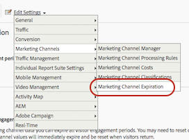

# Scadenza canale di marketing

>[!NOTE]
>
> Per informazioni generali sui canali di marketing, consulta [Introduzione ai canali di marketing](/help/components/c-marketing-channels/c-getting-started-mchannel.md).
>
> Per ottimizzare l’efficacia dei canali di marketing per la funzione Attribuzione e Customer Journey Analytics, abbiamo pubblicato alcune [best practice revisionate](/help/components/c-marketing-channels/mchannel-best-practices.md).

**[!UICONTROL Analytics]** > **[!UICONTROL Admin]** > **[!UICONTROL Report Suites]** > **[!UICONTROL Edit Settings]** > **[!UICONTROL Marketing Channels]** > **[!UICONTROL Marketing Channel Expiration]**.

Scopri come specificare la scadenza, o il periodo di coinvolgimento dei visitatori, per i canali di marketing.

Il coinvolgimento dei visitatori riguarda il tempo che desideri concedere all’attività precedente dei visitatori sul sito, per attribuirla al canale di primo contatto. L’impostazione di scadenza predefinita è 30 giorni.

Se i visitatori utilizzano frequentemente il sito, la finestra di coinvolgimento scorre insieme a loro. Devono essere inattivi per 30 giorni per fare in modo che il periodo scada e che i canali vengano reimpostati. Sia il primo che l’ultimo canale di contatto di un visitatore vengono ripristinati dopo 30 giorni di inattività in tale browser.

Esempio:

* Giorno 1: l’utente arriva al sito sul Display. I canali di primo e ultimo contatto verranno impostati su Display.
* Giorno 2: l’utente accede al sito tramite Ricerca naturale. Il primo contatto rimane Display e l’ultimo contatto viene impostato su Ricerca naturale.
* Giorno 35: l’utente non accede al sito da 33 giorni e ritorna utilizzando la scheda che aveva aperto nel browser. Supponendo un intervallo di coinvolgimento di 30 giorni, la finestra sarebbe stata chiusa e i cookie del canale di marketing sarebbero scaduti. Il canale di primo e ultimo contatto verrà reimpostato e classificato come Aggiornamento sessione poiché l’utente proviene da un URL interno.

## Impostazioni di scadenza canale di marketing

Le impostazioni di scadenza sono le seguenti:

| Campo | Definizione |
|--- |--- |
| Giorni di inattività | Il numero di giorni che devono trascorrere prima della scadenza del coinvolgimento di primo contatto di un visitatore. Il valore predefinito è 30. |
| Mai | Il periodo di coinvolgimento di un visitatore non scade. |
| Ripristino canale | Fa scadere tutti i periodi di coinvolgimento dei visitatori.  Se devi reimpostare tutti i dati del canale di marketing puoi far scadere tutti i periodi di coinvolgimento dei visitatori. Se in precedenza le regole di elaborazione non erano configurate correttamente, potrebbe essere necessario reimpostare i dati. Tutti i valori del primo e dell’ultimo canale di contatto scadranno immediatamente e verranno reimpostati al ritorno dei visitatori. |

## Definire la scadenza canale di marketing {#define-expiration}

Specifica il periodo di coinvolgimento del visitatore.

1. Fai clic su **[!UICONTROL Analytics]** > **[!UICONTROL Admin]** > **[!UICONTROL Report Suites]**.
2. In [!UICONTROL Report Suite Manager], fai clic su **[!UICONTROL Edit Settings]** > **[!UICONTROL Marketing Channels]** > **[!UICONTROL Marketing Channel Expiration]**.

   

3. Configura i campi del periodo di coinvolgimento del visitatore.
4. Fai clic su **[!UICONTROL Save.]**
