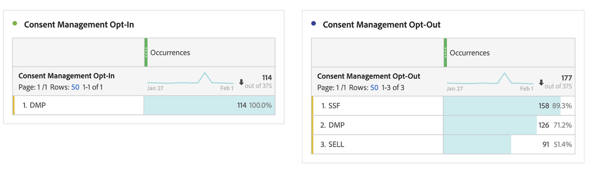

# Rapporti sulla privacy

La funzionalità di reporting sulla privacy consente di abilitare le dimensioni [Consent Management Opt-In](/help/components/dimensions/cm-opt-in.md), [Consent Management Opt-Out](/help/components/dimensions/cm-opt-out.md) e [Ad Platform Consent](/help/components//dimensions/ad-consent.md) da utilizzare nei rapporti.

>[!NOTE]
>
>È stato aggiunto un nuovo flag di consenso per la piattaforma di annunci. Per rendere effettiva questa nuova variabile, devi riabilitare i rapporti sulla privacy dei dati.

Per accedere a questa pagina:

1. Accedi ad Adobe Analytics e passa a **[!UICONTROL Admin]** > **[!UICONTROL Report suites]**.
1. Selezionare una o più suite di rapporti desiderate, quindi selezionare **[!UICONTROL Edit settings]** > **[!UICONTROL Privacy management]** > **[!UICONTROL Privacy reporting]**.

   

1. Fai clic su **[!UICONTROL Enable Data Privacy Reports]**.

   >[!NOTE]
   >
   >Una volta abilitate, queste variabili non possono essere disattivate.

   

1. Una volta abilitata, viene visualizzato un messaggio di conferma. Le dimensioni sono disponibili nei rapporti.

   
