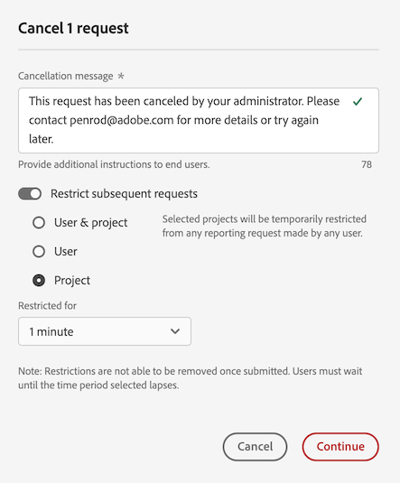
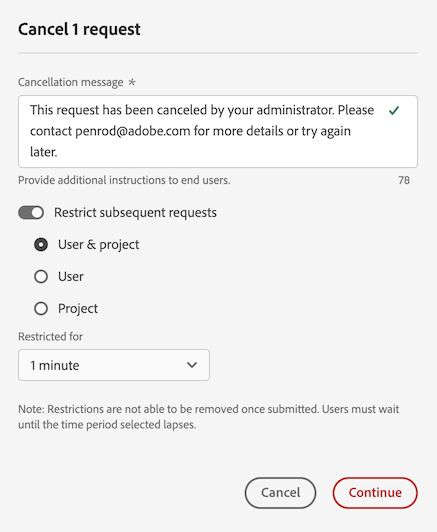

# Annullare le richieste di reporting in Reporting Activity Manager

[!UICONTROL Reporting Activity Manager] consente agli amministratori di diagnosticare e annullare rapidamente le richieste di reporting per risolvere i problemi di capacità di reporting durante i periodi in cui si verificano picchi di reporting.

Quando annulli le richieste di reporting, prendi in considerazione quanto segue:

* Puoi annullare richieste specifiche, annullare tutte le richieste provenienti da un utente specifico o annullare tutte le richieste relative a un progetto specifico.

  Quando annulli una richiesta, l&#39;azione viene registrata nei [registri](/help/admin/tools/logs.md). La colonna [!UICONTROL **Tipo evento**] viene visualizzata come [!UICONTROL **Azione amministratore**] e una descrizione dell&#39;annullamento è disponibile nella colonna [!UICONTROL **Evento**].

* Quando annulli le richieste, puoi anche scegliere di limitare le richieste successive per un determinato periodo di tempo.

  Quando si limita una richiesta successiva, l&#39;azione viene registrata nei [registri](/help/admin/tools/logs.md). La colonna [!UICONTROL **Tipo evento**] viene visualizzata come [!UICONTROL **Azione amministratore**] e una descrizione della restrizione è disponibile nella colonna [!UICONTROL **Evento**].

* Non puoi annullare una richiesta se la colonna [!UICONTROL **Utente**] di una richiesta indica che è [!UICONTROL **Non riconosciuto**]. In questo caso, significa che l’utente si trova in una società di accesso per la quale non disponi di autorizzazioni amministrative.

Per ulteriori informazioni su Reporting Activity Manager, inclusi i vantaggi chiave e i requisiti delle autorizzazioni, consulta [Panoramica di Reporting Activity Manager](/help/admin/tools/reporting-activity-manager/reporting-activity-overview.md).

## Annullare le richieste specifiche

Puoi annullare singole richieste che consumano una grande quantità di capacità di reporting.

1. In Adobe Analytics, vai a **[!UICONTROL Admin]** > **[!UICONTROL Reporting Activity Manager]**.

1. Seleziona la suite di rapporti in cui desideri annullare le richieste di reporting. <!--double-check this step-->

   Per ulteriori informazioni sui dati disponibili in questa pagina, consulta [Visualizzare l’attività di reporting in Reporting Activity Manager](/help/admin/tools/reporting-activity-manager/reporting-activity.md).

1. Seleziona la scheda [!UICONTROL **Richieste**], quindi seleziona una o più richieste.

   <!-- add screenshot -->

1. Seleziona [!UICONTROL **Annulla richieste**].

   Viene visualizzata la finestra di dialogo [!UICONTROL **Annulla _x_ richieste report**].

1. Il campo Messaggio di annullamento mostra il messaggio visualizzato dagli utenti quando le relative richieste vengono annullate. Viene fornito un messaggio predefinito. Puoi aggiornare il messaggio predefinito per fornire ulteriori dettagli.

1. (Facoltativo) Per limitare le richieste future per un determinato periodo di tempo:

   1. Abilita l’opzione per [!UICONTROL **limitare le richieste successive**]

      

   1. Scegli tra le seguenti opzioni:

      | Opzione | Funzione |
      |---------|----------|
      | [!UICONTROL **Utente &amp; progetto**] | Agli utenti associati alle richieste selezionate verrà temporaneamente impedito di eseguire richieste di reporting per i progetti associati. |
      | [!UICONTROL **Utente**] | Agli utenti associati alle richieste selezionate verrà temporaneamente impedito di effettuare qualunque richiesta di reporting. |
      | [!UICONTROL **Progetto**] | I progetti associati alle richieste selezionate saranno temporaneamente esclusi da tutte le richieste di reporting. |
      | [!UICONTROL **Esclusi per**] | Scegli per quanto tempo le richieste saranno limitate. Puoi scegliere 1 minuto (impostazione predefinita), 5 minuti, 10 minuti, 15 minuti o 30 minuti. <!-- double-check this -->
Non puoi rimuovere una restrizione subito dopo averla impostata.
 |

      {style="table-layout:auto"}

1. Seleziona [!UICONTROL **Continua con annullamento**].

   In Analysis Workspace viene visualizzata una notifica per informare gli utenti che la richiesta è stata annullata. Per ulteriori informazioni su come verrà visualizzato in Analysis Workspace, consulta [Cosa accade quando gli utenti accedono a un report annullato](#experience-when-users-access-a-cancelled-report).

## Annullare le richieste per utente

Puoi annullare tutte le richieste associate a uno o più utenti.

1. In Adobe Analytics, vai a **[!UICONTROL Admin]** > **[!UICONTROL Reporting Activity Manager]**.

1. Seleziona la suite di rapporti in cui desideri annullare le richieste di reporting. <!--double-check this step-->

   Per ulteriori informazioni sui dati disponibili in questa pagina, consulta [Visualizzare l’attività di reporting in Reporting Activity Manager](/help/admin/tools/reporting-activity-manager/reporting-activity.md).

1. Seleziona la scheda [!UICONTROL **Utenti**], quindi seleziona uno o più utenti.

   <!-- add screenshot -->

1. Seleziona [!UICONTROL **Annulla richieste**].

   Viene visualizzata la finestra di dialogo [!UICONTROL **Annulla _x_ richieste di report da x utenti**].

1. Il campo Messaggio di annullamento mostra il messaggio visualizzato dagli utenti quando le relative richieste vengono annullate. Viene fornito un messaggio predefinito. Puoi aggiornare il messaggio predefinito per fornire ulteriori dettagli.

1. (Facoltativo) Per limitare le richieste future per un determinato periodo di tempo:

   1. Abilita l’opzione [!UICONTROL **Limita le richieste successive**].

      

   1. Scegli tra le seguenti opzioni:

      | Opzione | Funzione |
      |---------|----------|
      | [!UICONTROL **Utente e progetto**] | Agli utenti selezionati verrà temporaneamente impedito di effettuare qualsiasi richiesta di reporting per i progetti associati. |
      | [!UICONTROL **Utente**] | Agli utenti selezionati verrà temporaneamente impedito di effettuare qualsiasi richiesta di reporting. |
      | [!UICONTROL **Progetto**] | I progetti associati agli utenti selezionati saranno esclusi da qualsiasi richiesta di reporting effettuata da qualsiasi utente. |
      | [!UICONTROL **Limitato per**] | Scegli per quanto tempo le richieste saranno limitate. Puoi scegliere 1 minuto (impostazione predefinita), 5 minuti, 10 minuti, 15 minuti o 30 minuti. <!--double-check this--> 
Non puoi rimuovere una restrizione subito dopo averla impostata.
 |

      {style="table-layout:auto"}

1. Seleziona [!UICONTROL **Continua con annullamento**].

   In Analysis Workspace viene visualizzata una notifica per informare gli utenti che la richiesta è stata annullata. Per ulteriori informazioni su come verrà visualizzato in Analysis Workspace, consulta [Cosa accade quando gli utenti accedono a un report annullato](#experience-when-users-access-a-cancelled-report).

## Annullare richieste per progetto

Puoi annullare tutte le richieste associate a uno o più progetti.

1. In Adobe Analytics, vai a **[!UICONTROL Admin]** > **[!UICONTROL Reporting Activity Manager]**.

1. Seleziona la suite di rapporti in cui desideri annullare le richieste di reporting. <!--double-check this step-->

   Per ulteriori informazioni sui dati disponibili in questa pagina, consulta [Visualizzare l’attività di reporting in Reporting Activity Manager](/help/admin/tools/reporting-activity-manager/reporting-activity.md).

1. Seleziona la scheda [!UICONTROL **Progetti**], quindi seleziona uno o più progetti.

   <!-- add screenshot -->

1. Seleziona [!UICONTROL **Annulla richieste**].

   Viene visualizzata la finestra di dialogo [!UICONTROL **Annulla _x_ richieste di report da x progetti**].

1. Il campo Messaggio di annullamento mostra il messaggio visualizzato dagli utenti quando le relative richieste vengono annullate. Viene fornito un messaggio predefinito. Puoi aggiornare il messaggio predefinito per fornire ulteriori dettagli.

1. (Facoltativo) Per limitare le richieste future per un determinato periodo di tempo:

   1. Abilita l’opzione [!UICONTROL **Limita le richieste successive**].

      

   1. Scegli tra le seguenti opzioni:

      | Opzione | Funzione |
      |---------|----------|
      | [!UICONTROL **Utente e progetto**] | I progetti selezionati saranno temporaneamente esclusi da qualsiasi richiesta di reporting effettuata dagli utenti associati. |
      | [!UICONTROL **Utente**] | Agli utenti associati ai progetti selezionati sarà impedito di effettuare qualsiasi richiesta di reporting. |
      | [!UICONTROL **Progetto**] | I progetti selezionati saranno temporaneamente esclusi da qualunque richiesta di reporting effettuata da qualsiasi utente. |
      | [!UICONTROL **Limitato per**] | Scegli per quanto tempo le richieste saranno limitate. Puoi scegliere 1 minuto (impostazione predefinita), 5 minuti, 10 minuti, 15 minuti o 30 minuti. <!--double-check this--> 
Non puoi rimuovere una restrizione subito dopo averla impostata.
 |

      {style="table-layout:auto"}

1. Seleziona [!UICONTROL **Continua con annullamento**].

   In Analysis Workspace viene visualizzata una notifica per informare gli utenti che la richiesta è stata annullata. Per ulteriori informazioni su come verrà visualizzato in Analysis Workspace, consulta [Cosa accade quando gli utenti accedono a un report annullato](#experience-when-users-access-a-cancelled-report).

## Annullare le richieste per applicazione

Puoi annullare tutte le richieste associate a una o più applicazioni. Quando si annullano richieste associate a un’applicazione, puoi scegliere di limitare ulteriormente le richieste associate a tale applicazione per un determinato periodo di tempo.

Le applicazioni includono gli elementi seguenti:

* Interfaccia utente di Analysis Workspace
* Progetti pianificati in Workspace
* Report Builder
* Interfaccia utente di Builder: segmento, metriche calcolate, annotazioni, pubblico, ecc.
* Chiamate API da 1.4 o 2.0 API
* Avvisi
* Collegamenti Condividi con chiunque
* Qualsiasi altra applicazione che esegue query sul motore di reporting di Analytics

Per annullare le richieste per applicazione:

1. In Adobe Analytics, vai a **[!UICONTROL Admin]** > **[!UICONTROL Reporting Activity Manager]**.

1. Seleziona la connessione in cui desideri annullare le richieste di reporting. <!--double-check this step-->

   Per ulteriori informazioni sui dati disponibili in questa pagina, consulta [Visualizzare l’attività di reporting in Reporting Activity Manager](/help/admin/tools/reporting-activity-manager/reporting-activity.md).

1. Seleziona la scheda [!UICONTROL **Applicazioni**], quindi seleziona una o più applicazioni.

   <!-- add screenshot -->

1. Seleziona [!UICONTROL **Annulla richieste**].

   Viene visualizzata la finestra di dialogo [!UICONTROL **Annulla _x_ richieste di report da x progetti**].

1. Il campo Messaggio di annullamento mostra il messaggio visualizzato dagli utenti quando le relative richieste vengono annullate. Viene fornito un messaggio predefinito. Puoi aggiornare il messaggio predefinito per fornire ulteriori dettagli.

1. (Facoltativo) Per limitare le richieste future per un determinato periodo di tempo:

   1. Abilita l’opzione per [!UICONTROL **limitare le richieste successive**]

      

   1. Scegli tra le seguenti opzioni:

      | Opzione | Funzione |
      |---------|----------|
      | [!UICONTROL **Utente &amp; progetto**] | Le applicazioni selezionate saranno temporaneamente escluse da qualsiasi richiesta di reporting effettuata dagli utenti e dai progetti associati.
Questa è l’opzione meno restrittiva.
 |
      | [!UICONTROL **Utente**] | Agli utenti associati alle applicazioni selezionate verrà impedito di effettuare qualunque richiesta di reporting. |
      | [!UICONTROL **Progetto**] | I progetti associati alle applicazioni selezionate saranno esclusi da qualunque richiesta di reporting effettuata da qualsiasi utente. |
      | [!UICONTROL **Esclusi per**] | Scegli per quanto tempo le richieste saranno limitate. Puoi scegliere 1 minuto (impostazione predefinita), 5 minuti, 10 minuti, 15 minuti o 30 minuti. <!--double-check this--> 
Non puoi rimuovere una restrizione subito dopo averla impostata.
 |

      {style="table-layout:auto"}

1. Seleziona [!UICONTROL **Continua con annullamento**].

   Nell’applicazione (ad esempio in Analysis Workspace) viene visualizzata una notifica che informa gli utenti che la richiesta è stata annullata. Per ulteriori informazioni su come verrà visualizzato in Analysis Workspace, consulta [Cosa accade quando gli utenti accedono a un report annullato](#experience-when-users-access-a-cancelled-report).

## Cosa accade quando gli utenti accedono a un report annullato

In Analysis Workspace, quando gli utenti tentano di accedere a un report o a una visualizzazione interessati da un annullamento, vedono i seguenti messaggi:

### Messaggio sul progetto

Quando gli utenti tentano di accedere a un progetto interessato da un annullamento, vedono un messaggio che li informa che il rapporto è temporaneamente limitato:

### Messaggio sulla visualizzazione

Quando gli utenti tentano di accedere a una visualizzazione interessata da un annullamento, vedono un messaggio che li informa che l’elaborazione dei dati per il rapporto è temporaneamente limitata:

