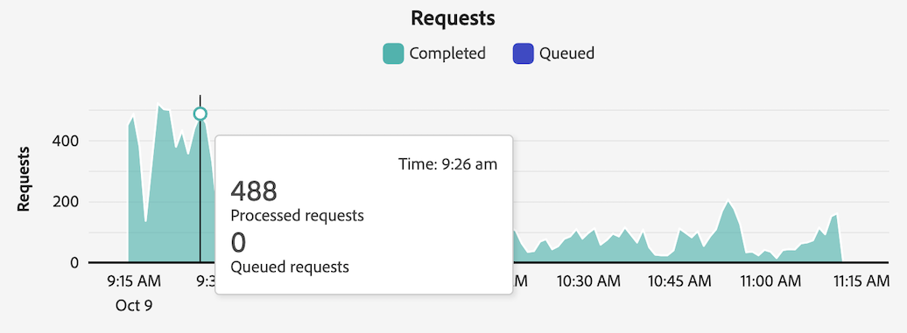

# Visualizzare le attività di reporting in Reporting Activity Manager

[!UICONTROL Reporting Activity Manager] consente agli amministratori di diagnosticare e risolvere rapidamente i problemi di capacità di reporting durante i periodi in cui si verificano picchi di reporting.

Per ulteriori informazioni su Reporting Activity Manager, inclusi i vantaggi chiave e le autorizzazioni necessarie, consulta [Panoramica di Reporting Activity Manager](/help/admin/tools/reporting-activity-manager/reporting-activity-overview.md).

## Visualizzare l’attività di reporting per tutte le suite di rapporti {#view-all-report-suites}

<!-- markdownlint-disable MD034 -->

>[!CONTEXTUALHELP]
>id="cja_tools_reportingactivitymanager_connections"
>title="Connessioni"
>abstract="Questa tabella mostra le connessioni per le quali si dispone dei diritti per gestire l’attività di reporting. Le informazioni su ciascuna connessione sono disponibili in ogni colonna della tabella."

<!-- markdownlint-enable MD034 -->

<!-- markdownlint-disable MD034 -->

>[!CONTEXTUALHELP]
>id="tools_reportingactivitymanager_connections"
>title="Connessioni"
>abstract="Questa tabella mostra le connessioni per le quali si dispone dei diritti per gestire l’attività di reporting. Le informazioni su ciascuna connessione sono disponibili in ogni colonna della tabella."

<!-- markdownlint-enable MD034 -->

1. In Adobe Analytics, vai a **[!UICONTROL Admin]** > **[!UICONTROL Reporting Activity Manager]**.

   Viene visualizzato un elenco delle suite di rapporti di base abilitate.

   

1. (Facoltativo) Puoi cercare o filtrare l’elenco delle suite di rapporti:

   * Utilizza il campo di ricerca per cercare una suite di rapporti specifica. Inizia a digitare il nome o l’ID della suite di rapporti e l’elenco degli aggiornamenti della suite di rapporti durante la digitazione.

   * Seleziona l’icona [!UICONTROL **Filtro**]  per espandere l’elenco delle opzioni filtro. Puoi filtrare per [!UICONTROL **Preferiti**] o [!UICONTROL **Stato**].

     Per contrassegnare una suite di rapporti come preferita, seleziona l’icona a forma di stella a sinistra del nome della suite di rapporti.

     <!-- (does this option still exist?) 1. (Optional) Select **[!UICONTROL Refresh]** at the top-right to refresh the data. -->

1. Visualizza le informazioni sull’utilizzo di ogni suite di rapporti. I dati mostrati nella tabella rappresentano l’attività di reporting per la suite di rapporti al momento dell’ultimo caricamento della pagina.

   Sono disponibili le seguenti colonne:

   | Elemento nell’interfaccia utente | Descrizione |
   | --- | --- |
   | **[!UICONTROL Report Suite]** | La suite di rapporti di base di cui si sta monitorando l’attività di reporting. |
   | **[!UICONTROL Virtual report suites]** | Mostra tutte le suite di rapporti virtuali che confluiscono in questa suite di rapporti di base. Le suite di rapporti virtuali aggiungono complessità alle richieste di reporting a causa di ulteriori livelli di filtro e di segmentazione applicati. Tutte le richieste provenienti dalle suite di rapporti virtuali vengono combinate nella suite di rapporti di base. |
   | **[!UICONTROL Capacity utilization]** | La percentuale in tempo reale della capacità di reporting della suite di rapporti in uso. 
**Nota**: una capacità di utilizzo pari al 100% non indica necessariamente che è necessario avviare immediatamente l’annullamento delle richieste di reporting. La capacità di utilizzo del 100% può essere integra se il tempo medio di attesa è ragionevole. D’altra parte, una capacità di utilizzo del 100% potrebbe indicare un problema se anche il numero di richieste in coda è in crescita.
 |
   | **[!UICONTROL Queued requests]** | Numero di richieste in attesa di elaborazione. <!-- ??? --> |
   | **[!UICONTROL Queue wait time]** | Tempo medio di attesa prima dell’inizio dell’elaborazione delle richieste. <!-- ???? --> |
   | **[!UICONTROL Status]** | Gli stati possibili sono: <ul><li>[!UICONTROL **Attivo**] (blu): i rapporti sono stati eseguiti sulla suite di rapporti nelle ultime 2 ore. I dati mostrati nella tabella rappresentano la capacità di reporting per la suite di rapporti al momento dell’ultimo caricamento della pagina.</li><li>[!UICONTROL **Inattivo**] (grigio): non sono stati eseguiti rapporti sulla suite di rapporti nelle ultime 2 ore, pertanto non vengono visualizzati dati per la suite di rapporti.</li></ul> |

   {style="table-layout:auto"}

## Visualizzare l’attività di reporting per una singola suite di rapporti

1. In Adobe Analytics, seleziona [!UICONTROL **Amministratore**] > [!UICONTROL **Gestione attività di reporting**].

1. Seleziona il titolo collegato della suite di rapporti per la quale desideri visualizzare i dettagli.

   I dati dell’attività di reporting vengono visualizzati per la suite di rapporti selezionata.

   <!-- Need to update this screenshot:  -->

1. (Facoltativo) Quando una connessione viene caricata per la prima volta in Reporting Activity Manager, i dati visualizzati rappresentano le metriche di utilizzo correnti. Per visualizzare le metriche aggiornate dopo il caricamento iniziale, selezionare il pulsante [!UICONTROL **Aggiorna**] per aggiornare manualmente la pagina.

1. Utilizza i grafici e la tabella disponibili per comprendere l’attività di reporting nella suite di rapporti.

   * [Visualizzare i grafici](#view-graphs)

   * [Visualizzare la tabella](#view-table)

### Visualizzare i grafici

Sono disponibili i seguenti grafici per comprendere meglio l’attività che si verifica nella suite di rapporti.

Se i grafici non sono visibili, seleziona il pulsante [!UICONTROL **Mostra grafici**].

#### Grafico Utilizzo {#utilization}

Il grafico Utilizzo mostra l’utilizzo dei rapporti per la suite di rapporti selezionata nelle ultime 2 ore.

Passa il puntatore sul grafico per visualizzare i punti nel tempo in cui la percentuale di capacità di utilizzo era più elevata nel minuto interessato.

* **Asse X**: capacità di utilizzo delle funzioni di reporting nelle ultime 2 ore.
* **Asse Y**: percentuale della capacità di utilizzo delle funzioni di reporting, minuto per minuto.

  

#### Grafico Utenti distinti

Il grafico Utenti distinti mostra l’attività di reporting per la suite di rapporti selezionata nelle ultime 2 ore.

Passa il puntatore sul grafico per visualizzare i punti nel tempo in cui il numero massimo di utenti èra più elevato nel minuto interessato.

* **Asse X**: l’attività di reporting nell’ultimo arco temporale di 2 ore.
* **Asse Y**: numero di utenti che hanno effettuato richieste di reporting, minuto per minuto.

  

#### Grafico Richieste

Il grafico Richieste mostra il numero di richieste elaborate e in coda per la suite di rapporti selezionata nelle ultime 2 ore.

Passa il puntatore sul grafico per visualizzare i punti nel tempo in cui il numero massimo di richieste èra più elevato nel minuto interessato.

* **Asse X**: numero di richieste elaborate e completate negli ultimi due ore.
* **Asse Y**: numero di richieste elaborate (in verde) e di richieste in coda (in viola), minuto per minuto.

  

#### Grafico In coda

Il grafico di accodamento mostra il tempo medio di attesa della coda (in secondi) per le richieste di reporting per la suite di rapporti selezionata nelle ultime 2 ore.

Passa il puntatore sul grafico per visualizzare i punti nel tempo in cui il tempo medio di attesa massimo èra più elevato nel minuto interessato.

* **Asse X**: tempo medio di attesa in coda per le richieste di reporting nell’ultimo arco temporale di 2 ore.
* **Asse Y**: tempo medio di attesa (in secondi).

  

### Visualizzare la tabella {#view-table}

Quando visualizzi la tabella, prendi in considerazione quanto segue:

* Puoi scegliere di visualizzare i dati selezionando una delle schede seguenti nella parte superiore della tabella dati: [!UICONTROL **Richiesta**], [!UICONTROL **Utente**], [!UICONTROL **Progetto**] o [!UICONTROL **Applicazione**].

* Puoi cercare o filtrare l’elenco delle connessioni:

   * Utilizza il campo di ricerca per cercare un rapporto specifico. Inizia a digitare il nome o l’ID della connessione e l’elenco delle connessioni si aggiorna durante la digitazione.

   * Seleziona l’icona [!UICONTROL **Filtro**]  per espandere l’elenco delle opzioni filtro. Puoi filtrare per [!UICONTROL **Stato**], [!UICONTROL **Complessità**], [!UICONTROL **Applicazione**], [!UICONTROL **Utente**] o [!UICONTROL **Progetto**].

   * Puoi selezionare [!UICONTROL **Nascondi grafici**] per visualizzare solo la tabella.

#### Visualizzare i dati in base alla richiesta

Quando selezioni la scheda [!UICONTROL **Richiesta**], nella tabella risultano disponibili le colonne seguenti:

| Colonna | Descrizione |
| --- | --- |
| [!UICONTROL **ID richiesta**] | ID univoco che può essere utilizzato per la risoluzione dei problemi. Per copiare l’ID, seleziona la richiesta, quindi seleziona l’opzione [!UICONTROL **Copia ID richiesta**]. |
| [!UICONTROL **Tempo di esecuzione**] | Da quanto tempo è in esecuzione la richiesta. |
| [!UICONTROL **Ora di inizio**] | Ora in cui è iniziata l’elaborazione della richiesta (in base all’ora locale dell’amministratore). |
| [!UICONTROL **Tempo di attesa**] | Tempo di attesa della richiiesta prima dell’elaborazione. Questo valore è generalmente “0” quando c’è abbastanza capacità. |
| [!UICONTROL **Applicazione**] | Le applicazioni supportate dalla [!UICONTROL Reporting Activity Manager] sono: <ul><li>Interfaccia utente di Analysis Workspace</li><li>Progetti pianificati in Workspace</li><li>Report Builder</li><li>Interfaccia utente di Builder: segmento, metriche calcolate, annotazioni, pubblico, ecc.</li><li>Chiamate API da 1.4 o 2.0 API</li><li>Avvisi</li><li>Collegamenti Condividi con chiunque</li><li>Qualsiasi altra applicazione che esegue query sul motore di reporting di Analytics</li></ul> |
| [!UICONTROL **Utente**] | L’utente che ha avviato la richiesta. 
**Nota:** se il valore di questa colonna è [!UICONTROL **Non riconosciuto**], significa che l&#39;utente si trova in una società di accesso per la quale non si dispone di autorizzazioni amministrative.
 |
| [!UICONTROL **Progetto**] | Nomi di progetto Workspace salvati, ID di report API e così via (I metadati possono variare tra le varie applicazioni). |
| [!UICONTROL **Stato**] | Indicatori di stato: <ul><li>**In esecuzione**: richiesta in fase di elaborazione.</li><li>**In sospeso**: richiesta in attesa di elaborazione.</li></ul> |
| [!UICONTROL **Complessità**] | Il tempo di elaborazione non è uguale per tutte le richieste. La complessità delle richieste può essere utile per avere un’idea generale sul tempo necessario per elaborarle. 
I valori possibili includono:
 <ul><li>[!UICONTROL **Basso**]</li><li>[!UICONTROL **Medio**]</li><li>[!UICONTROL **Alto**]</li></ul>Questo valore è influenzato dai valori delle colonne seguenti:<ul><li>[!UICONTROL **Limiti del mese**]</li><li>[!UICONTROL **Colonne**]</li><li>[!UICONTROL **Segmenti**]</li></ul> |
| [!UICONTROL **Limiti del mese**] | Il numero di mesi inclusi in una richiesta. Più alti sono i limiti mensili, maggiore è la complessità della richiesta. |
| [!UICONTROL **Colonne**] | Il numero di metriche e raggruppamenti nella richiesta. Più alto è il numero di colonne, maggiore è la complessità della richiesta. |
| [!UICONTROL **Segmenti**] | Il numero di segmenti applicati alla richiesta. Più alto è il numero di segmenti, maggiore è la complessità della richiesta. |

{style="table-layout:auto"}

#### Visualizza dati in base all’utente

Quando selezioni la scheda [!UICONTROL **Utente**], nella tabella sono disponibili le colonne seguenti:

| Colonna | Descrizione |
| --- | --- |
| [!UICONTROL **Utente**] | L’utente che ha avviato la richiesta. Se il valore di questa colonna è [!UICONTROL **Non riconosciuto**], significa che l’utente si trova in una società di accesso per la quale non disponi di autorizzazioni amministrative. |
| [!UICONTROL **Numero di richieste**] | Numero di richieste avviate dall’utente. |
| [!UICONTROL **Numero di progetti**] | Numero di progetti associati all’utente. <!-- ??? --> |
| [!UICONTROL **Applicazione**] | Le applicazioni supportate dalla [!UICONTROL Reporting Activity Manager] sono: <ul><li>Interfaccia utente di Analysis Workspace</li><li>Progetti pianificati in Workspace</li><li>Report Builder</li><li>Interfaccia utente di Builder: segmento, metriche calcolate, annotazioni, pubblico, ecc.</li><li>Chiamate API da 1.4 o 2.0 API</li><li>Avvisi</li><li>Collegamenti Condividi con chiunque</li><li>Qualsiasi altra applicazione che esegue query sul motore di reporting di Analytics</li></ul> |
| [!UICONTROL **Complessità media**] | Complessità media delle richieste avviate dall’utente. 
Il tempo di elaborazione non è uguale per tutte le richieste. La complessità delle richieste può essere utile per avere un’idea generale sul tempo necessario per elaborarle.

Il valore di questa colonna si basa su un punteggio determinato dai valori delle colonne seguenti:
<ul><li>[!UICONTROL **Media limiti mese**]</li><li>[!UICONTROL **Media colonne**]</li><li>[!UICONTROL **Media segmenti**]</li></ul> |
| [!UICONTROL **Media limiti mese**] | Numero medio di mesi inclusi nelle richieste. Più alti sono i limiti mensili, maggiore è la complessità della richiesta. |
| [!UICONTROL **Media colonne**] | Numero medio di metriche e raggruppamenti nelle richieste incluse. Più alto è il numero di colonne, maggiore è la complessità della richiesta. |
| [!UICONTROL **Media segmenti**] | Numero medio di segmenti applicati alle richieste incluse. Più alto è il numero di segmenti, maggiore è la complessità della richiesta. |

{style="table-layout:auto"}

#### Visualizzare i dati in base al progetto

Quando selezioni la scheda [!UICONTROL **Progetto**], nella tabella risultano disponibili le colonne seguenti:

| Colonna | Descrizione |
| --- | --- |
| [!UICONTROL **Progetto**] | Progetto in cui sono state avviate le richieste. |
| [!UICONTROL **Numero di richieste**] | Numero di richieste associate al progetto. |
| [!UICONTROL **Numero di utenti**] | Numero di utenti associati al progetto. <!-- ??? --> |
| [!UICONTROL **Applicazione**] | Le applicazioni supportate dalla [!UICONTROL Reporting Activity Manager] sono: <ul><li>Interfaccia utente di Analysis Workspace</li><li>Progetti pianificati in Workspace</li><li>Report Builder</li><li>Interfaccia utente di Builder: segmento, metriche calcolate, annotazioni, pubblico, ecc.</li><li>Chiamate API da 1.4 o 2.0 API</li><li>Avvisi</li><li>Collegamenti Condividi con chiunque</li><li>Qualsiasi altra applicazione che esegue query sul motore di reporting di Analytics</li></ul> |
| [!UICONTROL **Complessità media**] | Complessità media delle richieste incluse nel progetto. 
Il tempo di elaborazione non è uguale per tutte le richieste. La complessità delle richieste può essere utile per avere un’idea generale sul tempo necessario per elaborarle.

Il valore di questa colonna si basa su un punteggio determinato dai valori delle colonne seguenti:
<ul><li>[!UICONTROL **Media limiti mese**]</li><li>[!UICONTROL **Media colonne**]</li><li>[!UICONTROL **Media segmenti**]</li></ul> |
| [!UICONTROL **Media limiti mese**] | Numero medio di mesi inclusi nelle richieste. Più alti sono i limiti mensili, maggiore è la complessità della richiesta. |
| [!UICONTROL **Media colonne**] | Numero medio di metriche e raggruppamenti nelle richieste incluse. Più alto è il numero di colonne, maggiore è la complessità della richiesta. |
| [!UICONTROL **Media segmenti**] | Numero medio di segmenti applicati alle richieste incluse. Più alto è il numero di segmenti, maggiore è la complessità della richiesta. |

{style="table-layout:auto"}

#### Visualizzare i dati in base all’applicazione

Quando selezioni la scheda [!UICONTROL **Applicazione**], nella tabella risultano disponibili le colonne seguenti:

| Colonna | Descrizione |
| --- | --- |
| [!UICONTROL **Applicazione**] | Applicazione in cui sono state avviate le richieste. |
| [!UICONTROL **Numero di richieste**] | Numero di richieste associate all’applicazione. |
| [!UICONTROL **Numero di utenti**] | Numero di utenti associati all’applicazione. <!--???--> |
| [!UICONTROL **Numero di progetti**] | Numero di progetti associati all’applicazione. <!--???--> |
| [!UICONTROL **Complessità media**] | Complessità media delle richieste associate all’applicazione. 
Il tempo di elaborazione non è uguale per tutte le richieste. La complessità delle richieste può essere utile per avere un’idea generale sul tempo necessario per elaborarle.

Il valore di questa colonna si basa su un punteggio determinato dai valori delle colonne seguenti:
Il valore di questa colonna si basa su un punteggio determinato dai valori delle colonne seguenti:<ul><li>[!UICONTROL **Media limiti mese**]</li><li>[!UICONTROL **Media colonne**]</li><li>[!UICONTROL **Media segmenti**]</li></ul> |
| [!UICONTROL **Media limiti mese**] | Numero medio di mesi inclusi nelle richieste. Più alti sono i limiti mensili, maggiore è la complessità della richiesta. |
| [!UICONTROL **Media colonne**] | Numero medio di metriche e raggruppamenti nelle richieste incluse. Più alto è il numero di colonne, maggiore è la complessità della richiesta. |
| [!UICONTROL **Media segmenti**] | Numero medio di segmenti applicati alle richieste incluse. Più alto è il numero di segmenti, maggiore è la complessità della richiesta. |

{style="table-layout:auto"}

<!--

## Frequently asked questions {#faq}

| Question | Answer |
| --- | --- |
|  |  |

{style="table-layout:auto"}

-->