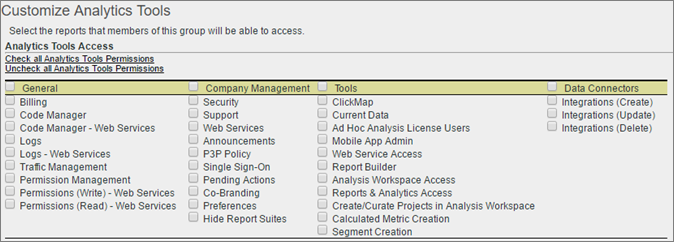

# Personalizzare le autorizzazioni degli strumenti di Analytics

>[!IMPORTANT]
>
>User and product management is moving to the [Admin Console](https://helpx.adobe.com/enterprise/using/admin-console.html). Adobe ti informerà quando sarà il momento di eseguire la migrazione degli utenti. After all customers have migrated, help content for **[!UICONTROL Analytics]** &gt; **[!UICONTROL Admin Tools]** &gt; **[!UICONTROL User Management]** will be retired.
>[!IMPORTANT]
>
>User and product management is moving to the [Admin Console](https://helpx.adobe.com/enterprise/using/admin-console.html). Adobe ti informerà quando sarà il momento di eseguire la migrazione degli utenti. After all customers have migrated, help content for **[!UICONTROL Analytics]** &gt; **[!UICONTROL Admin Tools]** &gt; **[!UICONTROL User Management]** will be retired.

Attiva le autorizzazioni degli utenti per gli elementi generali (fatturazione, registri ecc.), gestione società, strumenti, accesso ai servizi Web, Report Builder e integrazione dei Data Connectors.

**[!UICONTROL User Management]** &gt; **[!UICONTROL Groups]** &gt; **[!UICONTROL Report Access]** &gt; **[!UICONTROL Analytics Tools]** &gt; **[!UICONTROL Customize]**

>[!NOTE]
>
>La release Autunno 2016 (ottobre 20) ha apportato modifiche alla gestione dei gruppi. See [Administrative Changes - Fall 2016](../../../admin/user-management2/c-user-management/permissions-changes.md#concept_86581595B86B47D5B8F90282FC3E31EF) for a summary of changes.

## Accesso ai rapporti - Strumenti di Analytics

Click **[!UICONTROL Customize]** to select items to which this group will have access.

## Descrizioni campo

The settings on this page pertain to the report suites selected on the [!UICONTROL Define User Groups] page.

| Elemento | Descrizione |
|--- |--- |
| **Generale** |  |
| [Fatturazione](../../../admin/admin/billing-admin.md) | Abilita l'accesso alle informazioni di fatturazione, inclusi i dettagli sul traffico per ogni suite di rapporti. |
| [Code Manager](../../../admin/admin/code-manager-admin.md) | Abilita l'autorizzazione per scaricare il codice di raccolta dati per le piattaforme Web e mobili. |
| Gestione codici - Servizi Web | Consente a un utente non amministrativo di accedere a Code Manager tramite i servizi Web. |
| [Registri](../../../admin/admin/logs.md) | Abilita l'autorizzazione per i file, che consentono di vedere quando gli utenti accedono, l'utilizzo, l'accesso, le suite di rapporti e l'amministratore. |
| Registri - Servizi Web | Consente a un utente non amministrativo di accedere ai registri di Admin Tools tramite i servizi Web. |
| [Gestione traffico](../../../admin/c-traffic-management/traffic-management.md) | La pagina Gestione traffico consente di specificare le modifiche previste al volume del traffico. |
| Gestione delle autorizzazioni | Consente agli utenti non amministratori di accedere alle pagine di gestione utenti in Strumenti di amministrazione. Questi utenti dispongono di autorizzazioni di lettura ma non dispongono delle autorizzazioni di scrittura. |
| Autorizzazioni (scrittura) - Servizi Web | Concede agli utenti non amministratori le impostazioni di lettura e scrittura in Gestione utente in Servizi Web. Questa impostazione fa riferimento in modo specifico alle azioni di autorizzazione indicate nell'API amministratore. |
| Autorizzazioni (Leggi) - Servizi Web | Consente a un utente non amministrativo di visualizzare le impostazioni delle autorizzazioni in Gestione utente in Servizi Web. Questa impostazione fa riferimento in modo specifico alle azioni di autorizzazione indicate nell'API amministratore. |
| **Gestione società** |  |
| [Sicurezza](../../../admin/company/security-manager.md) | Concede l'autorizzazione alla pagina di Gestione della sicurezza per controllare l'accesso ai dati di reporting. Le opzioni includono password complesse, scadenza password, limitazioni di accesso IP e limitazioni per il dominio e-mail. |
| Informazioni sul supporto | Concede l'autorizzazione alle informazioni assistenza in Impostazioni società. |
| [Servizi web](../../../admin/company/web-services-admin.md) | Allows access to the Web Services page in the Admin Tools interface ([!UICONTROL Company Settings] &gt; [!UICONTROL Web Services]). L'API dei servizi Web fornisce accesso programmatico ai servizi Adobe Analytics che consentono di duplicare le funzionalità disponibili tramite l'interfaccia utente. |
| Annunci | Solo versione 14. |
| Single Sign-On (legacy) | Consente di accedere alla pagina Single Sign-On in Strumenti di amministrazione. **Nota:** Il single sign-on in Adobe Experience Cloud viene implementato mediante [il collegamento](https://marketing.adobe.com/resources/help/en_US/mcloud/organizations.html) dell'account tra Experience Cloud e le soluzioni. |
| [Azioni in sospeso](../../../admin/company/pending-actions-admin.md) | Grants permission to manage pending actions in [!UICONTROL Company Settings]. |
| [Co-branding](../../../admin/company/co-branding-admin.md) | Concede l'autorizzazione al marchio di Analytics. |
| [Preferenze](../../../admin/admin/preferences-manager.md) | Grants permission to the [!UICONTROL Preference Manager]. |
| [Nascondi suite di rapporti](../../../admin/company/c-hide-report-suites.md) | Concede l'autorizzazione per nascondere le suite di rapporti nell'interfaccia utente di Adobe Analytics. |
| **Strumenti** | Queste impostazioni concedono l'accesso agli strumenti Analytics (interfacce e applicazioni) e alle funzionalità avanzate come segmentazione e metriche calcolate. |
| [ClickMap](https://marketing.adobe.com/resources/help/en_US/sc/user/clickmap.html) | Displays  ClickMap in the [!UICONTROL Tools] menu in the header. **(Nota:** Adobe consiglia di utilizzare [la Activity Map](https://marketing.adobe.com/resources/help/en_US/analytics/activitymap/activitymap-enable.html). |
| [Dati correnti](https://marketing.adobe.com/resources/help/en_US/reference/data_latency.html) | Concede l'autorizzazione per utilizzare la funzione Dati corrente nei rapporti. |
| [Ad Hoc Analysis](https://marketing.adobe.com/resources/help/en_US/dsc/) License Users | Grants permission to access [!UICONTROL Ad Hoc Analysis]. |
| Accesso al servizio Web | Abilita l'accesso ai servizi Web per i non amministratori. Genera le credenziali del servizio Web. |
| [Generatore di report](https://marketing.adobe.com/resources/help/en_US/arb/setup.html) | Grants members of this group access to [!UICONTROL Report Builder] licenses. |
| [Accesso ad Analysis Workspace](https://marketing.adobe.com/resources/help/en_US/analytics/analysis-workspace/) | Grants users access to Analysis Workspace, the recommended reporting interface for [!DNL Adobe Analytics]. |
| [Reports &amp; Analytics](https://marketing.adobe.com/resources/help/en_US/sc/user/) | Consente agli utenti di accedere a Reporting e analisi. |
| [Creare/curare progetti](https://marketing.adobe.com/resources/help/en_US/analytics/analysis-workspace/curate.html) in Analysis Workspace | Concede agli utenti l'autorizzazione per creare e curare progetti in Analysis Workspace. |
| [Creazione di metriche calcolate](https://marketing.adobe.com/resources/help/en_US/analytics/calcmetrics/) | Concede agli utenti l'autorizzazione per creare metriche calcolate. |
| [Creazione di segmenti](https://marketing.adobe.com/resources/help/en_US/analytics/segment/) | Concede agli utenti l'autorizzazione per creare segmenti. |
| **Data Connectors** |  |
| Integrazioni (Create, Update, o Delete) | Concede l'autorizzazione per creare, aggiornare ed eliminare integrazioni del connettore dati. |
