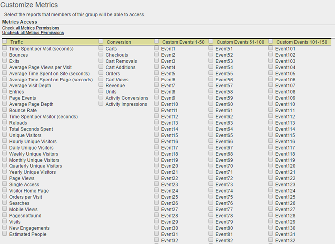

# Personalizzare le autorizzazioni delle metriche

>[!IMPORTANT]
>
>La gestione di utenti e prodotti sta passando all&#39; [Admin Console](https://helpx.adobe.com/it/enterprise/using/admin-console.html). Adobe ti avviserà quando è il tuo momento di eseguire la migrazione degli utenti. Dopo la migrazione di tutti i clienti, i contenuti della guida per **[!UICONTROL Analytics]** > **[!UICONTROL Admin]** > **[!UICONTROL All admin]** > **[!UICONTROL User management]** verranno ritirati.

Attiva le autorizzazioni per le metriche del traffico, le metriche di conversione, gli eventi personalizzati, gli eventi delle soluzioni e in base al contenuto.

**[!UICONTROL User Management]** >  **[!UICONTROL Groups]** >  **[!UICONTROL Report Access]** >  **[!UICONTROL Metrics]** >  **[!UICONTROL Customize]**

Le impostazioni nella pagina Personalizza metriche si applicano alle suite di rapporti selezionate nella pagina [!UICONTROL Define User Groups] .

## Eventi delle soluzioni

Oltre a [Eventi personalizzati](https://docs.adobe.com/content/help/it-IT/analytics/implementation/vars/page-vars/events/event-serialization.html), questa categoria include gli eventi delle soluzioni Analytics, tra cui Experience Manager (AEM), Advertising Cloud (AMO), Mobile, Video e Social.) A ogni gruppo personalizzato con qualsiasi metrica verranno aggiunti come nuove metriche tutti gli eventi della soluzione Analytics.

Puoi impostare le autorizzazioni per gli eventi personalizzati e gli eventi delle soluzioni Analytics (AEM, AMO, Mobile, Video e Social).

A ogni gruppo personalizzato con qualsiasi metrica verranno aggiunti come nuove metriche tutti gli eventi della soluzione Analytics.

Per informazioni sulle metriche utilizzate in Analytics, consulta [Panoramica delle metriche](/help/components/metrics/overview.md) .

## In base al contenuto

In base al contenuto sono incluse le variabili che consentono di gestire le autorizzazioni sulle metriche relative alle integrazioni di soluzioni Experience Cloud. Puoi gestire le autorizzazioni su [!DNL Social], [!DNL Mobile] o qualsiasi altro dato inserito tramite un&#39;integrazione [!DNL Experience Cloud]. Queste verranno abilitate per impostazione predefinita.
