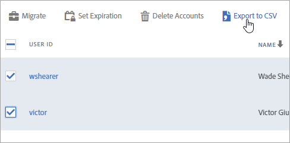

# Eseguire la migrazione degli account utente di Analytics per Enterprise e Federated ID{#migrate-analytics-user-accounts-for-enterprise-and-federated-ids}

Come eseguire la migrazione degli account utente di Analytics come Enterprise o Federated ID all’Admin Console.

## Prerequisiti {#prereqs}

Prerequisiti per la gestione degli utenti nell’Admin Console.

Per domini e directory nuovi, seguire i passaggi per:

* Impostare una directory
* Impostare domini
* Collegare domini a directory

Consulta [Impostazione di un sistema di gestione delle identità](https://helpx.adobe.com/enterprise/using/set-up-identity.html) per ulteriore assistenza.

Se un’altra unità aziendale o un altro team avevano già creato una directory in un’altra organizzazione, seguire i passaggi descritti in [trusting di directory](https://helpx.adobe.com/enterprise/using/set-up-identity.html#Directorytrusting) per stabilire la directory nell’organizzazione che stai utilizzando per Analytics.

## Eseguire la migrazione degli account utente per Enterprise e Federated ID {#task-0cfb3e4400fd4ab58e4d9704528b05fa}

In questa procedura, potrai:

* Scaricate un elenco di login utente da **[!UICONTROL Analytics]** &gt; **[!UICONTROL Analytics Users & Assets]**.

* Download a current users list from the **[!UICONTROL Admin Console]** &gt; **[!UICONTROL Users]**.

* Confrontare gli elenchi (cercando i duplicati in modo da evitare di sovrascrivere dati di account nell’Admin Console).
* Upload a finished [!DNL .csv] (from **[!UICONTROL Admin Console]** &gt; **[!UICONTROL Users]**) with Enterprise ID or Federated ID users to the Admin Console.

Se ti occorre trasferire gli account utente Adobe ID esistenti a un Enterprise ID o Federated ID, contatta l’Assistenza clienti di Adobe e richiedi un [trasferimento di massa delle identità utente](https://helpx.adobe.com/enterprise/using/bulk-operations.html).

**Per eseguire la migrazione degli account utente**

1. Scarica il file degli accessi utente di Analytics ([!DNL User Logins List.tab]) dalla Gestione utenti di Analytics, utilizzando uno dei metodi seguenti (a seconda che la migrazione degli utenti sia già stata effettuata o meno).
   1. *Prima della migrazione,* accedi a **[!UICONTROL Admin]** &gt; **[!UICONTROL User Management (Legacy)]** &gt; **[!UICONTROL Edit Users]**, quindi fai clic su **[!UICONTROL Download Report]**.

      

      Il collegamento Scarica rapporto viene visualizzato solo per i clienti che non hanno eseguito la migrazione degli utenti.

   1. *Se avete già migrato degli utenti,* andate a **[!UICONTROL Analytics]** &gt; **[!UICONTROL Analytics users and Assets]**.

      

   1. Nella [!DNL Users] pagina, selezionate gli utenti, quindi fate clic su **[!UICONTROL Export to CSV]**.

      

   1. Open the downloaded [!DNL User List.csv] file in Excel.

      Preparatevi a copiare i valori *`Email`*, *`First Name`* e *`Last Name`* in un [!DNL sample.csv] file (descritto nel passaggio successivo).

      >[!IMPORTANT]
      >
      >I valori nel file CSV devono essere delimitati da virgole.

      **Suggerimento**: durante questo passaggio, Adobe consiglia di ottimizzare l’elenco di utenti per assicurare che solo gli utenti con un ID e-mail valido siano inclusi nella migrazione di Enterprise ID o Federated ID.

1. Nell’Admin Console, scarica un elenco di utenti di Admin Console:

   1. Navigate to [Admin Console](http://adminconsole.adobe.html/#) &gt; **[!UICONTROL Users]**, then click [Export users list to CSV](https://helpx.adobe.com/enterprise/using/users.html).

      

   1. Compare the two files: the existing Admin Console users in the exported [!DNL .csv] file ( [!DNL sample.csv], in this example) with the users in the Analytics [!DNL User Logins List.csv] file.

      >[!IMPORTANT]
      >
      >If you find duplicates, delete them from the Analytics [!DNL User Logins List.csv] file. Questo passaggio aiuta a evitare la sovrascrittura delle autorizzazioni utente esistenti di Experience Cloud nell’Admin Console e ti fornisce un elenco di account da trasferire.

1. Scarica il modello CSV dall’Admin Console:
   1. Nella scheda Utenti, fate clic su **[!UICONTROL Add users by CSV]**, quindi **[!UICONTROL Download CSV Template]**.

      

   1. Scegli **[!UICONTROL Standard Template]**.

      Questo passaggio ti permette di scaricare un file modello [!DNL sample.csv].

      

1. Copiate i valori di *`Email`*, *`First Name`* e *`Last Name`* colonna [!DNL User Logins List.tab] nelle colonne corrispondenti nel [!DNL sample.csv] modello.

   **Esempio di file modello**

   

1. Nel modello ([!DNL sample.csv]), completa i seguenti campi obbligatori:

<table id="table_1B5EEFDB5BD8436EB760BE5FFAB1CF02"> 
 <thead> 
  <tr> 
   <th colname="col1" class="entry"> Campo </th> 
   <th colname="col2" class="entry"> Descrizione </th> 
  </tr>
 </thead>
 <tbody> 
  <tr> 
   <td colname="col1"> 
E-mail 
 </td> 
   <td colname="col2"> 
Copiato da User Logins List.tab. 
 </td> 
  </tr> 
  <tr> 
   <td colname="col1"> 
Nome 
 </td> 
   <td colname="col2"> 
Copiato da User Logins List.tab. 
 </td> 
  </tr> 
  <tr> 
   <td colname="col1"> 
Cognome 
 </td> 
   <td colname="col2"> 
Copiato da User Logins List.tab. 
 </td> 
  </tr> 
  <tr> 
   <td colname="col1"> 
Tipo di identità 
 </td> 
   <td colname="col2"> 
 Federated ID o  Enterprise ID. 
 </td> 
  </tr> 
  <tr> 
   <td colname="col1"> 
Dominio 
 </td> 
   <td colname="col2"> 
Assicurati che i domini nelle colonne Le colonne  Dominio e  E-mail corrispondono ai domini stabiliti nei <a href="/help/admin/user-management2/user-migration/c-migration-tool/migrate-enterprise.md#prereqs" format="dita" scope="local"> prerequisiti</a>. 
 </td> 
  </tr> 
  <tr> 
   <td colname="col1"> 
Codice paese 
 </td> 
   <td colname="col2"> </td> 
  </tr> 
 </tbody> 
</table>

For more information about the fields in the [!DNL .csv] file, see [CSV file format](https://helpx.adobe.com/enterprise/using/users.html).

>[!NOTE]
>
>Altre colonne, ad esempio *`Product Configurations`* e *`Admin Roles`* possono essere vuote.

1. On the Users tab in the Admin Console, upload the template file by clicking **[!UICONTROL Add users by CSV]** (as shown in Step 3.).
1. In Analytics, eseguite lo strumento di migrazione (come descritto in [Migrazione degli account](/help/admin/user-management2/user-migration/c-migration-tool/t-migrate-users.md#task-f3355f3b14a340feae58cfa04c0ba1c9)utente di Analytics).
1. Fai clic su **[!UICONTROL Migrate]** &gt; **[!UICONTROL Migrate as Enterprise IDs]**.

   

   When you click **[!UICONTROL Migrate]**, user are linked to the Enterprise ID/Federated ID account in Admin Console. The permissions of the legacy user account in Analytics will match the permissions granted to the Enterprise/Federated ID login in **[!UICONTROL Admin Console]** &gt; **[!UICONTROL Analytics]** &gt; **[!UICONTROL Product Profiles]**. L’ID utente viene visualizzato nel bucket Migrazione completata. Puoi disabilitare l’accesso legacy [!DNL my.omniture.com].

   After migrating users, the status under the Migration Status column changes from *`Not Initiated`* to *`Migrated`*.

   Anche gli utenti Adobe ID visualizzati nello strumento di migrazione possono essere migrati in questa procedura. Fino a quando non viene eseguito un trasferimento di identità, devono ancora accedere con il proprio Adobe ID. Contatta l’Assistenza clienti di Adobe per ricevere assistenza nel trasferimento di identità.
