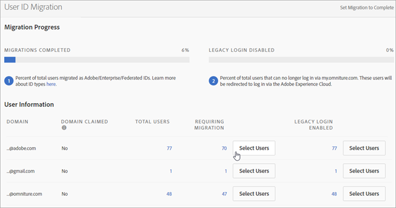

# Eseguire la migrazione degli account utente di Analytics per Adobe ID {#migrate-analytics-user-accounts-for-adobe-ids}

Eseguire la migrazione dal sistema legacy di gestione utenti di Analytics all’Admin Console.

## Eseguire la migrazione degli account utente di Analytics per Adobe ID {#task-f3355f3b14a340feae58cfa04c0ba1c9}

Eseguire la migrazione dal sistema legacy di gestione utenti di Analytics all’Admin Console.

>[!NOTE]
>
>Se un amministratore che non ha eseguito l’accesso tramite Experience Cloud tenta di accedere allo strumento di migrazione degli ID utente, verrà reindirizzato alla pagina di accesso di Experience Cloud.

**Per eseguire la migrazione degli utenti di Analytics**

1. Passa a **[!UICONTROL Analytics]** > **[!UICONTROL Admin]** > **[!UICONTROL User ID Migration]**.

   

   La pagina Migrazione ID utente contiene due sezioni: *Avanzamento migrazione* e *Informazioni utente*.

   **Avanzamento migrazione**

   <table id="table_F9F1CFF762C745E198CB075A02BA2DDA"> 
   <thead> 
   <tr> 
      <th colname="col1" class="entry"> Fase </th> 
      <th colname="col2" class="entry"> Descrizione </th> 
   </tr>
   </thead>
   <tbody> 
   <tr> 
      <td colname="col1"> 
Migrazioni completate 
 </td> 
      <td colname="col2"> 
Gli utenti hanno accettato l’invito. 
 </td> 
   </tr> 
   <tr> 
      <td colname="col1"> 
Accesso legacy disattivato 
 </td> 
      <td colname="col2"> 
L’accesso legacy con un ID della società è stato disattivato. Gli utenti adesso potranno accedere a Experience Cloud utilizzando il proprio Adobe ID o Enterprise ID. Quando tutti gli utenti avranno raggiunto questa fase, avrai completato la migrazione. 
 
Durante la migrazione, l’accesso legacy è disattivato. Gli utenti vengono reindirizzati a  experiencecloud.adobe.com e devono accedere utilizzando il loro Adobe ID o Enterprise ID. 
 </td> 
   </tr> 
   </tbody> 
   </table>

   **Informazioni utente**

   Informazioni utente descrive gli utenti nella tua organizzazione, separati per nome del dominio.

   <table id="table_3822E27AF81E4A188562FEB5131548A5"> 
   <thead> 
   <tr> 
      <th colname="col1" class="entry"> Elemento </th> 
      <th colname="col2" class="entry"> Descrizione </th> 
   </tr>
   </thead>
   <tbody> 
   <tr> 
      <td colname="col1"> 
Dominio 
 </td> 
      <td colname="col2"> 
I domini sono specifici degli ID e-mail dell’attuale base di utenti di Analytics. Un dominio può essere registrato da una sola organizzazione ed esclusivamente dagli amministratori di sistema. Per ulteriori informazioni, vedi <a href="https://helpx.adobe.com/it/enterprise/help/request-access-to-claimed-domain.html">Richiedere l’accesso a un dominio registrato</a>. 
 </td> 
   </tr> 
   <tr> 
      <td colname="col1"> 
Dominio registrato 
 </td> 
      <td colname="col2"> 
Se desideri trasferire gli utenti come Enterprise ID o Federated ID, devi essere amministratore di sistema e registrare un dominio disponibile tramite l’Admin Console prima di eseguire la migrazione degli utenti. Puoi trovare ulteriori informazioni <a href="https://helpx.adobe.com/it/enterprise/help/identity.html">qui</a>. 
 
Se non desideri registrare domini per Enterprise ID o Federated ID, salta questo passaggio ed esegui la migrazione degli utenti come Adobe ID. <a href="https://helpx.adobe.com/it/enterprise/help/identity.html">Qui</a> puoi trovare ulteriori informazioni sui tipi di ID. 
 </td> 
   </tr> 
   </tbody> 
   </table>

1. Individua il dominio contenente gli ID utente che desideri trasferire quindi, in **[!UICONTROL Requiring Migration]**, fai clic su **[!UICONTROL Select Users]**.
1. Nella pagina [!DNL Users], seleziona gli utenti di cui vuoi eseguire la migrazione, quindi fai clic su **[!UICONTROL Migrate]**.

   Quando fai clic su **[!UICONTROL Migrate]**, gli utenti ricevono un invito (Migrazione avviata) che devono accettare. Questa azione sposta l’ID utente a Migrazione completata. In seguito, potrai disattivarne l’accesso legacy a `[!DNL my.omniture.com].`

   

1. Specifica il tipo di ID con cui vuoi eseguire la migrazione degli utenti (Adobe ID o Enterprise ID)

   Dopo avere trasferito gli utenti, lo stato della colonna Stato di migrazione cambia da *`Not Initiated`* a *`Migrated`*.

   Se viene visualizzato *`Failed`*, passa il cursore del mouse sull’icona per vedere il motivo per cui la migrazione non è riuscita.
