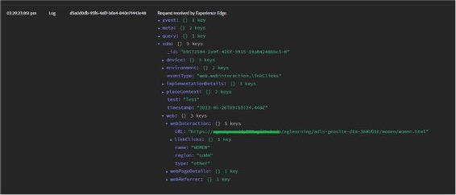

# Attivare e abilitare Activity Map

Descrive i passaggi che l’amministratore di Analytics deve completare per abilitare la raccolta di collegamenti di Activity Map e il download degli utenti.

## Passaggio 1. Attivare Activity Map {#update_code}

Il modulo Activity Map fa parte di AppMeasurement.js, dei tag di Adobe Experience Platform e del Web SDK (alloy.js). I dati di Activity Map non possono essere raccolti a meno che non venga eseguito l’aggiornamento alla **versione 2.15.0 di Web SDK** o superiore, oppure all’**estensione di tag v1.90 di Adobe Analytics** o superiore, oppure alla **versione 1.6 di AppMeasurement** o superiore.

+++Web SDK (estensione di tag di Adobe Experience Platform)

NOTA: Web SDK attualmente raccoglie informazioni su Activity Map registrando eventi di clic per collegamenti separati. Questo è diverso da AppMeasurement che registra le informazioni dell’Activity Map per i collegamenti interni includendole nel caricamento della pagina successiva. Per questo motivo, la raccolta Web SDK genera chiamate al server aggiuntive. Una versione futura di Web SDK renderà possibile configurare Web SDK per creare pacchetti di informazioni per le Activity Map sugli hit successivi, essenzialmente in linea con il comportamento di AppMeasurement.

1. Nei tag di Adobe Experience Platform, passa alla proprietà per la quale stai implementando Analytics.
1. In [!UICONTROL Extensions] -> [!UICONTROL Adobe Experience Platform Web SDK], seleziona **[!UICONTROL Enable click data collection]** come evidenziato di seguito.
1. Crea la libreria con le modifiche.
1. Pubblica la libreria in produzione.

**Convalida**

Interagisci con le chiamate tramite la scheda di rete di Developer Console:

1. Carica lo script di avvio per lo sviluppo sul sito.
1. Su Fai clic sugli elementi, cerca “/ee” nella scheda di rete

   

Adobe Experience Platform Debugger

1. Scarica e installa [Adobe Experience Platform Debugger](https://chromewebstore.google.com/detail/adobe-experience-platform/bfnnokhpnncpkdmbokanobigaccjkpob).
1. Passa a [!UICONTROL Logs] > [!UICONTROL Edge] > [!UICONTROL Connect to Edge].

   

**Domande frequenti**

* **La chiamata di interazione non viene attivata nella scheda di rete.**
La raccolta dati di clic in una chiamata di raccolta va filtrata con “/ee” o “collect?”

* **Non esiste alcuna visualizzazione del payload per la chiamata di raccolta.**
La chiamata di raccolta è progettata in modo tale che il tracciamento non influisca sulla navigazione verso altri siti, pertanto la funzione di scaricamento del documento è applicabile alle chiamate di raccolta. Questo non influisce sulla raccolta dei dati, ma se devi convalidare sulla pagina, aggiungi target = &quot;_blank&quot; al rispettivo elemento. Il collegamento viene quindi aperto in una nuova scheda.

* **Come ignori la raccolta di dati personali?**
Aggiungi le rispettive condizioni in&lt;&lt; on before link click send callback>> e restituisci false per ignorare tali valori. [Ulteriori informazioni](https://experienceleague.adobe.com/docs/experience-platform/edge/fundamentals/configuring-the-sdk.html?lang=it)

  Codice di esempio:

  

+++

+++Implementazione manuale di Web SDK

Consulta [Tracciare i collegamenti](https://experienceleague.adobe.com/docs/experience-platform/edge/data-collection/track-links.html?lang=it) per informazioni su come implementare il tracciamento dei collegamenti e come abilitare Activity Map acquisendo `region` dell’elemento HTML su cui è stato fatto clic.

>[!NOTE]
>
>L’abilitazione del tracciamento dei collegamenti con Web SDK attualmente invia eventi di collegamento quando si passa da una pagina all’altra. Questo è diverso dal funzionamento di AppMeasurement e può potenzialmente causare hit fatturabili aggiuntivi inviati ad Adobe.

+++

+++Estensione Analytics (tag di Adobe Experience Platform)

Nei tag di Adobe Experience Platform, passa alla proprietà per la quale stai implementando Analytics. Nella finestra di dialogo [!UICONTROL Install Extension], seleziona **[!UICONTROL Use Activity Map]**.

+++

+++AppMeasurement

1. Scarica la libreria JavaScript più recente per AppMeasurement.
Passa a **[!UICONTROL Analytics]** > **[!UICONTROL Admin]** > **[!UICONTROL All admin]** > **[!UICONTROL Code manager]**.
1. Implementala seguendo [queste istruzioni](https://experienceleague.adobe.com/docs/analytics/implementation/js/overview.html?lang=it).

+++

## Passaggio 2. Abilitare i rapporti Activity Map {#enable}

Devi abilitare i rapporti Activity Map a livello di suite di rapporti.

1. Accedi ad Adobe Analytics e passa a  **[!UICONTROL Analytics]** > **[!UICONTROL Admin]** > **[!UICONTROL Report Suites]**, seleziona la suite di rapporti quindi seleziona **[!UICONTROL Edit Settings]** > **[!UICONTROL Activity Map]** > **[!UICONTROL Activity Map Reporting]** .

1. Activity Map raccoglie i dati dei collegamenti nei rapporti Activity Map. Affinché l’attivazione avvenga, devi prima attivare le variabili facendo clic su **[!UICONTROL Enable Activity Map Reports]**.

   Questo passaggio aggiunge tutte le dimensioni di Analytics necessarie per raccogliere i dati.

   

1. Dopo circa un’ora, verifica il [rapporto Activity Map sulle pagine](/help/analyze/activity-map/activitymap-reporting-analytics.md), che mostra tutte le pagine in cui gli utenti hanno fatto clic su un collegamento.

## Passaggio 3. Aggiungere utenti al profilo di prodotto di [!UICONTROL Activity Map Access] {#add_users}

1. Fai clic su **[!UICONTROL Add Users to Group]**.

   Verrà visualizzata la pagina del profilo di prodotto in [Adobe Admin Console](https://adminconsole.adobe.com/E2F05B3B52F54D2E0A490D44@AdobeOrg/overview).

1. Se non hai già creato un profilo di prodotto [!UICONTROL Activity Map Access], crealo adesso. Gli elementi di autorizzazione richiesti per questo profilo sono [!UICONTROL Analytics Tools] > [!UICONTROL Activity Map] e [!UICONTROL Analytics Tools] > [!UICONTROL Segment Publishing].

1. Aggiungi degli utenti a questo profilo di prodotto. Questo consente agli utenti di scaricare Activity Map da  **[!UICONTROL Adobe Analytics]** > **[!UICONTROL Tools]** > **[!UICONTROL ActivityMap]** .

