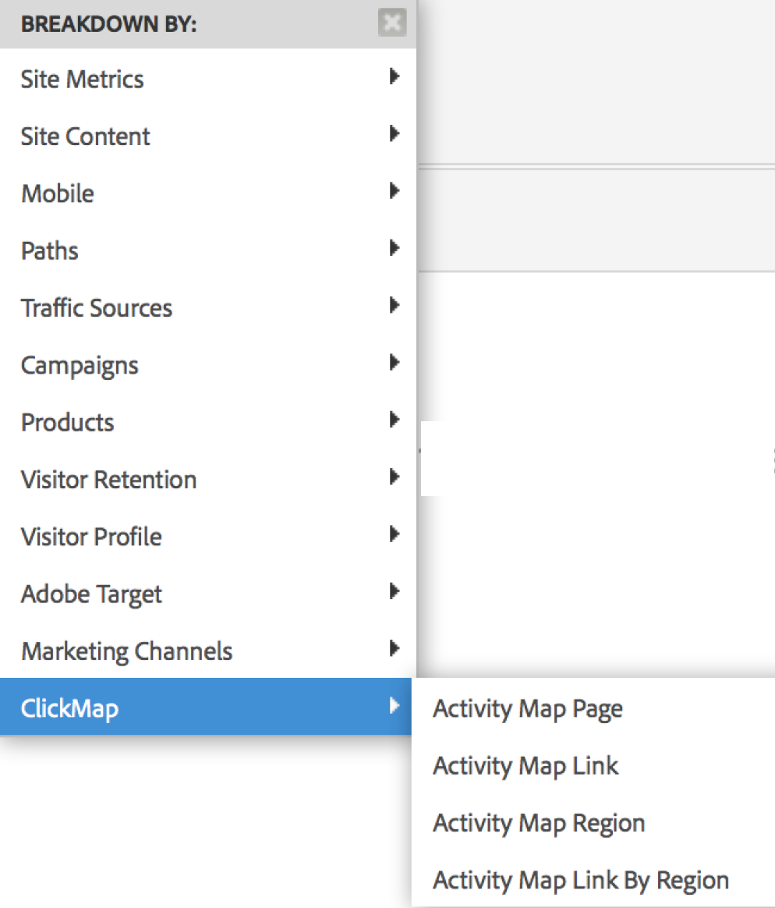

# Abilitare Activity Map{#enable-activity-map}

Illustra i passaggi necessari per  Analytics Admin per abilitare  raccolta di collegamenti Activity Map e il download degli utenti.

## Passaggio 1: Aggiorna il codice AppMeasurement (Javascript) a v1.6 (o versione successiva) {#section_5D1586289DF2489289B1B6C1C80C300D}

Il modulo Activity Map  fa parte del file AppMeasurement.js (nella parte superiore del file). La libreria AppMeasurement caricherà il modulo Activity Map  al momento della creazione dell&#39;istanza.

Non è possibile raccogliere  dati Activity Map se non si esegue l&#39;aggiornamento a questa versione (o successiva) di AppMeasurement.

1. Scarica il codice AppMeasurement più recente (AppMeasurement_Javascript-1.6.zip) andando a **[!UICONTROL Analytics]** > **[!UICONTROL Admin]** > **[!UICONTROL Code Manager]** e [implementalo](https://docs.adobe.com/content/help/it-IT/analytics/implementation/js/overview.html).

   Abbiamo incluso alcuni [esempi di codice](/help/analyze/activity-map/activitymap-getting-started/activitymap-getting-started-admins/activitymap-sample-implementation-code.md) di implementazione per aiutarti a visualizzare le modifiche apportate al codice includendo il modulo Activity Map .

1. Confermare l’implementazione:

   1. Quando si fa clic su un elemento selezionabile, i dati vengono memorizzati in un cookie denominato s_sq.
   1. I dati del Activity Map  possono essere visualizzati nella stringa di query nella chiamata di tracciamento. Ad esempio:

      ```
      …&c.&a.&Activity Map.&link=My%20Link&region=My%20Region&page=My%20Page&.Activity Map&.a&.c&...
      ```

1. Per visualizzare il collegamento o la regione **[!UICONTROL Activity Map Link by Region]** della pagina, suddividi il rapporto per:  {width=&quot;400px&quot;}

## Passaggio 2: Abilitare i rapporti  Activity Map {#section_D14F15D2FC0346FCAD8B3B87E6DD33D4}

Innanzitutto, è necessario abilitare  report Activity Map a livello di suite per report.

1. Accedi ad Adobe  Analytics e passa a **[!UICONTROL Analytics]** > **[!UICONTROL Admin > Suite di rapporti >[seleziona suite]di rapporti > Modifica impostazioni >  Activity Map]** > **[!UICONTROL Activity Map Reporting]** .
1.  Activity Map raccoglie i dati del collegamento nei report  Activity Map. Per attivare l’attivazione, è innanzitutto necessario attivare le variabili facendo clic su **[!UICONTROL Enable Activity Map Reports]**.

   Questo passaggio aggiunge tutte le  dimensioni Analytics necessarie per la raccolta dei dati.

1. Dopo circa un&#39;ora, controllate il rapporto [Pagina Activity Map](/help/analyze/activity-map/activitymap-reporting-analytics.md), che mostra tutte le pagine in cui gli utenti hanno fatto clic su un collegamento.

## Passaggio 3: Aggiunta di utenti  gruppo di accesso Activity Map {#section_4C7A47BB7DEF4AFFBC276392467F9675}

1. Fai clic su **[!UICONTROL Add Users to Group]**.

   Viene visualizzata la pagina di gestione dei gruppi nell’Admin Console .

1. [Aggiungete utenti a questo gruppo](https://docs.adobe.com/content/help/it-IT/analytics/admin/user-product-management/user-groups/groups.html) e **[!UICONTROL Save Group]**.

1. Questo consente agli utenti Admin di scaricare  Activity Map da **[!UICONTROL Adobe Analytics]** > **[!UICONTROL Tools]** > **[!UICONTROL ActivityMap]** .

>[!NOTE]
>
>Se desiderate che gli utenti non amministratori scarichino  Activity Map, create un nuovo gruppo di utenti che fornisca l&#39;autorizzazione &quot;Strumenti&quot; e &quot;Installazione legacy di ClickMap&quot;. Questo livello di autorizzazione, combinato con  Activity Map Access, fornisce le autorizzazioni per scaricare e utilizzare lo strumento.
