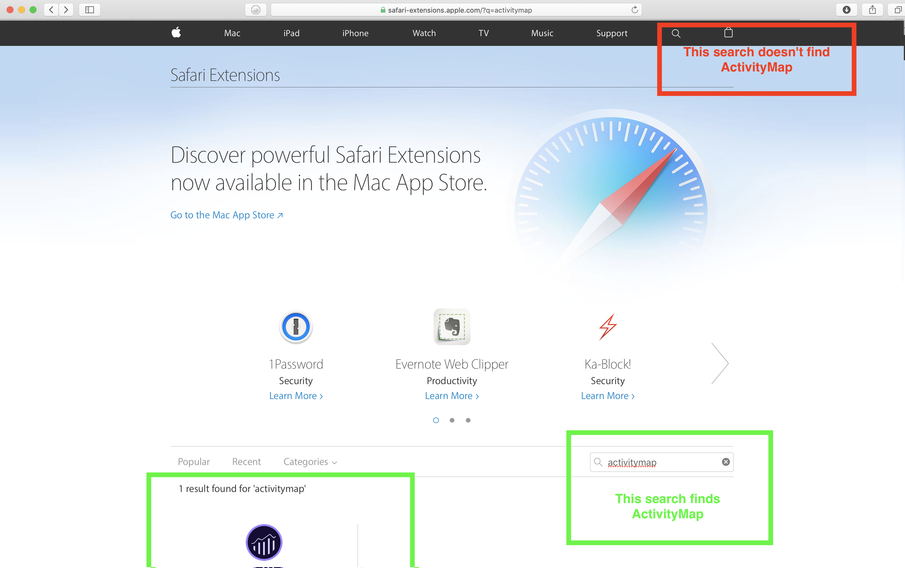

# Install Activity Map browser plug-ins{#install-activity-map-browser-plug-ins}

Il processo di installazione varia a seconda del browser in uso.

Plug-in del browser Activity Map:

* Vengono inseriti manualmente come tag pagina di Analytics.
* Viene avviato da un pulsante o una voce di menu nella barra degli strumenti del browser.
* Sono compatibili solo con le versioni più recenti di questi browser desktop: Internet Explorer, Firefox, Chrome e Safari.
* Support the **[!UICONTROL Remember my login]** feature.
* **Può** inserire la barra degli strumenti Activity Map su pagine Web che non contengono codice della pagina Analytics. Visualizza un messaggio di errore se la pagina non contiene il codice della pagina Analytics.
* Richiede di seguire un processo di installazione del plug-in del browser.

## Install Activity Map plug-in on Chrome {#section_6907253D5D5E4422967E6439207A013F}

1. Go to **[!UICONTROL Adobe Analytics]** &gt; **[!UICONTROL Tools]** &gt; **[!UICONTROL Activity Map]**.  

1. Fai clic su **[!UICONTROL Download Activity Map]**.
1. Fai clic su **[!UICONTROL Install the Activity Map Plug-in]**.
1. Answer **[!UICONTROL Yes]** when the security warning asks you whether you want to download the Activity Map Browser Plug-in.
1. Una volta completato il download, individuate la posizione del file.zip e decomprimete il relativo contenuto.
1. Return to Chrome's address bar and enter `chrome://extensions`.
1. Controllate la casella Modalità sviluppatore.
1. Fate clic su Carica estensioni non composte e selezionate la cartella decompressa dalla finestra a comparsa.
1. If you see an Adobe Analytics icon  {width="70px"} added to your tool bar, your download was successful. You can now [launch Activity Map](launch-Activity Map.md#concept_2392036DB1AF4B05BEA3E9F4EE9B46B8) from your page.

## Install Activity Map plug-in on Firefox {#section_1F69D3D22DB34D6992747B1A62C1D2DA}

1. Go to **[!UICONTROL Analytics]** &gt; **[!UICONTROL Activity Map]**.

1. Fai clic su **[!UICONTROL Download Activity Map]**.
1. Fai clic su **[!UICONTROL Install the Activity Map Plug-in]**.
1. Click **[!UICONTROL Allow]** when this message appears: 

1. Fai clic su **[!UICONTROL Install Now]**.
1. Click the **[!UICONTROL Open Menu]** icon at the top right and select **[!UICONTROL Add-Ons]**. {width = "250 px"}

1. La Mappa dell'attività deve essere elencata come uno dei componenti aggiuntivi Firefox.
1. If you see an Adobe Analytics icon   added to your tool bar, your download was successful. You can now [launch Activity Map](launch-Activity Map.md#concept_2392036DB1AF4B05BEA3E9F4EE9B46B8) from your page.

## Install Activity Map plug-in on Internet Explorer {#section_1A33705D7F784C4A88C9026ADC860FB8}

1. Go to **[!UICONTROL Analytics]** &gt; **[!UICONTROL Activity Map]**.

1. Fai clic su **[!UICONTROL Download Activity Map]**.
1. Fai clic su **[!UICONTROL Install the Activity Map Plug-in]**.
1. Click **[!UICONTROL Run]** to initiate the Activity Map installation.
1. Click **[!UICONTROL Yes]** on the popup to allow the program to make changes to the computer.
1. Seguite le istruzioni della procedura guidata di installazione.
1. Se la Activity Map è stata installata correttamente, in Internet Explorer compare una notifica che indica che la barra degli strumenti Activity Map è pronta per l'uso. Attivarlo per iniziare a utilizzare l'applicazione. You can now [launch Activity Map](launch-Activity Map.md#concept_2392036DB1AF4B05BEA3E9F4EE9B46B8) from your page.

## Install Activity Map plug-in on Safari {#section_4F306BDDFBC04D4CA48B7C37B0AACC48}

1. Go to **[!UICONTROL Analytics]** &gt; **[!UICONTROL Activity Map]**.

1. <https://safari-extensions.apple.com/>Passa a.
1. Search for "activity" or "activitymap" and click through the Adobe Activity Map installation.  
1. If you see an Adobe Analytics icon  {width="70px"} added to your tool bar, your download was successful. You can now [launch Activity Map](launch-Activity Map.md#concept_2392036DB1AF4B05BEA3E9F4EE9B46B8) from your page.