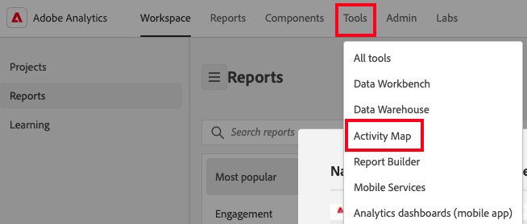

# Installazione dei plug-in di Activity Map nel browser{#install-activity-map-browser-plug-ins}

Il processo di installazione varia a seconda del browser utilizzato.

Plug-in del browser Activity Map:

* Vengono inseriti manualmente come tag di pagina di Analytics.
* Vengono avviati da un pulsante o da una voce di menu nella barra degli strumenti del browser.
* Sono compatibili solo con le versioni più recenti dei seguenti browser desktop: Internet Explorer, Firefox e Chrome.
* Supporta la funzione **[!UICONTROL Remember my login]** .
* **È possibile** inserire la barra degli strumenti di Activity Map nelle pagine web che non contengono il codice della pagina di Analytics. Visualizza un messaggio di errore se la pagina non contiene il codice della pagina di Analytics.
* Richiedi di eseguire un processo di installazione dei plug-in per browser.

## Installare il plug-in di Activity Map su Chrome {#section_6907253D5D5E4422967E6439207A013F}

1. Vai a **[!UICONTROL Adobe Analytics]** > **[!UICONTROL Tools]** > **[!UICONTROL Activity Map]**.  
1. Fai clic su **[!UICONTROL Download Activity Map]**.
1. Fai clic su **[!UICONTROL Install the Activity Map Plug-in]**.
1. Rispondi a **[!UICONTROL Yes]** quando viene richiesto se desideri scaricare il plug-in browser Activity Map.
1. Una volta completato il download, trova il percorso del file .zip e decomprimi il contenuto.
1. Torna alla barra degli indirizzi di Chrome e immetti `chrome://extensions`.
1. Seleziona la casella Modalità Sviluppatore .
1. Fai clic su Carica estensioni decompresse e seleziona la cartella decompressa dalla finestra a comparsa.
1. Se viene aggiunta un&#39;icona Adobe Analytics {width=&quot;70px&quot;} alla barra degli strumenti, il download è stato eseguito correttamente. Ora è possibile [avviare Activity Map](/help/analyze/activity-map/activitymap-getting-started/activitymap-getting-started-users/activitymap-launch.md) dalla pagina.

## Installare il plug-in Activity Map su Firefox {#section_1F69D3D22DB34D6992747B1A62C1D2DA}

1. Vai a **[!UICONTROL Analytics]** > **[!UICONTROL Activity Map]**.

1. Fai clic su **[!UICONTROL Download Activity Map]**.
1. Fai clic su **[!UICONTROL Install the Activity Map Plug-in]**.
1. Fai clic su **[!UICONTROL Allow]** quando viene visualizzato questo messaggio: 
1. Fai clic su **[!UICONTROL Install Now]**.
1. Fai clic sull&#39;icona **[!UICONTROL Open Menu]** in alto a destra e seleziona **[!UICONTROL Add-Ons]**. {width=&quot;250px&quot;}
1. Activity Map deve essere elencato come uno dei componenti aggiuntivi Firefox.
1. Se viene aggiunta un&#39;icona Adobe Analytics  alla barra degli strumenti, il download è stato eseguito correttamente. Ora è possibile [avviare Activity Map](/help/analyze/activity-map/activitymap-getting-started/activitymap-getting-started-users/activitymap-launch.md) dalla pagina.

## Installare il plug-in di Activity Map in Internet Explorer {#section_1A33705D7F784C4A88C9026ADC860FB8}

1. Vai a **[!UICONTROL Analytics]** > **[!UICONTROL Activity Map]**.
1. Fai clic su **[!UICONTROL Download Activity Map]**.
1. Fai clic su **[!UICONTROL Install the Activity Map Plug-in]**.
1. Fai clic su **[!UICONTROL Run]** per avviare l’installazione di Activity Map.
1. Fare clic su **[!UICONTROL Yes]** nella finestra a comparsa per consentire al programma di apportare modifiche al computer.
1. Segui le istruzioni contenute nella procedura guidata di installazione.
1. Se Activity Map è stato installato correttamente, in Internet Explorer verrà visualizzata una notifica in cui si informa che la barra degli strumenti di Activity Map è pronta per l’uso. Abilitalo per iniziare a utilizzare l&#39;applicazione. Ora è possibile [avviare Activity Map](/help/analyze/activity-map/activitymap-getting-started/activitymap-getting-started-users/activitymap-launch.md) dalla pagina.
