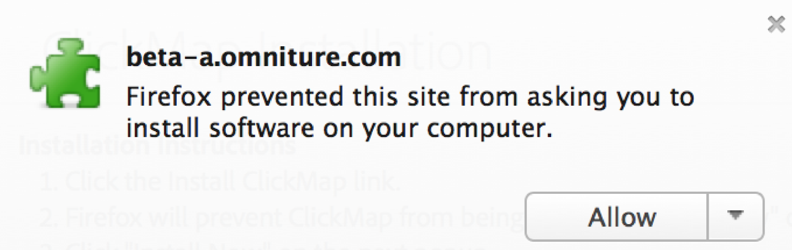

# Installazione dei plug-in di Activity Map nel browser

Il processo di installazione varia a seconda del browser in uso.

Plug-in browser Activity Map:

* Vengono inseriti manualmente come tag di pagina di Analytics.
* Viene avviato da un pulsante o da una voce di menu nella barra degli strumenti del browser.
* Sono compatibili solo con le versioni più recenti di questi browser desktop: Internet Explorer, Firefox e Chrome.
* Supporta il **[!UICONTROL Remember my login]** funzionalità.
* **Può iniettare** la barra degli strumenti Activity Map nelle pagine web che non contengono il codice della pagina Analytics. Visualizza un messaggio di errore se la pagina non contiene il codice della pagina Analytics.
* Richiede di passare attraverso un processo di installazione del plug-in del browser.

## Installare il plug-in Activity Map in Chrome {#chrome}

1. Vai a **[!UICONTROL Adobe Analytics]** > **[!UICONTROL Tools]** > **[!UICONTROL Activity Map]**.  
1. Fai clic su **[!UICONTROL Download Activity Map]** (Crea set di dati).
1. Fai clic su **[!UICONTROL Install the Activity Map Plug-in]** (Crea set di dati da schema).
1. Risposta **[!UICONTROL Yes]** quando l’avviso di protezione ti chiede se desideri scaricare il plug-in del browser Activity Map.
1. Al termine del download, individua il percorso del file .zip e decomprimi il contenuto.
1. Torna alla barra degli indirizzi di Chrome e immetti `chrome://extensions`.
1. Seleziona la casella Modalità sviluppatore.
1. Fai clic su Carica estensioni decompresse e seleziona la cartella decompressa dalla finestra a comparsa.
1. Se sulla barra degli strumenti è stata aggiunta un&#39;icona di Adobe Analytics, il download è stato eseguito correttamente.   Ora puoi [Activity Map di launch](/help/analyze/activity-map/activitymap-getting-started/activitymap-launch.md) dalla pagina.

## Installare il plug-in Activity Map su Firefox {#firefox}

1. Vai a **[!UICONTROL Analytics]** > **[!UICONTROL Activity Map]**.
1. Fai clic su **[!UICONTROL Download Activity Map]** (Crea set di dati).
1. Fai clic su **[!UICONTROL Install the Activity Map Plug-in]** (Crea set di dati da schema).
1. Clic **[!UICONTROL Allow]** quando viene visualizzato questo messaggio: 
1. Fai clic su **[!UICONTROL Install Now]** (Usa modello di attribuzione non predefinito).
1. Fai clic su **[!UICONTROL Open Menu]** in alto a destra e seleziona **[!UICONTROL Add-Ons]**. {width="250px"}
1. Activity Map deve essere elencato come uno dei componenti aggiuntivi Firefox.
1. Se sulla barra degli strumenti è stata aggiunta un&#39;icona di Adobe Analytics, il download è stato eseguito correttamente.   Ora puoi [Activity Map di launch](/help/analyze/activity-map/activitymap-getting-started/activitymap-launch.md) dalla pagina.

