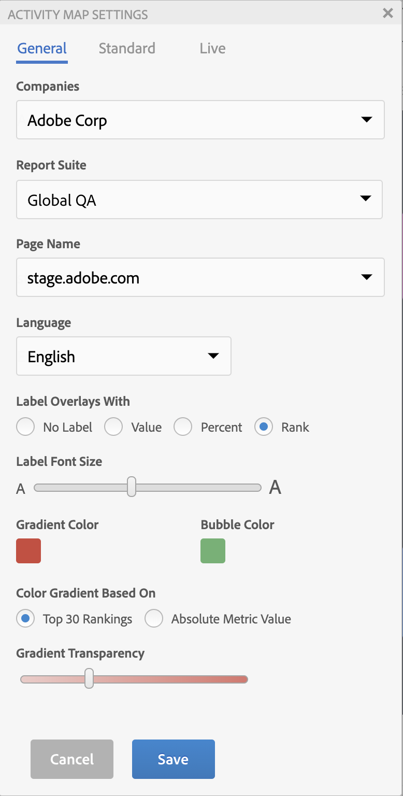
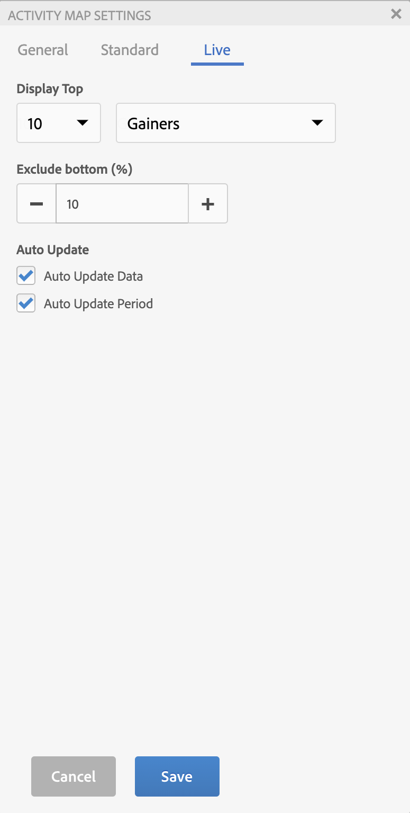

# Configurare le impostazioni di Activity Map

Il pannello Impostazioni di Activity Map consente di modificare le impostazioni e le proprietà di tutti i tipi di visualizzazioni di sovrapposizione.

Per accedere al pannello Impostazioni di Activity Map , fai clic sull’icona a forma di ingranaggio nella barra degli strumenti di Activity Map.

## Impostazioni generali {#section_697A12F099494D699A4BF498598178C5}

| Impostazione | Descrizione |
| --- | --- |
| **[!UICONTROL Companies]** | Seleziona la società di accesso applicabile. |
| **[!UICONTROL Report Suite]** | L’elenco delle suite di rapporti accessibili non è più limitato alle suite di rapporti definite nel tag della pagina web. Ora puoi sostituire la suite di rapporti selezionata (corrispondente a uno dei tag nella pagina) con un’altra suite di rapporti. La nuova suite di rapporti non deve necessariamente essere collegata a un tag sulla pagina. Se modifichi la suite di rapporti selezionata nelle impostazioni di Activity Map, il processo di salvataggio comporta l’aggiornamento di tutti i rapporti di Analytics interessati. **Importante**:  [!UICONTROL Virtual Report Suites] non sono compatibili con  [!UICONTROL Live Mode], solo con  [!UICONTROL Standard Mode]. Se sei in [!UICONTROL Live Mode] per una suite di rapporti standard, ma selezioni un [!UICONTROL Virtual Report Suite] in questa finestra di dialogo, una volta fatto clic su **[!UICONTROL OK]** qui, verrà visualizzata la modalità standard. Inoltre, il controllo Calendario viene reinizializzato in modo che corrisponda al tipo di calendario della suite di rapporti (gregoriano, retail, personalizzato...). |
| **[!UICONTROL Page Name]** | Pagina a cui si applicano queste impostazioni. |
| **[!UICONTROL Language]** | La selezione corrisponde alle lingue offerte per Adobe Analytics. |
| **[!UICONTROL Label Overlays With]** | <ul><li>**[!UICONTROL No Label]**: applicabile solo alla sovrapposizione sfumatura. In questo caso, il colore della sovrapposizione trasmette un senso per la classificazione del collegamento</li><li>**[!UICONTROL Value]**: il totale della metrica grezza per quel collegamento</li><li>**[!UICONTROL Percent]**: percentuale della metrica per questo collegamento nella metrica totale per la pagina.</li><li>**[!UICONTROL Rank]**: classificazione di questo collegamento tra tutti i collegamenti presenti nella pagina di cui è stato effettuato il rendering</li></ul> |
| **[!UICONTROL Label Font Size]** | Consente di aumentare o diminuire la dimensione del font dell’etichetta di sovrapposizione, utilizzando un cursore, per una migliore leggibilità. |
| **[!UICONTROL Gradient/Bubble Color]** | Per visualizzare le classificazioni di collegamento sovrapposte per le visualizzazioni Sfumatura o Sovrapposizione bolla, seleziona uno dei vari colori disponibili. |
| **[!UICONTROL Color Gradient Based On]** | <ul><li>**[!UICONTROL Top 30 Rankings]**: L’intensità del colore viene normalizzata per i primi 30 valori.</li><li>**[!UICONTROL Absolute Metric Value]**: L’intensità del colore è una funzione del valore della metrica assoluta.</li></ul> |
| **[!UICONTROL Gradient Transparency]** | Seleziona il livello di trasparenza per le sovrapposizioni sfumatura. Questa impostazione non influisce sulle sovrapposizioni [!UICONTROL Bubble]. |

## Impostazioni standard {#section_24DB95376E1A448494ECF3F57743FC19}

Queste impostazioni si applicano alla sovrapposizione in modalità standard.

| Impostazione | Descrizione |
| --- | --- |
| **[!UICONTROL Dynamic Data Filtering]** | Questo menu a discesa consente di visualizzare le sovrapposizioni per<ul><li>(Impostazione predefinita) Tutti i collegamenti presenti nella pagina</li><li>Il numero di collegamenti in alto (più alto) o in basso (più basso) nella pagina, dove # può essere una scelta tra 1, 10, 50 o 100.</li></ul> |
| **[!UICONTROL Hide overlays for links that received no hits]**. | Una casella di controllo che attiva o disattiva la visibilità delle sovrapposizioni per i collegamenti privi di dati.<ul><li>(Impostazione predefinita) Se la casella di controllo è selezionata, non viene visualizzata alcuna sovrapposizione quando un collegamento non ha dati di collegamento ActivityMap.</li><li>Se la casella di controllo è deselezionata, allora se un collegamento non ha dati di collegamento ActivityMap, viene visualizzata una sovrapposizione con etichetta &quot;-&quot;, che significa N/D (non applicabile). |

## Impostazioni live {#section_D30F6E62FB5D404090B588F396A460AF}

Queste impostazioni si applicano alla sovrapposizione della modalità live.

| Impostazione | Descrizione |
|---|---|
| **[!UICONTROL Display Top]** | Per visualizzare le sovrapposizioni **[!UICONTROL Gainers]** o **[!UICONTROL Losers]** (o entrambe), seleziona il numero di collegamenti. |
| **[!UICONTROL Exclude bottom (%)]** | Selezionare questa opzione per eliminare i collegamenti Gainers-Losers con dati sparsi. Filtrare la percentuale inferiore di modifiche del collegamento per visualizzare solo i collegamenti con dati sufficienti a mostrare guadagni o perdite rilevanti. La percentuale viene calcolata in base al numero di collegamenti presenti nella pagina. Ad esempio, filtrando il 10% inferiore di un elenco di 200 collegamenti si escluderanno i 20 collegamenti più recenti. |
| **[!UICONTROL Auto Update Data]** | Consente di decidere se i dati di Analytics visualizzati nell’interfaccia si aggiornano automaticamente al momento del calcolo di un nuovo periodo. |
| **[!UICONTROL Auto Update Period]** | Quando questa opzione è selezionata, aggiorna la pagina Web con ogni nuovo recupero di dati in modo che i collegamenti presenti nella pagina possano essere sincronizzati più strettamente con i dati raccolti. |
