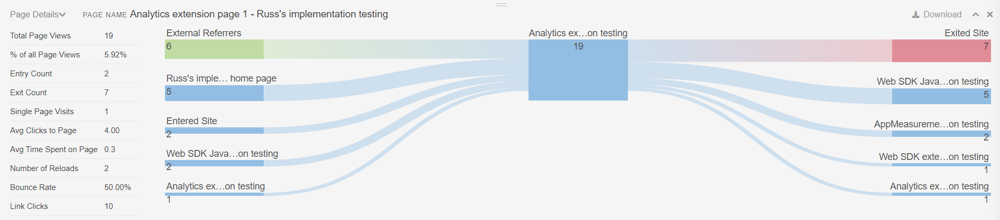

# Interfaccia dell’estensione Activity Map

L’estensione Activity Map consente di visualizzare i dati dei clic sovrapposti sul sito web. Per scaricare l’estensione, accedi alla pagina seguente, che fornisce un collegamento al web store:

**[!UICONTROL Tools]** > **[!UICONTROL Activity Map]** > **[!UICONTROL Download Activity Map]**

Una volta installata e abilitata, l’interfaccia è composta da diverse parti:

* Un pannello superiore che consente di configurare l’estensione e i rapporti
* Una sovrapposizione che visualizza i collegamenti più popolari
* Pannello inferiore che mostra le metriche per i collegamenti più popolari

## Pannello superiore

Il pannello superiore contiene i controlli di base per la sovrapposizione Activity Map.

Offre le seguenti impostazioni:

* **Visualizzazione Standard/Live**: consente di passare dalla visualizzazione Standard alla visualizzazione Live.
   * Visualizzazione standard: mostra la sovrapposizione in base ai dati storici.
   * Vista live: mostra la sovrapposizione basata sui dati live. Il selettore di date diventa un menu a discesa che consente di modificare la granularità dei dati live.
* **Selettore metrica**: consente di modificare la metrica segnalata dalla sovrapposizione. Se hai selezionato Live View, sono disponibili solo [!UICONTROL Link Clicks].
* **Selettore segmento**: consente di selezionare un [segmento](/help/components/segmentation/seg-overview.md), visualizzando un sottoinsieme di dati all&#39;interno della sovrapposizione. I segmenti non sono disponibili nella visualizzazione Live.
* **Tipo di visualizzazione sovrapposizione**: consente di modificare il modo in cui la sovrapposizione visualizza la classificazione dei collegamenti.
   * **[!UICONTROL Bubble]**: i collegamenti principali ricevono una bolla verde che mostra il relativo rango numerico durante il periodo di reporting. Puoi cambiare il colore della bolla in [Impostazioni](settings.md).
   * **[!UICONTROL Gradient]**: i collegamenti superiori sono ombreggiati in rosso trasparente. I link più popolari sono quelli di colore rosso più scuro. È possibile modificare il colore della sfumatura in [Impostazioni](settings.md).
   * **[!UICONTROL Off]**: disabilita sovrapposizioni collegamento.
* **Selettore data**: consente di modificare il periodo di reporting.

L’intestazione di questo pannello contiene le seguenti impostazioni:

* **Espandi/comprimi pannello superiore**: attiva/disattiva il pannello superiore per visualizzare le impostazioni in orizzontale o in verticale (icona a forma di freccia doppia).
* **[!UICONTROL Toggle page details]**: mostra o nasconde il pannello inferiore (icona a forma di occhio).
* **[!UICONTROL Show settings]**: apre un menu per le impostazioni che è possibile modificare (icona ingranaggio):
   * **[!UICONTROL Settings]**: apre le [impostazioni](settings.md) dell&#39;estensione.
   * **[!UICONTROL Help]**: apre la documentazione su Experience League (questa pagina).
   * **[!UICONTROL Adobe community]**: apre la [community Experience League](https://experienceleaguecommunities.adobe.com/?profile.language=it).
   * **[!UICONTROL About]**: visualizza la versione dell&#39;estensione.
   * **[!UICONTROL Logout]**: effettua la disconnessione dall&#39;estensione e richiede di effettuare di nuovo l&#39;accesso.
* **[!UICONTROL Quit Activity Map]**: chiude tutte le sovrapposizioni per l&#39;estensione (icona X).

## Sovrapposizione pagina

La sovrapposizione pagina contiene il contenuto del sito con una sovrapposizione che mostra la posizione dei collegamenti più popolari su cui hai fatto clic durante il periodo di reporting. È possibile configurare queste sovrapposizioni di collegamento affinché vengano visualizzate come bolle o sfumature nel pannello superiore **[!UICONTROL Overlay visualization type]**.

Se si fa clic su una bolla o una sfumatura, è possibile visualizzare i dettagli di quel particolare collegamento.

## Pannello inferiore

Il pannello inferiore mostra una vista aggregata dei collegamenti visualizzati sulla sovrapposizione.

* **Tipo di report**: attiva/disattiva il pannello inferiore per visualizzare il report **[!UICONTROL Links on page]** o **[!UICONTROL Page details]**.
* **[!UICONTROL Page name]**: nome della dimensione [Pagina](/help/components/dimensions/page.md) corrente.
* **[!UICONTROL Search]**: filtrare il report per visualizzare solo i nomi dei collegamenti che corrispondono al testo immesso.
* **[!UICONTROL Download]**: esporta il rapporto in formato CSV. È possibile includere il report [!UICONTROL Links on page], il report [!UICONTROL Page] e il report [!UICONTROL Page flow] nello stesso file di download.
* **[!UICONTROL Change report docking position]**: attiva o disattiva la visualizzazione del pannello nella parte inferiore o superiore della finestra del browser.
* **[!UICONTROL Close the report]**: chiude il pannello. È possibile aprire nuovamente il pannello utilizzando il pulsante **[!UICONTROL Toggle page details]** nel pannello superiore (l&#39;icona a forma di occhio).

Il report **[!UICONTROL Links on page]** mostra un report di base dell&#39;area di lavoro con le seguenti impostazioni:

* La dimensione [Collegamento Activity Map](/help/components/dimensions/activity-map-link.md)
* La metrica [Occorrenze](/help/components/metrics/occurrences.md) (etichettata come **[!UICONTROL Link clicks]**)
* Il valore [Pagina](/help/components/dimensions/page.md) corrente applicato come segmento

Il report **[!UICONTROL Page details]** mostra una visualizzazione [Flusso](/help/analyze/analysis-workspace/visualizations/c-flow/flow.md) utilizzando la dimensione [Pagina](/help/components/dimensions/page.md), concentrandosi sulla pagina corrente. Le metriche seguenti per la pagina corrente sono visualizzate a sinistra:

* Totale [visualizzazioni pagina](/help/components/metrics/page-views.md)
* [!UICONTROL % of all page views]
* Conteggio [Voce](/help/components/metrics/entries.md)
* [Esci](/help/components/metrics/exits.md) conteggio
* [Visite a pagina singola](/help/components/metrics/single-page-visits.md)
* [!UICONTROL Avg clicks to page]
* Tempo medio [trascorso sulla pagina](/help/components/metrics/time-spent.md)
* Numero di [ricaricamenti](/help/components/metrics/reloads.md)
* [Percentuale mancati recapiti](/help/components/metrics/bounce-rate.md)
* [!UICONTROL Link clicks]

