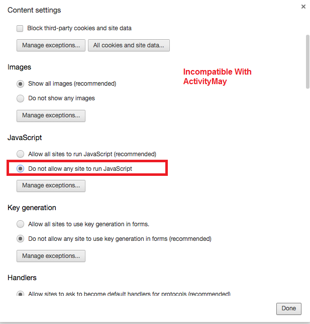
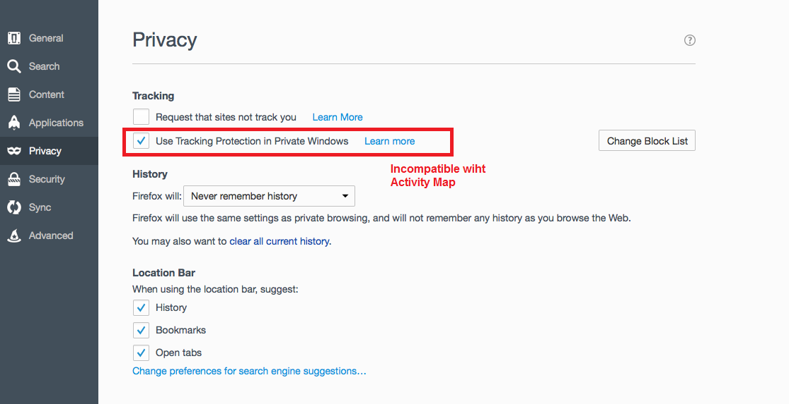
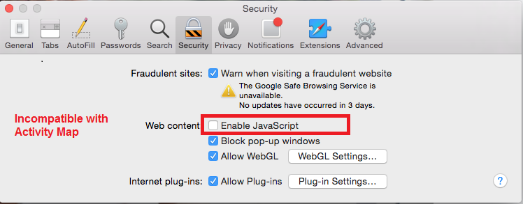

# Risoluzione dei problemi relativi alle estensioni del browser

Mostra i parametri del browser non compatibili con l’utilizzo di Activity Map. Disattiva queste impostazioni.

## Chrome

## Firefox

## Safari

## Internet Explorer

