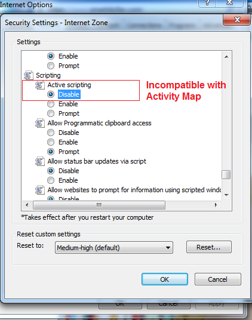

# Risoluzione dei problemi relativi alle estensioni del browser

Mostra i parametri del browser che non sono compatibili con l'uso di Activity Map. È consigliabile disattivare queste impostazioni.

## Chrome

## Firefox

## Safari

## Internet Explorer

