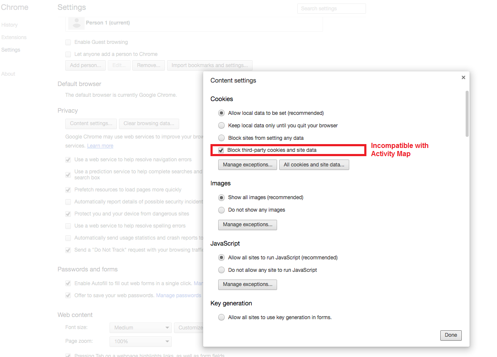
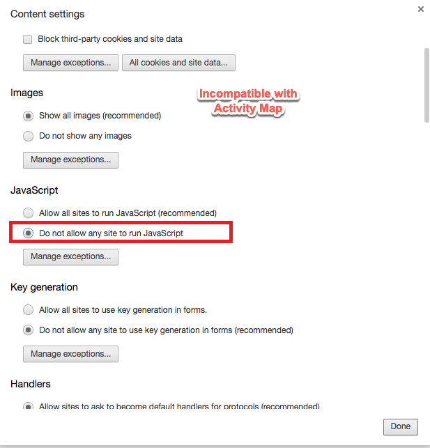

# Risoluzione dei problemi delle estensioni del browser

Mostra i parametri del browser non compatibili con l'uso della Activity Map. È necessario disattivare queste impostazioni.

## Chrome

## Firefox

## Safari

## Internet Explorer

