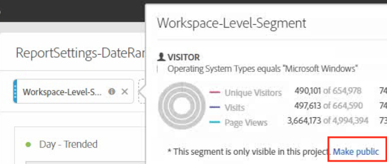
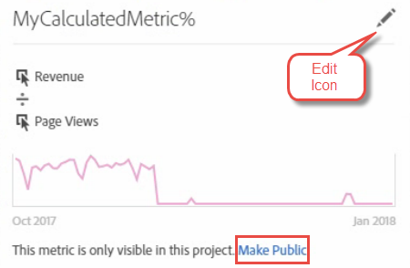

# Domande frequenti su Converter Converter

## Project Converter FAQ {#topic_8231595303AD403E9322645A63632D57}

* [Problemi noti di conversione](../../../analyze/ad-hoc-analysis/c-aha-project-converter/aha2aw-converter-faq.md#section_39C922A58B2E49C9877B363042801361)
* [Domande frequenti sulla conversione](../../../analyze/ad-hoc-analysis/c-aha-project-converter/aha2aw-converter-faq.md#section_1E53FE373AF045978F939916124E194E)

## Known Conversion Issues {#section_39C922A58B2E49C9877B363042801361}

| Problema | Descrizione |
|--- |--- |
| Granularità minuti con suddivisioni o colonne | Quando nelle colonne sono presenti suddivisioni di minuti o se nelle colonne è presente granularità dei minuti, il progetto non può essere convertito in Analysis Workspace. Una soluzione consiste nel rimuovere la suddivisione di granularità minuti e rimuoverla dalle colonne, quindi convertire il progetto. In Analysis Workspace puoi quindi applicare suddivisioni sulla granularità dei minuti. |
| Metrica calcolata interna utilizzata insieme a un segmento di colonna | Se utilizzi una metrica calcolata interna insieme a un segmento di colonna, il progetto non può essere convertito in Analysis Workspace. Per risolvere il problema, rimuovi le metriche calcolate interne dal progetto prima della conversione, quindi riaggiungerle in Analysis Workspace. |

## Conversion FAQ {#section_1E53FE373AF045978F939916124E194E}

<table id="table_48CC119236C94835A6A512E989BE4200"> 
 <thead> 
  <tr> 
   <th colname="col1" class="entry"> Domanda </th> 
   <th colname="col2" class="entry"> Risposta </th> 
  </tr>
 </thead>
 <tbody> 
  <tr> 
   <td colname="col1"> 
<b>Q: Le funzioni di Analisi ad hoc non sono supportate in Analysis Workspace?</b> 
 </td> 
   <td colname="col2"> 
A: Il rapporto Analisi sito non è supportato in Analysis Workspace. Esistono anche alcune lievi differenze tra le visualizzazioni ad Hoc Analysis e Workspace. Per maggiori informazioni, consultate le domande riportate di seguito. 
 </td> 
  </tr> 
  <tr> 
   <td colname="col1"> 
<b>Q: Come vengono convertite le impostazioni della tabella?</b> 
 </td> 
   <td colname="col2"> 
    <ul id="ul_A645A004FB094A1593439A6607FE9A6B"> 
     <li id="li_033CA771F08A4BC3B0BC52CDCCA03FF4"><b>Numero di righe mostrate: Area di lavoro è impaginata per mostrare solo 10 righe (personalizzabili fino a 400 righe alla volta), mentre Ad Hoc mostra fino a 50,000 righe in una pagina. </b> I dati sono ancora in Workspace, ma sono semplicemente impaginati a un predefinito di 10 righe. </li> 
     <li id="li_A8B8890149334032A56D8D1C0F8691EA"><b>Ricerca avanzata: </b>Diverse opzioni di ricerca simultanea non sono supportate, ma una singola opzione di ricerca (ad esempio  Tutte queste parole,  la frase esatta,  una di queste o Nessuna di queste parole) verrà convertita in Analysis Workspace. </li> 
    </ul> </td> 
  </tr> 
  <tr> 
   <td colname="col1"> 
<b>Q: In che modo i grafici/grafici sono convertiti?</b> 
 </td> 
   <td colname="col2"> 
A: In Workspace, i grafici e i grafici sono denominati visualizzazioni. 
 
    <ul id="ul_597F5AB826EF434295D0CABD0313CAD5"> 
     <li id="li_AFB2805418034721A9519D999128C0A8"><b>Impostazioni</b>: Le impostazioni di visualizzazione come Numero di elementi o Numero di barre non sono supportate in Workspace. </li> 
     <li id="li_D5C7EA8815344EDB8585CBB8E1AF583E"><b>Grafico a torta</b>: Viene esportato <a href="https://marketing.adobe.com/resources/help/en_US/analytics/analysis-workspace/donut.html" format="html" scope="external"> come</a> visualizzazione Anello. Questa visualizzazione in Workspace è limitata a 19 sezioni. </li> 
     <li id="li_91659FBFD77C4B3393D78447D658B7B4"><b>Grafico a bolle</b>: Viene esportato come visualizzazione <a href="https://marketing.adobe.com/resources/help/en_US/analytics/analysis-workspace/scatterplot.html" format="html" scope="external"> a dispersione</a> . Per impostazione predefinita, il grafico a dispersione disegna la prima metrica sull'asse x e la seconda metrica sull'asse y. Se è presente una sola metrica, i grafici a bolle saranno convertiti in visualizzazioni Line. </li> 
     <li id="li_FA05085FFB1747EBAF63616AC2B8D59C"><b>Istogramma</b>: Supporta un'altra logica di implementazione in Workspace rispetto ad Analisi ad hoc. Therefore, it is converted to a <a href="https://marketing.adobe.com/resources/help/en_US/analytics/analysis-workspace/bar.html" format="html" scope="external"> Bar</a> visualization. </li> 
     <li id="li_959499D20796459CA0F6BBC8F0A8D808"><b>Diagramma dispersione</b>: Nei progetti esportati in Analysis Workspace, l'asse Y è impostato come la prima colonna, l'asse X è la seconda colonna e il diametro è la terza colonna. </li> 
     <li id="li_14E06D7A5106405A89A07B44FFD9A92D"><b>Tabelle di abbandono</b>: Per visualizzare le tabelle di fallthrough o abbandono, fai clic con il pulsante destro del mouse sul punto di controllo e seleziona un'opzione di suddivisione. </li> 
     <li id="li_240F43C386F04111A7632A8FCA37832C"><b>Intervalli date a livello di rapporto fallout</b>: Gli intervalli di date del rapporto personalizzati non sono stati applicati alle visualizzazioni Abbandono. </li> 
     <li id="li_1FF5B3FD9E424E7190AF03FD4DD9D654"><b>Rapporto Flusso</b>: Flusso viene spostato in un pannello separato per mantenere gli intervalli di date e la segmentazione. </li> 
     <li id="li_BE8F8F6EC2EA49E18EF52539BC1700E0"><b>Funnel di conversione</b>: Verrà convertita in una tabella freeform perché non è supportata in Analysis Workspace. La visualizzazione Abbandono è una sostituzione consigliata per il funnel di conversione, ma si comporta in modo leggermente diverso. </li> 
    </ul> </td> 
  </tr> 
  <tr> 
   <td colname="col1"> 
<b>Q: In che modo i segmenti sono convertiti?</b> 
 </td> 
   <td colname="col2"> 
    <ul id="ul_15D5B17461E2402DB07DF8B0A10AAC37"> 
     <li id="li_CF9C3D235A664B15B21D9F89DC5EF7D3">I segmenti sono interni al progetto convertito (non pubblici). Potete scegliere di renderli pubblici, come illustrato: 
 
 </li> 
     <li id="li_AE61DAEC5C0047349DD192EFEEDB0BF9">I segmenti a livello di area di lavoro Analisi ad hoc sono applicati a livello di progetto/area di lavoro in Workspace. </li> 
     <li id="li_B1559E2C18724FE189AF87D0BEF16811">I segmenti a livello di rapporto Analisi ad hoc sono applicati a livello di colonna della tabella in Workspace. </li> 
     <li id="li_0E6DF6D44EA448A4A212BA2BB8E342CF">I segmenti di tabella Analisi ad hoc sono applicati a livello di colonna in Workspace. </li> 
    </ul> 
You can edit segments in the <a href="https://marketing.adobe.com/resources/help/en_US/analytics/segment/" format="https" scope="external"> Segment Builder</a>. 
 </td> 
  </tr> 
  <tr> 
   <td colname="col1"> 
<b>Q: Come vengono convertiti gli intervalli di date?</b> 
 </td> 
   <td colname="col2"> 
    <ul id="ul_A24AB597F3CE4847AF00D49A9A72A395"> 
     <li id="li_24FD18AF64114445939C4FBC03F2D406">‘Last X day’ date ranges in Ad Hoc Analysis <i>exclude</i> today, while Analysis Workspace <i>includes</i> today. Di conseguenza, intervalli di date come'ultimi 90 giornì potrebbero non corrispondere esattamente tra gli strumenti. Utilizza intervalli di date personalizzati per recuperare lo stesso periodo di tempo in Analysis Workspace. </li> 
     <li id="li_AA4390470C494748B4B12030B1226720">L'intervallo date a livello di area di lavoro Analisi ad hoc viene applicato a livello di progetto/area di lavoro in Workspace. </li> 
     <li id="li_B8F0CDD413154856A315D087FEC4D418">L'intervallo date a livello di rapporto Analisi ad hoc viene applicato a livello di colonna della tabella in Workspace. </li> 
    </ul> 
You can edit your custom date ranges under  Analytics &gt;  Components &gt;  Date Ranges. 
 </td> 
  </tr> 
  <tr> 
   <td colname="col1"> 
<b>Q: Come vengono convertite le metriche calcolate?</b> 
 </td> 
   <td colname="col2"> 
    <ul id="ul_ADA380D5D09B4223AAE4853D4C64F679"> 
     <li id="li_010572F793F54680ABE64117DAB7E800">Le metriche calcolate sono interne al progetto esportato (non pubblico). You can choose to make them public, by right-clicking the metric and clicking  Make Public. 
 
 </li> 
     <li id="li_930546EC8FEB432C8810FAF93556FC9A">Tutti i tipi di metriche calcolate sono supportati per l'esportazione. </li> 
     <li id="li_DFF7C6F8BB2344928D49194DA0F6EC38"><b>Tipi di allocazione</b>: Anche se Analysis Workspace non mostra esplicitamente il tipo di allocazione di una metrica calcolata, l'esportazione crea e corrisponde al tipo di allocazione presente in Analisi ad hoc. </li> 
    </ul> 
You can edit the allocation type in the <a href="https://marketing.adobe.com/resources/help/en_US/analytics/calcmetrics/" format="https" scope="external"> Calculated Metric Builder</a> by clicking the edit (pencil) icon. 
 </td> 
  </tr> 
  <tr> 
   <td colname="col1"> 
<b>Q: In che modo le impostazioni dati globali in Ad Hoc sono applicate ai progetti convertiti?</b> 
 </td> 
   <td colname="col2"> 
Impostazioni dati globali potrebbe causare l'esportazione di due volte lo stesso progetto in modo diverso: 
 
    <ul id="ul_E3827883DD8045FAAB359D7E85E3EEFA"> 
     <li id="li_1056CA4813C44638BEB070228AE6914C"><b>Conta istanze ripetute.</b> Qualsiasi impostazione applicata al momento dell'esportazione viene applicata al progetto esportato in Analysis Workspace. </li> 
     <li id="li_D5405E2862CF434CA82AA9DE000F4BBC"><b>Origini dati.</b> In Analysis Workspace, vengono visualizzati tutti i dati Analytics, comprese le origini dati. </li> 
    </ul> </td> 
  </tr> 
  <tr> 
   <td colname="col1"> 
<b>Q: Se il mio progetto Analisi ad hoc è pianificato, la pianificazione verrà convertita in Analysis Workspace?</b> 
 </td> 
   <td colname="col2"> 
No, le pianificazioni non sono convertite. In Analysis Workspace, open the project you would like to schedule and go to  Share &gt;  Send File on Schedule to set up a new schedule. Assicurati di annullare il progetto pianificato in Analisi ad hoc. 
 </td> 
  </tr> 
  <tr> 
   <td colname="col1"> 
<b>Q: Esistono differenze di denominazione tra i due strumenti?</b> 
 </td> 
   <td colname="col2"> 
A: Sì. See <a href="https://marketing.adobe.com/resources/help/en_US/analytics/analysis-workspace/adhocanalysis_vs_analysisworkspace.html" format="html" scope="external"> Comparison of Key Terminology </a>in the Analysis Workspace documentation. 
 </td> 
  </tr> 
 </tbody> 
</table>

