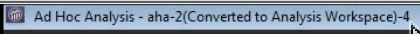
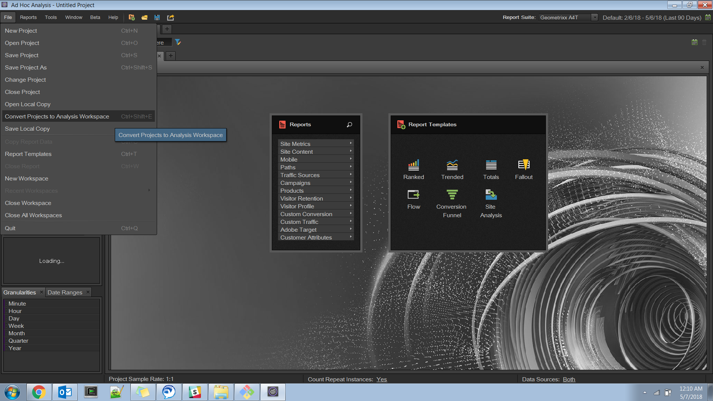
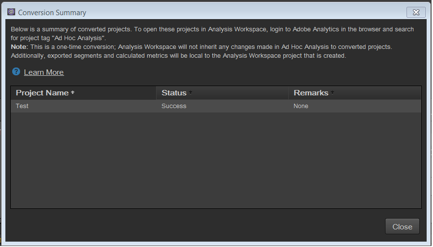

# Conversione di progetti in Ad Hoc Analysis

>[!IMPORTANT]
>
> Adobe si sta muovendo  Ad Hoc Analysis fino alla fine del suo ciclo di vita il 1 marzo 2021. [Ulteriori informazioni](https://adobe.ly/discoverworkspace)

## Convertire i progetti {#topic_5A55F73488704C5D8E42CDD04B5984DE}

Prima di convertire i progetti, tiene presente che:

* Per convertire i progetti, devi aver effettuato l’accesso ad Ad Hoc Analysis come amministratore o come non amministratore con l’autorizzazione per utilizzare Analysis Workspace.
* Poiché si tratta di una conversione una tantum, eventuali ulteriori modifiche apportate ai progetti Ad Hoc convertiti non verranno riportate in Analysis Workspace. Tuttavia puoi convertire nuovamente un progetto.
* Eventuali progetti Ad Hoc Analysis convertiti continueranno a esistere in Ad Hoc, con una parentesi nel titolo che indica che lo stato e il numero di conversioni. Esempio:

   

Per la conversione di progetti Ad Hoc Analysis hai a disposizione 2 opzioni:

* Selezione dei progetti da convertire da un elenco.
* Converti solo il progetto attualmente aperto.

### Selezione di progetti da un elenco

1. In Ad Hoc Analysis, fai clic su **[!UICONTROL File]** > **[!UICONTROL Convert Projects to Analysis Workspace]**.

   

1. Nella finestra di dialogo **[!UICONTROL Convert Projects to Analysis Workspace]**, seleziona il progetto da convertire oppure premi + per selezionare l’intero elenco.

   

1. Fai clic su **[!UICONTROL Convert]**.
1. Tutti i progetti convertiti sono ora elencati in [!UICONTROL Conversion Summary] insieme a colonne di stato che indicano se la conversione è avvenuta con successo, insieme all’eventuale codice di errore. Contatta l’Assistenza clienti Adobe per ulteriori diagnosi con il “`Error-Id: <Error-Code>`”.

   

### Conversione del progetto corrente

1. In Ad Hoc Analysis, apri un progetto da convertire.
1. Fai clic su **[!UICONTROL Convert current project to Analysis Workspace.]** 

1. Tutti i progetti convertiti sono ora elencati in [!UICONTROL Conversion Summary] insieme a colonne di stato che indicano se la conversione è avvenuta con successo, insieme all’eventuale codice di errore. Contatta l’Assistenza clienti Adobe per ulteriori diagnosi con il “`Error-Id: <Error-Code>`”.
