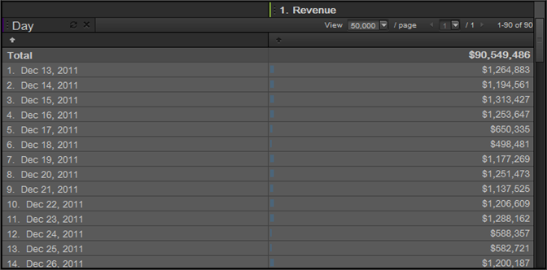

# Tempo

Ora è una dimensione di reporting utile per il passaggio su ore, giorni, settimane e intervalli di date. Ad esempio, un report Prodotti mostra il numero di entrate effettuate a un prodotto durante l'intervallo di date selezionato. Puoi aggiungere una dimensione Giorno per visualizzare la tendenza in ogni giorno del periodo di reporting. Il tempo fornisce le impostazioni di granularità Ora, Giorno, Settimana, Mese, Trimestre e Anno. I predefiniti per intervalli di date includono impostazioni quali Oggi, Ieri e Ultimi 7 giorni.

## Tempo {#concept_CB64A0A2150C471FB0B0B42516905887}

Ora è una dimensione di reporting utile per il passaggio su ore, giorni, settimane e intervalli di date. Ad esempio, un report Prodotti mostra il numero di entrate effettuate a un prodotto durante l'intervallo di date selezionato. Puoi aggiungere una dimensione Giorno per visualizzare la tendenza in ogni giorno del periodo di reporting. Il tempo fornisce le impostazioni di granularità Ora, Giorno, Settimana, Mese, Trimestre e Anno. I predefiniti per intervalli di date includono impostazioni quali Oggi, Ieri e Ultimi 7 giorni.

Per aggiungere dimensioni ora, trascinare uno o più intervalli di date dal riquadro degli strumenti Ora alla tabella del rapporto o al Generatore tabella.

Questo esempio mostra una dimensione Day con ricavi.

## Time - Definitions {#reference_6E718B78E437438E825DB9262086A987}

In the Time pane, you can select date ranges and trending presets, then drag your selections to the [!UICONTROL Table Builder] or report grid.

<!-- 

r_time_panel.xml

 -->

| Campo | Definizione |
|--- |--- |
| Intervalli di date | Consente di selezionare uno o più periodi di tempo e trascinarli nel Generatore tabella o nella griglia del rapporto. Visualizza i periodi di tempo come suddivisioni nelle righe o come intestazioni di colonna. Puoi selezionare periodi come intervalli di giorno, settimana, mese o date personalizzate. Se utilizzate un calendario personalizzato in sitecatalyst, le suite di rapporti ereditano tali impostazioni. |
| Tendenza | Consente di generare rapporti sulle tendenze su ora, giorno, settimana, mese e così via. Quando trascini elementi da Tendenza al rapporto, stai visualizzando dati su un'impostazione temporale regolata dall'intervallo di date specificato dal calendario. |