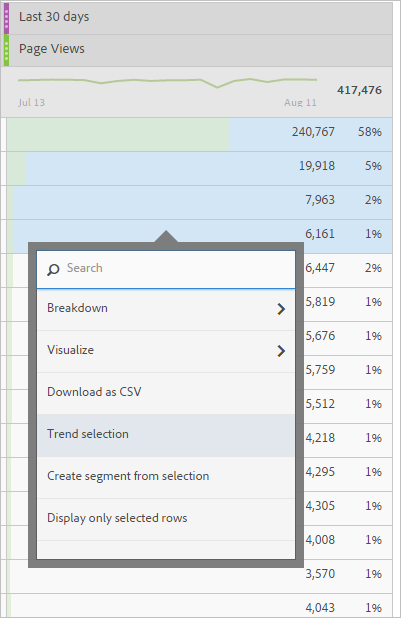
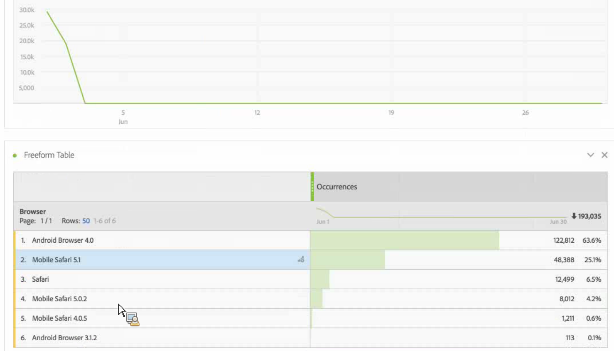

# Panoramica di Analysis Workspace

Analysis Workspace rimuove tutte le limitazioni tipiche di un rapporto singolo di Analytics. Offre un’area di lavoro solida e flessibile su cui realizzare analisi di progetti personalizzati. Trascina su un progetto un numero qualsiasi di tabelle di dati, visualizzazioni e componenti (dimensioni, metriche, segmenti e granularità temporali). Crea all’istante suddivisioni e segmenti, coorti per analisi e avvisi, confronta segmenti, esegue analisi di flusso e di abbandono, cura e programma i rapporti da condividere con i tuoi colleghi.

**[!UICONTROL Analytics]** &gt; **[!UICONTROL Workspace]**

## Overview video {#section_B99BF8A326D94ECB91BD69C9888AD10C}

>[!VIDEO](https://www.youtube.com/watch?v=IHOy-QsvVcA)

Playlist completa di YouTube disponibile [qui](https://www.youtube.com/playlist?list=PL2tCx83mn7GuNnQdYGOtlyCu0V5mEZ8sS).

>[!NOTE]
>
>See [What&#39;s New in Analysis Workspace](../../analyze/analysis-workspace/new-features-in-analysis-workspace.md#concept_EDB651D6F41E4F7BB4EB5E1EBB95D195) for updates about features.

## Full control over project elements and components {#section_B7E3EDA3EDEE407D833F4FDB69646EEC}

Analysis Workspace offre libertà e flessibilità:

* Inserisci componenti (dimensioni, metriche, segmenti e granularità temporali) tramite trascinamento
* Inserisci più visualizzazioni nel progetto tramite trascinamento
* Sposta, ridimensiona e disponi in colonna le visualizzazioni dovunque nel progetto

Consulta [Creazione di un progetto di Analysis Workspace](../../analyze/analysis-workspace/build-workspace-project/t-freeform-project.md#task_C2C698ACC7954062A28E4784911E6CF2) per ulteriori informazioni.

## Multiple visualizations in a project {#section_B7670740C2D44130B21DAF0873280DA5}

Trascina in un progetto tutte le visualizzazioni desiderate.

Crea un progetto visualizzando la percentuale dei cambiamenti, utilizzando visualizzazioni multiple corrispondenti alle celle di una tabella dati a forma libera.

See [Create an Analysis Workspace project](../../analyze/analysis-workspace/build-workspace-project/t-freeform-project.md#task_C2C698ACC7954062A28E4784911E6CF2) for more information.

## Intra-linking to panels and visualizations {#section_253EA04E067F4A29A8B54CE2B7631086}

In conjunction with the [rich text editing](../../analyze/analysis-workspace/visualizations/text.md#concept_2315D97E27364E3194AC1C459B654B2F) capabilities of Analysis Workspace, you can link down to specific panels and visualizations within a project from a text box, such as to create a project&#39;s table of contents. Tali collegamenti possono essere condivisi come i normali collegamenti dei progetti, per indirizzare un utente a specifici pannelli o visualizzazioni di un progetto. Sono state aggiunte nuove opzioni accessibili mediante clic con il pulsante destro del mouse: “Ottieni collegamento pannello” e “Ottieni collegamento visualizzazione”. Per aggiungere un collegamento intra-link al progetto:

1. Trascina una visualizzazione di testo in un progetto, ad esempio accanto a una visualizzazione o a una tabella che richiede informazioni di contesto.
1. Inserisci i contenuti desiderati nella casella di testo, ad esempio un sommario, quindi evidenzia la voce che desideri collegare a un pannello o a una visualizzazione, ad esempio Metriche sul successo.

   

1. Scorri fino al pannello o alla visualizzazione da collegare e fai clic con il pulsante destro del mouse sull’intestazione del pannello.
1. Scroll down and select **[!UICONTROL Get Panel Link]** or **[!UICONTROL Get Visualization Link]**:

   

1. Copia il collegamento e aggiungilo al collegamento ipertestuale Metriche sul successo nella visualizzazione di testo. Fai clic sul simbolo di spunta per salvare il testo.

Se il progetto contiene visualizzazioni o pannelli compressi, quando si fa clic sul relativo collegamento la visualizzazione o il pannello corrispondente viene espanso per renderlo visibile all’utente.

>[!NOTE]
>
>You can also use this feature within the **[!UICONTROL Edit Description]** right-click option.

## Link to other projects {#section_AE886C367C3E4F189B65B1BD9BCDBD8C}

You can link users to other projects that may be of interest to them by going to  **[!UICONTROL Share]** &gt; **[!UICONTROL Get Project Link]** and embedding this link in project descriptions, for example.

## Dynamic visualization of selected cells {#section_182CEC285E4547EBA4608D5F70C9D5D7}

Seleziona celle singole e osserva come le visualizzazioni cambiano in modo dinamico. [Sincronizza e blocca](../../analyze/analysis-workspace/analysis-workspace-features.md#section_9D66A001586F49CEB0C565581E44957C) una visualizzazione con le celle selezionate.

## Lock selected items or positions {#section_9D66A001586F49CEB0C565581E44957C}

Il blocco delle visualizzazioni consente di verificare quali origini delle tabelle di dati a forma libera corrispondono alle visualizzazioni.

See [Manage data sources](../../analyze/analysis-workspace/visualizations/t-sync-visualization.md#task_A73B065DC3834AFCA422E364A1468099).

## Trend visualizations from selected cells {#section_34930C967C104C2B9092BA8DCF2BF81A}

Crea una visualizzazione dalle celle selezionate. (Right-click &gt; **[!UICONTROL Trend Selection]**.)

Le selezioni della tendenza sono ora **collegate** alla tabella seguente, quindi se selezioni una riga diversa nella tabella, il grafico di tendenza la rispecchia.

## Dimensions and dimension item breakdowns {#section_1380C1F9E51E4BFB8C5D35E7A53BC70D}

In qualità di rivenditore, puoi effettuare analisi delle campagne più approfondite che mai e comprendere come coinvolgere meglio i clienti. Analizza i dati in tantissimi modi per ogni necessità; realizza query con metriche, dimensioni, segmenti, linee temporali e altri valori rilevanti.

See [Break down dimensions](../../analyze/analysis-workspace/components/dimensions/t-breakdown-fa.md#task_B594DA2476E84DFDA8279E831F0BD9C4).

## Segments from table selections {#section_73BC3688089B426D969B3D5B606DA970}

Seleziona celle nella tabella a forma libera e crea un segmento dalla selezione.

Confronta più segmenti e crea e applica all’istante i segmenti. Puoi applicare più segmenti per concentrarti su clienti specifici sulla base di comportamenti e interazioni per poi confrontarli tra di loro.

Trascina un segmento nel pannello a forma libera a livello di progetto per applicare il segmento all’intero progetto.

Consulta  [Segmenti](../../analyze/analysis-workspace/components/t-freeform-project-segment.md#task_11C6A2C7717B48049E5750B9D20FEC80).

## Project and component tagging {#section_F54D688132A541F2982326D5E022B90D}

Puoi assegnare i tag a progetti e componenti in Analysis Workspace:

* Applica o crea dei tag a livello di progetto nel pannello di informazioni. (  

* Fai clic con il pulsante destro del mouse sui componenti a cui applicare (o per cui creare) il tag dal pannello Componenti.
* Usa il simbolo # nel campo di ricerca per individuare i tag.

## Component actions {#section_CBF4D0A5F63E4B0883077B8D852B800B}

Per eseguire azioni a livello di componente puoi usare il menu Azioni nella parte superiore della barra dei componenti a sinistra. Select a component and click **[!UICONTROL Actions]** to view the actions.

| Azione del componente | Descrizione |
|--- |--- |
| Tag | Organizzare o gestire i componenti tramite l’applicazione di tag. Questa azione si riflette nel rispettivo Component Manager (Gestione componenti), ad esempio Analytics &gt; Componenti &gt; Segmenti o Analytics &gt; Componenti &gt; Progetti |
| Preferito | Aggiungere il componente all’elenco dei preferiti. Questa azione si riflette nel rispettivo Component Manager (Gestione componenti), ad esempio Analytics &gt; Componenti &gt; Segmenti o Analytics &gt; Componenti &gt; Progetti  . |
| Approva | Approvare il componente per renderlo canonico. Questa azione si riflette nel rispettivo Component Manager (Gestione componenti), ad esempio Analytics &gt; Componenti &gt; Segmenti o Analytics &gt; Componenti &gt; Progetti |
| Condividi | Applicabile solo ai segmenti. |
| Elimina | Applicabile solo ai segmenti. |

See [Visualizations](../../analyze/analysis-workspace/visualizations/freeform-analysis-visualizations.md#concept_09242627629147A88A68F1506954C276) for more information.

## Additional feature descriptions {#section_5F06AE43C0194CFDBCA7EE0EA3C30B05}

**Cosa puoi trascinare e mettere in colonna**

Componenti

* Dimensioni
* Segmenti
* Metriche
* Intervalli di date
* Granularità temporali (ore, giorno, settimane ecc.)

**Tabelle a forma libera multiple e visualizzazioni multiple**

Non esiste un limite tecnico per il numero di tabelle a forma libera e visualizzazioni che puoi aggiungere al pannello. Inoltre, puoi eseguire una nuova visualizzazione (o un’esportazione in CSV) per ogni tabella a forma libera o riga selezionata di una tabella.

**Disposizione, ordinamento e copia delle colonne**

* Ordina predefiniti di intervalli date (non include gli intervalli date personalizzati).
* Ctrl/Comando + trascinamento di una colonna per copiarla; trascina la copia per incollarla nella nuova posizione nella tabella.

Consulta [Tasti di scelta rapida disponibili in Analysis Workspace](../../analyze/analysis-workspace/build-workspace-project/fa-shortcut-keys.md#concept_9A6356084DBC4D468E265E7A65B3E051) per ottenere ulteriori informazioni.

**Selezioni e azioni**

Puoi selezionare righe e colonne in modo simile alla selezione di righe e colonne in Excel. In seguito, potrai eseguire azioni su tali selezioni. Ad esempio:

* Creare visualizzazioni dalle selezioni
* Copiare negli Appunti (CTRL/Comando + C)
* Analizzare più righe selezionate. Seleziona le righe e trascina una dimensione sulla selezione. Oppure, fai clic con il pulsante destro del mouse sulla selezione e usa il menu Analisi approfondita.

**Modifiche salvate automaticamente e non salvate**

Se chiudi il browser (o se fai clic sul pulsante Indietro) ti verrà chiesto di salvare le modifiche perché il progetto non è stato salvato. Se si verifica un arresto anomalo del sistema, in fase di caricamento del progetto, riceverai un avviso per ripristinarlo allo stato precedente.

I progetti già esistenti (non nuovi) verranno salvati automaticamente solo quando il browser si arresta in maniera anomala oppure in tutte le altre circostanze che ti impediscono di salvarli correttamente.

**Tutte le visite**

Un segmento unico predefinito per Analysis Workspace. *`All Visits`* visualizza i totali per i componenti aggiunti alla tabella.

**Metriche calcolate**

Utilizza i calcoli nello stesso modo in cui usi le metriche standard.

Consulta [Metriche calcolate](https://marketing.adobe.com/resources/help/en_US/analytics/calcmetrics/).
