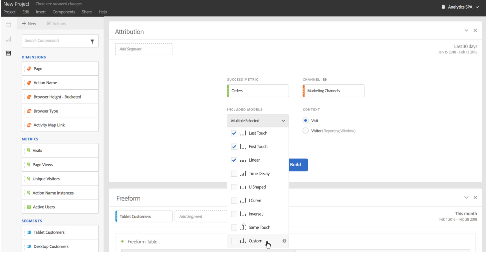

# Utilizzare Attribution IQ in Analysis Workspace

Attribution IQ in Analysis Workspace consente di confrontare tra di loro tutti i modelli di attribuzione supportati; visualizzare le sequenze di marketing chiave che conducono a una conversione con visualizzazioni avanzate di abbandono e flusso; seguire facilmente le tendenze di canale o campagna di marketing per vedere le prestazioni nel corso del tempo; trovare anomalie statistiche nelle prestazioni di un canale o di una campagna; essere avvisati se le prestazioni calano o aumentano.

## Use attribution in freeform tables {#section_F2F72AE840EB4EA781302A559726E6F4}

Le tabelle a forma libera di Analysis Workspace supportano modelli di attribuzione che possono essere utilizzati su praticamente qualsiasi metrica. Modelli di attribuzione che possono essere impostati nella metrica di colonna di una tabella a forma libera in Impostazioni colonne:

1. Fai clic sull’icona Impostazioni (a forma di ingranaggio) nella colonna di una tabella a forma libera.

   

1. Under **[!UICONTROL Data Settings]**, check **[!UICONTROL Use non-default attribution model]**. Per ulteriori informazioni sui diversi modelli di attribuzione, consulta [Panoramica di Attribution IQ](../../../analyze/analysis-workspace/attribution-iq/attribution.md#section_4B9E7F83AE0B451A992397E55C3F5871).

   

## Apply attribution models to breakdowns {#section_ED1E7532CF084B5AB0942BD80B4770C9}

Qualsiasi suddivisione all’interno di una tabella a forma libera può anche essere oggetto dell’applicazione di un modello di attribuzione che può essere uguale o diverso rispetto alla colonna principale. Ad esempio, si potrebbe voler analizzare gli ordini lineari sulla dimensione canali di marketing ma applicare ordini a forma di U agli specifici codici di tracciamento all’interno di un canale. Per modificare il modello di attribuzione applicato a una suddivisione, passa il cursore sul modello di suddivisione e fai clic su Edit (Modifica):

## Compare one attribution model to another {#section_1D74C09549CC4EC8A952A7392C76D375}

If you’d like to quickly and easily compare one attribution model to another, right click a metric and select **[!UICONTROL Add comparative attribution model]**:

Ciò consente di confrontare in modo rapido e semplice un modello di attribuzione con un altro senza dover inserire una metrica e configurarla due volte.

## Attribution panel and visualizations {#section_6B02F28182F14ECC9FC5020F224726E6}

Il pannello Attribuzione permette di strutturare facilmente un’analisi confrontando diversi modelli di attribuzione. Per accedere al pannello Attribuzione:

1. Fai clic sull’icona del pannello all’estremità sinistra.
1. Trascina il pannello Attribuzione nel progetto di Analysis Workspace.

   

1. Aggiungi una metrica di successo da attribuire e aggiungi una dimensione di canale rispetto alla quale eseguire l’attribuzione (ad esempio, canali di marketing o promozioni interne).

   

1. Seleziona i [modelli di attribuzione](../../../analyze/analysis-workspace/attribution-iq/attribution.md) da confrontare, quindi seleziona l’[intervallo di lookback](../../../analyze/analysis-workspace/attribution-iq/attribution.md).

   Il pannello Attribuzione restituirà un ampio set di dati e visualizzazioni per aiutare a comprendere meglio come i canali di marketing (o altre dimensioni) operano assieme:

   

   Segue una descrizione di ciascuna visualizzazione:

| Visualizzazione | Descrizione |
|--- |--- |
| Metrica totale | Il numero totale di conversioni che si sono verificate nell’intervallo di tempo di reporting. Queste sono le conversioni attribuite lungo la dimensione selezionata. |
| Grafico a barre di confronto per l’attribuzione della metrica | Consente di confrontare visivamente le conversioni attribuite per ciascuno degli elementi dimensione dalla dimensione selezionata. Ogni colore di barra rappresenta un distinto modello di attribuzione che è stato selezionato. |
| Tabella a forma libera dell’attribuzione di metrica | Mostra gli stessi dati del grafico a barre: se selezioni colonne o righe diverse in questa tabella, il grafico a barre e numerose altre visualizzazioni vengono filtrati nel pannello. Questa tabella funziona come qualsiasi altra tabella freeform in Workspace, consentendo di aggiungere metriche, segmenti, suddivisioni ecc. |
| Grafico di sovrapposizione delle dimensioni | Un diagramma di Venn che mostra i tre elementi dimensione principali (ad es. canali) e quanto spesso essi partecipano unitamente a una conversione. Ad esempio, le dimensioni della sovrapposizione a bolla indicano quanto spesso si è verificata una conversione quando un visitatore è stato esposto a entrambi gli elementi dimensione (ad es. canali). Quando si selezionano altre righe nella tabella a forma libera, la visualizzazione si aggiorna in base alla selezione. |
| Punti di contatto di marketing per percorso | Un istogramma che indica il numero di punti di contatto di marketing (o qualsiasi dimensione) riscontrati per un visitatore nell’intervallo di date di reporting. Questa visualizzazione è utile per vedere l’impatto dell’attribuzione a più contatti per un set di dati. Se quasi tutti i visitatori hanno solo un singolo punto di contatto, diversi modelli di attribuzione produrranno risultati simili. |
| Dettagli di prestazione di un canale di marketing | Consente di confrontare visivamente fino a tre modelli di attribuzione mediante un grafico di dispersione. |
| Flusso del canale di marketing | Consente di vedere con quali canali si interagisce più comunemente e in quale ordine lungo il percorso di un visitatore. |
