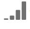

# Modelli di attribuzione e finestre di lookback

Il concetto di attribuzione in Adobe  Analytics richiede due componenti:

* **Modello di attribuzione:** il modello descrive la distribuzione delle conversioni negli hit in un gruppo. Ad esempio, primo contatto o ultimo contatto.
* **Intervallo di lookback dell’attribuzione:** l’intervallo di lookback descrive quali gruppi di hit vengono considerati per ogni modello. Ad esempio, visita o visitatore.

## Modelli di attribuzione

| Icona interfaccia utente | Modello di attribuzione | Definizione | Quando utilizzare |
| --- | --- | --- | --- |
|  | Ultimo contatto | Attribuisce un credito del 100% al punto di contatto più di recente che si verifica prima della conversione. | Si tratta del modello di attribuzione più semplice e comune. Viene spesso utilizzato per le conversioni con un breve ciclo di considerazione. Ultimo contatto viene comunemente utilizzato dai team che gestiscono il marketing di ricerca o che analizzano le parole chiave di ricerca interne. |
|  | Primo contatto | Attribuisce un credito del 100% al punto di contatto visualizzato per la prima volta nell’intervallo di lookback dell’attribuzione. | Si tratta di un altro modello di attribuzione utile per l’analisi dei canali di marketing destinati a generare brand awareness o acquisizione di clienti. Viene utilizzato di frequente dai team di display/social marketing ma è ottimo anche per valutare l’efficacia dei prodotti consigliati durante la navigazione nel sito. |
|  | Stesso contatto | Attribuisce un credito del 100% all’hit in cui si è verificata la conversione. Se un punto di contatto non si verifica sullo stesso hit di una conversione, viene inserito in “None”. | Si tratta di un modello utile quando si valuta l’esperienza utente o il contenuto presentato immediatamente nel momento della conversione. I team che si occupano di prodotti o design utilizzano spesso questo modello per valutare l’efficacia di una pagina in cui si verifica una conversione. |
|  | Lineare | Attribuisce lo stesso credito a ogni punto di contatto che porta a una conversione. | Si tratta di un modello utile per conversioni con esperienze utente o cicli di considerazione più lunghi che necessitano di un coinvolgimento del cliente più frequente. Viene spesso utilizzato dai team che misurano l’efficacia delle notifiche delle app mobili o con prodotti basati su abbonamento. |
|  | A forma di U | Attribuisce il 40% di credito alla prima interazione, il 40% di credito all’ultima interazione e divide il restante 20% in qualsiasi punto di contatto intermedio. Per le conversioni con un singolo punto di contatto, viene assegnato un credito del 100%. Per le conversioni con due punti di contatto, viene assegnato un credito del 50% a entrambi. | Si tratta di un ottimo modello per individuare le interazioni che hanno avviato o chiuso una conversione, pur identificando le interazioni di supporto. L’attribuzione a forma di U è comunemente utilizzata dai team che adottano un approccio più bilanciato ma desiderano dare più valore ai canali di origine o conclusione di una conversione. |
|  | A forma di J | Attribuisce il 60% di credito all’ultima interazione, il 20% di credito alla prima interazione e divide il restante 20% in qualsiasi punto di contatto intermedio. Per le conversioni con un singolo punto di contatto, viene assegnato un credito del 100%. Per le conversioni con due punti di contatto, viene assegnato il 75% di credito all’ultima interazione e il 25% di credito alla prima. | Si tratta di un modello ideale per dare priorità a ricerche e chiusure, pur concentrandosi sulla chiusura delle interazioni. L’attribuzione a forma di J viene spesso utilizzata dai team che adottano un approccio più bilanciato e desiderano dare più valore ai canali da cui è stata conclusa una conversione. |
|  | J inversa | Attribuisce un credito del 60% al primo punto di contatto, un credito del 20% all’ultimo punto di contatto e divide il restante 20% in qualsiasi punto di contatto intermedio. Per le conversioni con un singolo punto di contatto, viene assegnato un credito del 100%. Per le conversioni con due punti di contatto, viene assegnato il 75% di credito alla prima interazione e il 25% di credito all’ultima. | Si tratta di un modello ideale per dare priorità a ricerche e chiusure, pur concentrandosi sulla ricerca delle interazioni. L’attribuzione a J inversa è spesso utilizzata dai team che adottano un approccio più bilanciato e desiderano dare più valore ai canali di origine della conversione. |
|  | Personalizzato | Consente di specificare i valori da assegnare ai punti di contatto, agli ultimi punti di contatto e a eventuali punti di contatto intermedi. I valori specificati vengono normalizzati al 100% anche se la somma dei numeri personalizzati immessi è inferiore a 100. Per le conversioni con un singolo punto di contatto, viene assegnato un credito del 100%. Per le interazioni con due punti di contatto, il parametro intermedio viene ignorato. Il primo e l’ultimo punto di contatto vengono quindi normalizzati al 100% e il credito viene assegnato di conseguenza. | Si tratta di un modello perfetto per avere pieno controllo sul proprio modello di attribuzione e rispondere a esigenze specifiche che altri modelli di attribuzione non soddisfano. |
|  | Decadimento nel tempo | Segue un decadimento esponenziale con un parametro di mezza durata personalizzato, dove il valore predefinito è 7 giorni. Il valore di ciascun canale dipende dalla quantità di tempo trascorsa tra l’avvio del punto di contatto e l’eventuale conversione. La formula utilizzata per determinare il credito è `2^(-t/halflife)`, dove `t` è il tempo tra un punto di contatto e una conversione. Tutti i punti di contatto vengono quindi normalizzati al 100%. | Si tratta di un modello ideale per i team che eseguono regolarmente campagne pubblicitarie video o che mirano su eventi basati su data prestabilita. Più una conversione si verifica dopo un evento di marketing, meno credito viene assegnato. |
|  | Partecipazione | Assegna il 100% di credito a tutti i punti di contatto unici. Il numero totale di conversioni è aumentato rispetto ad altri modelli di attribuzione. La partecipazione deduplica i canali visualizzati più volte. | Si tratta di un modello ottimo per comprendere quanto spesso i clienti sono esposti a una determinata interazione. Le società di comunicazioni utilizzano spesso questo modello per calcolare la velocità del contenuto. Le società di commercio al dettaglio usano spesso questo modello per capire quali sono le parti del sito che sono fondamentali per la conversione. |
|  | [Algoritmica](algorithmic.md) | Utilizza tecniche statistiche per determinare in modo dinamico l’allocazione ottimale del credito per la metrica selezionata. | Utile per evitare supposizioni o euristiche al momento della scelta del modello di attribuzione corretto per la propria attività. |

## Intervalli di lookback

Per intervallo di lookback si intende la quantità di tempo che una conversione deve recuperare nel passato per includere i punti di contatto. I modelli di attribuzione che attribuiscono maggiore credito alle prime interazioni visualizzano differenze più importanti quando si visualizzano diversi intervalli di lookback.

* **Intervallo di lookback su visita:** considera fino l’inizio di una visita che ha generato una conversione. Gli intervalli di lookback sono ridotti perché considerano esclusivamente la visita. Gli intervalli di lookback su visita rispettano la definizione di visita modificata nelle suite di rapporti virtuali.

* **Intervallo di lookback su visitatore:** considera fino alla prima visita registrata nel mese indicato nell’intervallo di date corrente. Gli intervalli di lookback su visitatore sono ampie in quanto possono coinvolgere molte visite. Il lookback del visitatore considera tutti i valori dall&#39;inizio del mese dell&#39;intervallo di date del report. Ad esempio, se l’intervallo di date del rapporto è dal 15 settembre al 30 settembre, l’intervallo di date del lookback su visitatore considererà il periodo dal 1° al 30 settembre.

* **Finestra di lookback personalizzata:** Consente di espandere la finestra di attribuzione oltre l&#39;intervallo di date del rapporto fino a un massimo di 90 giorni. Le finestre di lookback personalizzate vengono valutate per ogni conversione nel periodo di reporting. Ad esempio, per una conversione che si verifica il 20 febbraio, una finestra di lookback di 10 giorni valuterà tutti i punti di contatto di dimensione dal 10 al 20 febbraio nel modello di attribuzione.

## Esempio

Prendi in considerazione l’esempio seguente:

1. Il 15 settembre, un visitatore arriva sul tuo sito tramite un annuncio pubblicitario di ricerca a pagamento, poi se ne va.
2. Il 18 settembre, il visitatore ritorna sul tuo sito tramite un collegamento social media ricevuto da un amico. Aggiunge diversi articoli al carrello, ma non acquista nulla.
3. Il 24 settembre, il team marketing gli invia un’e-mail con un coupon da utilizzare su alcuni degli elementi nel carrello. Applica il coupon, ma visita diversi altri siti per vedere se sono disponibili altri coupon. Ne trova un altro tramite un annuncio pubblicitario, quindi completa un acquisto dal valore di 50 $.

A seconda dell’intervallo di lookback e del modello di attribuzione definiti, ai canali saranno assegnati crediti diversi. Di seguito sono riportati alcuni esempi significativi:

* Utilizzando il **primo contatto** e un **intervallo di lookback su visita**, l’attribuzione considera solo la terza visita. Tra e-mail e visualizzazione, e-mail è avvenuta prima, quindi e-mail ottiene 100% di credito per l’acquisto di 50 $.
* Utilizzando il **primo contatto** e un **intervallo di lookback su visitatore**, l’attribuzione esamina tutte e tre le visite. La ricerca a pagamento è avvenuta prima, quindi ottiene il 100% di credito per l’acquisto di 50 $.
* Utilizzando un modello **lineare** e un **intervallo di lookback su visita**, il credito è diviso tra e-mail e visualizzazione. Entrambi questi canali ricevono un credito di 25 $.
* Utilizzando un modello **lineare** e un **intervallo di lookback su visitatore**, il credito è suddiviso tra ricerca a pagamento, social, e-mail e visualizzazione. Ogni canale ottiene un credito di 12,50 $ per questo acquisto.
* Utilizzando un modello **a forma di J** e un **intervallo di lookback su visitatore**, il credito è suddiviso tra ricerca a pagamento, social, e-mail e visualizzazione.
   * Il 60% di credito è assegnato alla visualizzazione, per un valore di 30 $.
   * Il 20% di credito è assegnato alla ricerca a pagamento, per un valore di 10 $.
   * Il restante 20% è suddiviso tra social e e-mail, ovvero 5 $ ciascuno.
* Utilizzando **Decadimento nel tempo** e un **intervallo di lookback su visitatore**, il credito è diviso tra ricerca a pagamento, social, e-mail e visualizzazione. Utilizzando la mezza durata predefinita di 7 giorni:
   * Intervallo di 0 giorni tra il punto di contatto visualizzazione e la conversione. `2^(-0/7) = 1`
   * Intervallo di 0 giorni tra il punto di contatto e-mail e la conversione. `2^(-0/7) = 1`
   * Intervallo di 6 giorni tra il punto di contatto social e la conversione. `2^(-6/7) = 0.552`
   * Intervallo di 9 giorni tra il punto di contatto ricerca a pagamento e la conversione. `2^(-9/7) = 0.41`
   * La normalizzazione di questi valori determina quanto segue:
      * Visualizzazione: 33,8%, ovvero 16,88 $
      * E-mail: 33,8% ovvero 16,88 $
      * Social: 18,6%, ovvero 9,32 $
      * Ricerca a pagamento: 13,8%, ovvero 6,92 $

>[!TIP]
>
>Anche altri eventi di conversione, come ordini o eventi personalizzati, saranno suddivisi se il credito è associato a più di un canale. Ad esempio, se due canali contribuiscono a un evento personalizzato utilizzando un modello di attribuzione lineare, entrambi i canali ottengono 0,5 dell’evento personalizzato. Queste frazioni di eventi vengono sommate tra tutte le visite, quindi arrotondate al numero intero più vicino per la generazione del rapporto.
