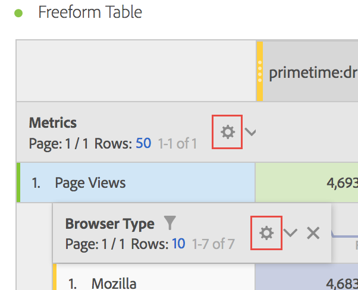

# Impostazioni riga

Le Impostazioni riga variano a seconda del componente che hai trascinato all’interno della tabella.

In una tabella, puoi utilizzare anche le [azioni pulsante destro](/help/analyze/analysis-workspace/visualizations/freeform-table.md) per gestire le righe selezionate.

Per accedere alle impostazioni di riga, fai clic sull’icona Impostazioni accanto a una dimensione, a un segmento, a una metrica, a un periodo di tempo o a un’interruzione in ognuna di queste:

<table id="table_7ACE6413DB1F40349ED2860020F92E55"> 
 <thead> 
  <tr> 
   <th colname="col1" class="entry"> Impostazione delle righe </th> 
   <th colname="col2" class="entry"> Descrizione </th> 
  </tr>
 </thead>
 <tbody> 
  <tr> 
   <td colname="col1"> 
<a href="/help/analyze/analysis-workspace/components/calendar-date-ranges/time-comparison.md"  > Confronto date</a> 
 </td> 
   <td colname="col2"> 
<b>Allinea le date di ogni colonna affinché inizino tutte sulla stessa riga. </b> 
 
Quando scegli di allineare le date, ad esempio in un confronto mese-su-mese tra ottobre e settembre 2016, la colonna a sinistra inizierà con il 1 ottobre e la colonna a destra inizierà con il 1 settembre: 
 
 
 
Disabilitata per impostazione predefinita. 
 </td> 
  </tr> 
  <tr> 
   <td colname="col1"> 
Percentuali 
 </td> 
   <td colname="col2"> 
<b>Calcola percentuali per riga</b> 
 
Forza il calcolo delle percentuali delle celle di una riga, anziché di una colonna. Questo è utile in particolare per le percentuali di tendenza. L’opzione è attivata per impostazione predefinita quando si usa l’icona Visualizza. 
 </td> 
  </tr> 
  <tr> 
   <td colname="col1"> 
Totali colonna 
 </td> 
   <td colname="col2"> 
Queste impostazioni vengono visualizzate solamente con <a href="/help/analyze/analysis-workspace/build-workspace-project/column-row-settings/manual-vs-dynamic-rows.md"  > righe manuali (statiche)</a> (quando hai selezionato un set finito di elementi) e non con righe dinamiche (quando rilasci una dimensione che mostra tutti gli elementi). 
Nota: per righe manuali <i>metriche</i>, l’impostazione è disabilitata in quanto non avrebbe alcun senso sommare ulteriori metriche oltre alle righe correnti in una tabella. 
 
 
<b>Calcola i totali, sommando i valori attualmente presenti in ciascuna colonna (abilitata per impostazione predefinita):</b> 
 
Questa opzione consente di calcolare solo le righe presenti nella tabella (calcolo lato client). 
 
<b>Calcola i totali sulla base di tutte le righe di ogni metrica (disabilitata per impostazione predefinita):</b> 
 
Questa opzione include tutti gli elementi di questa dimensione anche quelli non elencati nella tabella (calcolo lato server). 
 </td> 
  </tr> 
  <tr> 
   <td colname="col1"> 
Breakdowns (Suddivisioni) 
 </td> 
   <td colname="col2"> 
<b>Suddivisione per posizione:</b> 
 
È possibile mostrare le suddivisioni in base a una posizione fissa in una tabella a forma libera. Ad esempio, puoi specificare di suddividere sempre le prime sette righe. 
 
(In precedenza, i valori elencati nella suddivisione erano bloccati. This led to a situation where, for example, if you broke down  Date by  Page, you got a list of the top 50 pages for your selected date range. Se avessi salvato questo rapporto e lo avessi eseguito di nuovo un mese più tardi, le prime 50 pagine sarebbero probabilmente cambiate. Analysis Workspace utilizzava comunque i risultati della suddivisione originale e restituiva le stesse pagine, ma con il mese corrente come intervallo di date.) 
 
Per eseguire suddivisioni sulla base di una posizione fissa: 
 
    <ol id="ol_A396A11566AA4F52BC3ABBC373CEF477"> 
     <li id="li_BDAB1E9A48D44944A4F7C31F1182B923">Suddividi alcune delle righe nella tua tabella. </li> 
     <li id="li_C5610437D3714CCEB9F3C771864B4336">Fai clic sull’icona Impostazioni (ingranaggio) accanto alla riga della tabella che desideri mettere in posizione fissa. </li> 
     <li id="li_675E429DC3B94201978166F9408D30B1">Spunta la casella di controllo accanto a Suddivisione per posizione. </li> 
     <li id="li_E8A417D0D6D1438CAE825843BA0A7060">Modifica l’ordinamento o l’intervallo di date e osserva come ora le suddivisioni sono correlate alla posizione della riga e non alle righe a codifica fissa. </li> 
    </ol> 
Disabilitata per impostazione predefinita. 
 </td> 
  </tr> 
 </tbody> 
</table>

