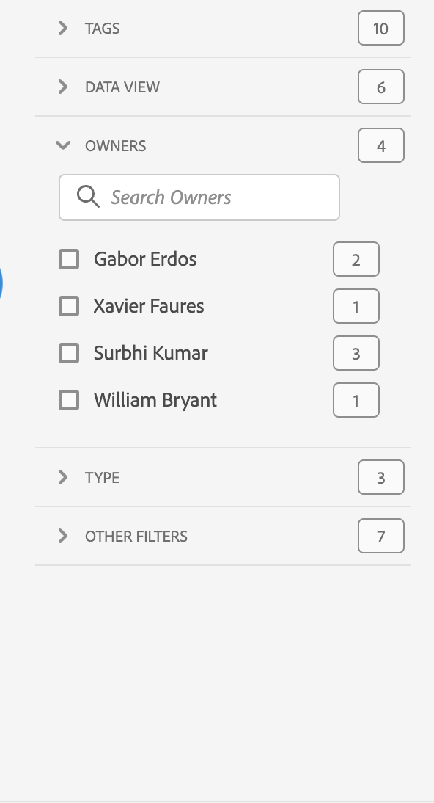

# Panoramica dei progetti

Con i progetti Workspace puoi combinare pannelli, visualizzazioni e componenti per preparare analisi da condividere con altri utenti nella tua organizzazione. Prima di iniziare il tuo primo progetto, scopri come poter accedere ai progetti, gestirli e sportarti al loro interno.

Per accedere ai progetti in Adobe Analytics, selezionare **[!UICONTROL Workspace]**.  Gestione **[!UICONTROL Projects]** elenca tutti i progetti di tua proprietà o che sono stati condivisi con te. Il Project manager con l’elenco Progetto è anche la pagina di destinazione predefinita per Adobe Analytics, a meno che tu non abbia configurato diversamente in Preferenze.

## Area del titolo

Dall’area del titolo ➊ puoi creare un progetto o una cartella, modificare le preferenze e mostrare o nascondere un pannello con sezioni aggiuntive.

* Per mostrare o nascondere un pannello a sinistra che consente di selezionare tra **[!UICONTROL Projects]** e **[!UICONTROL Learning]**, seleziona .
* Il titolo mostra Progetti, a cui può essere aggiunto un percorso alla cartella selezionata. Ad esempio: [!UICONTROL Projects] > **[!UICONTROL Company Folder]**. Selezionando una singola sottocartella, puoi passare direttamente alla cartella desiderata.
* Per visualizzare i riquadri per [**[!UICONTROL Blank project]**](create-projects.md), [**[!UICONTROL Blank mobile scorecard]**](/help/analyze/mobile-app/create-scorecard.md), **[!UICONTROL Open the documentation]** e **[!UICONTROL Open release notes]**, selezionare  **[!UICONTROL Show more]**. Per nascondere l’area con i riquadri, seleziona **[!UICONTROL Show less]**.
* In base a quello che hai scelto di visualizzare, utilizzando il selettore [Mostra](#show-selector) puoi modificare le preferenze ed eseguire azioni sulla cartella corrente visibile in **[!UICONTROL Projects]**:

  | Azione | Descrizione |
  |---|---|
  | **[!UICONTROL Create project]** | Seleziona per [creare un nuovo progetto](create-projects.md). |
  | **[!UICONTROL Create folder]** | Seleziona per [creare una nuova cartella](workspace-folders/create-folders.md). |
  |  **[!UICONTROL Edit preferences]** | [Modifica le preferenze](/help/analyze/analysis-workspace/user-preferences.md) per tutti i tuoi progetti. Quando la breadcrumb restituisce uno spazio limitato, questa azione fa parte del sottomenu . |
  | **[!UICONTROL Add projects]** | Seleziona per [aggiungere progetti](workspace-folders/add-projects.md) alla cartella corrente. Quando la breadcrumb restituisce uno spazio limitato, questa azione fa parte del sottomenu . |
  | **[!UICONTROL Rename folder]** | [Rinomina](workspace-folders/manage-folders.md#rename-folders) la cartella corrente. |
  | **[!UICONTROL Move folder]** | [Sposta](workspace-folders/manage-folders.md#move-folders) la cartella corrente. |
  | **[!UICONTROL Delete folder]** | [Elimina](workspace-folders/manage-folders.md#delete-folders) la cartella corrente. |

## Elenco dei progetti

L’elenco progetti ➋ mostra tutti i progetti di tua proprietà e che sono stati condivisi con te. L’elenco dispone delle seguenti colonne:

| Colonna | Descrizione |
| --- | --- |
|  | Se sono selezionati uno o più progetti, nella parte bassa dell’interfaccia Progetti viene visualizzata una barra blu delle azioni. Per ulteriori dettagli, consulta [Azioni](#actions). |
|  | Seleziona per contrassegnare come preferito  o non preferito  un progetto. |
| **[!UICONTROL Title and description]** | Per modificare il progetto, seleziona il collegamento del titolo, che apre il [progetto Workspace](/help/analyze/analysis-workspace/home.md). I progetti condivisi con te sono contrassegnati con l’icona . Seleziona  per visualizzare un menu popup con ulteriori dettagli sul progetto. Seleziona  per aprire un menu di scelta rapida con alcune azioni. Per ulteriori dettagli, consulta [Azioni](#actions). |
| **[!UICONTROL Type]** | Un progetto Workspace, una cartella  o una [scorecard per dispositivi mobili](/help/analyze/mobile-app/home.md). |
| **[!UICONTROL Tags]** | I tag applicati al progetto. |
| **[!UICONTROL Scheduled]** | Indica se un progetto è programmato per essere inviato tramite e-mail ai destinatari. Le opzioni sono  **[!UICONTROL On]** o  **[!UICONTROL Off]**. Consulta [Inviare dati di progetto ad altri](/help/analyze/analysis-workspace/curate-share/t-schedule-report.md). |
| **[!UICONTROL Shared link (anyone)]** | Se un progetto è condiviso con altri, anche con persone che non hanno accesso ad Analysis Workspace. Le opzioni sono  **[!UICONTROL Active]** o  **[!UICONTROL Inactive]**. Consulta [Condividere un progetto con qualcuno (accesso non richiesto)](/help/analyze/analysis-workspace/curate-share/share-projects.md#share-a-project-with-anyone-no-login-required) in [Condividere i progetti](/help/analyze/analysis-workspace/curate-share/share-projects.md) per ulteriori informazioni. |
| **[!UICONTROL Project Role]** | Il tuo ruolo nel progetto. Le opzioni sono: Modifica, Duplica, Visualizza. Consulta [Ruoli di progetto](/help/analyze/analysis-workspace/curate-share/curate.md) per ulteriori informazioni. |
| **[!UICONTROL Report Suite]** | La suite di rapporti a cui è associato il progetto. |
| **[!UICONTROL Owner]** | Autore del progetto (tu o l’utente che ha condiviso con te il progetto). |
| **[!UICONTROL Shared with]** | Utenti con cui il progetto è stato condiviso. |
| **[!UICONTROL Last Modified]** | Data e ora dell’ultima volta che il progetto è stato modificato. |
| **[!UICONTROL Last Opened]** | Data e ora dell’ultima apertura del progetto. |
| **[!UICONTROL Component ID]** | ID del componente. |
| **[!UICONTROL Longest Date Range]** | L’intervallo di date più lungo tra i pannelli o le visualizzazioni del progetto. |
| **[!UICONTROL Number of Queries]** | Il numero totale di query contenute nel progetto. |
| **[!UICONTROL Location]** | La cartella in cui risiede il progetto. |

Passa il puntatore su un’intestazione di colonna per visualizzare  e seleziona dal menu di scelta rapida:

* **[!UICONTROL Sort Ascending]**
* **[!UICONTROL Sort Descending]**
* **[!UICONTROL Resize column]**. Viene visualizzata una linea blu che ti aiuta a ridimensionare la colonna.

### Azioni

Puoi eseguire azioni su uno o più progetti utilizzando il menu di scelta rapida  o la barra delle azioni blu.

| Icona | Azione | Descrizione |
|:---:| ---|---|
|  | **[!UICONTROL *x *selezionato]** | Deseleziona i progetti e le cartelle selezionati e rimuovi la barra blu delle azioni. |
|  | **[!UICONTROL Delete]** | Elimina uno o più progetti o cartelle. Viene richiesta una conferma. 
I progetti eliminati:
<ul><li>Non possono essere recuperati</li><li>Vengono rimossi dall’elenco dei progetti</li><li>Non è più possibile accedervi con il rispettivo URL</li><li>Non sono più inclusi nelle consegne pianificate, nei casi in cui erano precedentemente configurate per le consegne pianificate Per informazioni sulle consegne pianificate, consulta [Progetti pianificati](/help/components/scheduled-projects-manager.md).  
 |
|  | **[!UICONTROL Share]** | Condividi un progetto. Per ulteriori informazioni, consulta [Condividere un progetto](/help/analyze/analysis-workspace/curate-share/share-projects.md). |
|  | **[!UICONTROL Rename]** | Rinomina un progetto. Si apre una finestra di dialogo **[!UICONTROL Rename: *del nome del progetto *]**. Immetti un nuovo nome e seleziona **[!UICONTROL Save]**. |
|  | **[!UICONTROL Copy]** | Copia uno o più progetti. Al progetto vengono assegnati lo stesso nome e suffisso `(Copy)`. |
|  | **[!UICONTROL Pin]** o **[!UICONTROL Unpin]** | Fissa o sposta uno o più progetti o cartelle. I progetti e le cartelle fissati vengono visualizzati nella parte superiore dell’elenco e ignorano l’ordinamento specificato. |
|  | **[!UICONTROL Move up]** | Sposta un progetto o una cartella fissati verso l’alto nell’elenco dei progetti. |
|  | **[!UICONTROL Move down]** | Sposta un progetto o una cartella fissati verso il basso nell’elenco dei progetti. |
|  | **[!UICONTROL Tag]** | Consente di assegnare tag a uno o più progetti o cartelle. Viene visualizzata la finestra di dialogo **[!UICONTROL Tag Components]** in cui è possibile selezionare uno o più tag. Seleziona **[!UICONTROL Save]** per salvare i tag per i progetti o le cartelle selezionate. |
|  | **[!UICONTROL Approve]** o **[!UICONTROL Unapprove]** | Consente di approvare o annullare l’approvazione di un progetto. Solo gli amministratori possono approvare i progetti. |
|  | **[!UICONTROL Export CSV]** | Consente di esportare i progetti selezionati in un file CSV denominato `Project List.csv`. |
|  | **[!UICONTROL Add Projects]** | Consente di aggiungere uno o più progetti a una cartella selezionata. In **[!UICONTROL Add Projects]** è possibile selezionare uno o più progetti. Seleziona **[!UICONTROL Add]** per aggiungere i progetti alla cartella. Per ulteriori informazioni, consulta [Aggiungere progetti alle cartelle](workspace-folders/add-projects.md#from-inside-a-folder). |
|  | **[!UICONTROL Move to]** | Consente di spostare in una cartella uno o più progetti selezionati. In **[!UICONTROL Select Folder]** seleziona la cartella in cui spostare il progetto selezionato e seleziona **[!UICONTROL Move]**. Per ulteriori informazioni, consulta [Aggiungere progetti alle cartelle](workspace-folders/add-projects.md#from-the-project-list). |

## Mostra selettore

Puoi cambiare il look and feel dell’interfaccia Progetti utilizzando i selettori **[!UICONTROL Show]** ➌. Il selettore **[!UICONTROL Show]** consente di definire le opzioni disponibili nell’[area del titolo](#title-area) e le colonne visualizzate nell’[elenco dei progetti](#project-list).

* Per modificare le opzioni disponibili per l’[area del titolo](#title-area), seleziona **[!UICONTROL Show]** **[!UICONTROL All projects]** o **[!UICONTROL Show]** **[!UICONTROL Folders & Projects]**.

* Per definire le colonne da visualizzare nell’[elenco dei progetti](#project-list), seleziona  e nella finestra di dialogo **[!UICONTROL Customize table]** seleziona o deseleziona le colonne desiderate. Seleziona **[!UICONTROL Apply]** per applicare la personalizzazione. Per ulteriori dettagli sulle colonne, consulta [Elenco dei progetti](#project-list).

## Pannello dei filtri

Puoi filtrare i progetti e le cartelle presenti nell’[elenco dei progetti](#project-list) utilizzando il pannello dei filtri ➍. Per mostrare o nascondere il pannello dei filtri, utilizza l’icona .

Il pannello dei filtri è costituito dalle sezioni seguenti.

### Tag

| Tag | Descrizione |
|---|---|
| {width="300"} | La sezione **[!UICONTROL Tags]** consente di filtrare in base ai tag. <ul><li>Puoi utilizzare  *Ricerca tag* per cercare i tag in base ai quali applicare il filtro.</li><li>Puoi selezionare più di un tag. I tag disponibili dipendono dalle selezioni effettuate in altre sezioni nel pannello dei filtri.</li><li>I numeri indicano:<ul><li>**2︎⃣**: numero di tag disponibili per i progetti, risultanti dal filtro corrente.</li><li>7︎⃣: numero di progetti associati al tag specifico.</li></ul></li></ul> |

### Suite di rapporti

| Suite di rapporti | Descrizione |
|---|---|
| {width="300"} | La sezione **[!UICONTROL Report Suites]** ti consente di filtrare in base alle suite di rapporti. <ul><li>Puoi utilizzare  *Cerca suite di rapporti* per cercare le suite di rapporti che desideri utilizzare per filtrare.</li><li>Puoi selezionare più di una suite di rapporti. Le suite di rapporti disponibili dipendono dalle selezioni effettuate in altre sezioni nel pannello dei filtri.</li><li>I numeri indicano:<ul><li>**3︎⃣**: numero di suite di rapporti disponibili per i progetti risultanti dal filtro corrente.</li><li>4︎⃣: numero di progetti associati alla suite di rapporti specifica.</li></ul></li></ul> |

### Proprietari

| Proprietario | Descrizione |
|---|---|
| {width="300"} | La sezione **[!UICONTROL Owner]** consente di filtrare in base ai proprietari. <ul><li>Puoi utilizzare  *Ricerca proprietari* per cercare i proprietari da utilizzare per filtrare.</li><li>Puoi selezionare più di un proprietario. I proprietari disponibili dipendono dalle selezioni effettuate in altre sezioni nel pannello dei filtri.</li><li>I numeri indicano:<ul><li>**3︎⃣**: numero di proprietari disponibili per i progetti, risultanti dal filtro corrente.</li><li>4︎⃣: numero di progetti associati al proprietario specifico.</li></ul></li></ul> |

### Tipo

| Tipo | Descrizione |
|---|---|
| {width="300"} | La sezione **[!UICONTROL Type]** consente di filtrare in base al tipo di progetti o cartelle.<ul><li>È possibile scegliere una o più delle opzioni seguenti:<ul><li> **[!UICONTROL folder]**</li><li>**[!UICONTROL Workspace project]**</li><li>**[!UICONTROL Mobile scorecard]**</li></ul> <li>Puoi selezionare più di un altro filtro. Gli altri filtri disponibili dipendono dalle selezioni effettuate in altre sezioni nel pannello dei filtri.</li><li>I numeri indicano:<ul><li>**5︎⃣**: numero di altri filtri disponibili per i progetti risultanti dal filtro corrente.</li><li>4︎⃣: numero di progetti associati all’altro filtro specifico.</li></ul></li></ul> |

### Altri filtri

| Altri filtri | Descrizione |
|---|---|
| {width="300"} | La sezione **[!UICONTROL Other filters]** ti consente di filtrare in base ad un altro filtro predefinito.<ul><li>È possibile scegliere una o più delle opzioni seguenti:<ul><li> **[!UICONTROL Show all]**</li><li>**[!UICONTROL Shared with me]**</li><li>**[!UICONTROL Mine]**</li><li>**[!UICONTROL Approved]**</li><li>**[!UICONTROL Favorites]**</li></ul> Ciò che puoi selezionare dipende dal tuo ruolo e dalle autorizzazioni.</li><li>Puoi selezionare più di un altro filtro. Gli altri filtri disponibili dipendono dalle selezioni effettuate in altre sezioni nel pannello dei filtri.</li><li>I numeri indicano:<ul><li>**5︎⃣**: numero di altri filtri disponibili per i progetti risultanti dal filtro corrente.</li><li>4︎⃣: numero di progetti associati all’altro filtro specifico.</li></ul></li></ul> |

## Ricerca

Utilizza l’area di ricerca ➎ per cercare progetti e cartelle utilizzando il campo . Inizia a digitare e l’[elenco progetti](#project-list) filtra automaticamente l’input della ricerca.

L’area Ricerca mostra anche i filtri applicati dal pannello Filtro.

* Per rimuovere un filtro, seleziona  nel filtro.
* Per rimuovere tutti i filtri, seleziona Cancella tutto.

Se lo spazio è limitato alla visualizzazione dei singoli filtri, visualizzerai **[!UICONTROL Segmenting by *x *filtri]**.

* Per rimuovere un filtro:

   1. Utilizza **[!UICONTROL *x *filtri]** per aprire un menu di scelta rapida in cui sono elencati i tipi di filtri e i singoli filtri.
   1. Seleziona  per rimuovere un filtro.

