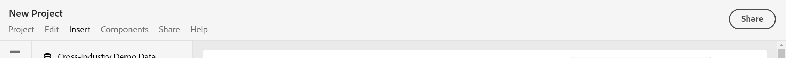

# Panoramica sui progetti

I progetti Workspace ti consentono di combinare componenti dati, tabelle e visualizzazioni per sviluppare le tue analisi e condividerle con chiunque all’interno della tua organizzazione. Prima di iniziare il primo progetto, scopri come accedere, navigare e gestire i progetti.

## Elenco progetti {#project-list}

La prima volta che scegli **[!UICONTROL Analytics]** > **[!UICONTROL Workspace]**, nella pagina sono elencati tutti i progetti di tua proprietà o che sono stati condivisi con te. Questa è anche la pagina di destinazione per Adobe Analytics, a meno che tu non abbia precedentemente impostato una pagina di destinazione personalizzata.

La pagina dell’elenco dei progetti Workspace contiene le seguenti informazioni:

| Elemento | Descrizione |
|---|---|
| [Crea nuovo progetto](/help/analyze/analysis-workspace/home.md) | Fai clic su questo collegamento per avviare un nuovo progetto da zero o da un [template](https://experienceleague.adobe.com/docs/analytics/analyze/analysis-workspace/build-workspace-project/starter-projects.html?lang=en#analysis-workspace) creato per te. |
| Gestione progetti | Fai clic su questo collegamento per passare al modulo di gestione dei componenti per progetti (**[!UICONTROL Analytics]** > **[!UICONTROL Components]** > **[!UICONTROL Projects]**), in cui vengono elencati tutti i tuoi progetti e dove puoi assegnare tag, condividere, eliminare, rinominare, approvare, copiare ed esportare i progetti come file CSV. |
| Imposta come pagina di destinazione | Consente di impostare la pagina attuale come pagina di destinazione di Workspace. |
| [Visualizza esercitazioni](https://docs.adobe.com/content/help/en/analytics-learn/tutorials/analysis-workspace/analysis-workspace-basics/analysis-workspace-introduction.html) | Consente di accedere ai video tutorial su Analysis Workspace. |
| Nome | Nome del progetto Workspace. |
| Proprietario | Autore del progetto (tu o l’utente che ha condiviso con te il progetto). |
| Tipo | Indica se si tratta di un progetto Workspace o di una [scheda di valutazione mobile](https://docs.adobe.com/content/help/it-IT/analytics/analyze/mobapp/home.html). |
| [Ruolo progetto](https://experienceleague.adobe.com/docs/analytics/analyze/analysis-workspace/curate-share/share-projects.html) | Indica il ruolo del progetto: proprietari, modifica, duplicato, visualizzazione. |
| Tag | Tag applicati al progetto. |
| Ultima modifica | Data e ora dell’ultima volta che il progetto è stato modificato. |
| Progetti preferiti | Per contrassegnare un progetto come preferito, aprilo e fai clic sulla stella accanto al nome del progetto. Al successivo avvio di Workspace, verrà elencato tra i progetti preferiti. |
| Progetti visualizzati di frequente | Elenca i progetti che vengono aperti più spesso, per accedervi più facilmente. |

## Barra dei menu {#menu-bar}

All’interno di un progetto, il menu fornisce opzioni per la gestione del progetto, l’aggiunta di componenti, la ricerca di aiuto e altro ancora. È inoltre possibile accedere a ogni opzione di menu tramite le scelte rapide da tastiera [a1/>.](https://experienceleague.adobe.com/docs/analytics/analyze/analysis-workspace/build-workspace-project/fa-shortcut-keys.html)

| Voce di menu | Descrizione |
|---|---|
| Progetto | Include azioni comuni per la gestione dei progetti, tra cui Nuovo, Apri, Salva, Salva con nome e [Salva con nome](https://experienceleague.adobe.com/docs/analytics/analyze/analysis-workspace/build-workspace-project/starter-projects.html). Puoi anche aggiornare l’intero progetto per recuperare i dati e le definizioni più recenti facendo clic su Aggiorna progetto. [Le opzioni Scarica CSV e ](https://experienceleague.adobe.com/docs/analytics/analyze/analysis-workspace/curate-share/download-send.html) PDF consentono di esportare i dati da Workspace. [Informazioni e ](https://experienceleague.adobe.com/docs/analytics/analyze/analysis-workspace/build-workspace-project/freeform-overview.html?#info-settings) impostazioni progetto offre molte opzioni per la gestione del progetto. |
| Modificare | Annulla o ripristina l’ultima azione. Cancella tutto ripristina il progetto in un punto iniziale vuoto. |
| Inserisci   | Inserisci nuovi pannelli o visualizzazioni da questo menu. Puoi anche inserire nuovi pannelli e visualizzazioni dalla barra a sinistra. |
| [Componenti](https://experienceleague.adobe.com/docs/analytics/analyze/analysis-workspace/components/analysis-workspace-components.html) | Crea dal progetto nuovi segmenti, metriche calcolate, intervalli di date o componenti di avviso. Puoi anche creare nuovi componenti dalla barra a sinistra. Se le definizioni dei componenti sono state recentemente modificate, Aggiorna componenti recupererà le definizioni più recenti. |
| [Condividi](https://experienceleague.adobe.com/docs/analytics/analyze/analysis-workspace/curate-share/send-schedule-files.html) | Cura, condividi e pianifica progetti PDF/CSV per i destinatari della tua organizzazione. |
| Aiuto | Accedi alla documentazione dell&#39;Aiuto, ai video e alla community di Experience League . Gestisci la visibilità dei suggerimenti di Workspace e del [debugger](https://www.adobe.io/apis/experiencecloud/analytics/docs.html#!AdobeDocs/analytics-2.0-apis/master/reporting-tricks.md). Trova dettagli su Workspace e fattori che influiscono sulle prestazioni del progetto [a1/>.](https://experienceleague.adobe.com/docs/analytics/analyze/analysis-workspace/workspace-faq/optimizing-performance.html) |
| Pulsante Condividi o Proprietario | Se ti trovi in una pagina di proprietà o di modifica per il progetto, il pulsante Condividi in alto a destra consente di accedere con un solo clic ai destinatari del progetto. Se ti trovi in un ruolo Duplica o Visualizza per il progetto, verrà visualizzato il nome del proprietario del progetto. |

### Informazioni e impostazioni progetto {#info-settings}

**[!UICONTROL Workspace]** > **[!UICONTROL Project]** > **[!UICONTROL Project Info & Settings]** fornisce informazioni a livello di progetto sul progetto attualmente attivo.

Le impostazioni includono:

| Impostazione | Descrizione |
|---|---|
| Progetto Nome | Nome assegnato al progetto. Puoi fare doppio clic sul nome per modificarlo. |
| Creato da | Nome del proprietario del progetto. |
| Ultima modifica | Data dell’ultima modifica apportata al progetto. |
| Tag | Elenca eventuali tag applicati a un progetto per facilitarne la categorizzazione. |
| Descrizione | La descrizione è utile per chiarire lo scopo di un progetto. Puoi fare doppio clic sulla descrizione per modificarla. |
| Conteggio istanze ripetute nel progetto | Consente di specificare se conteggiare o meno, per i rapporti, le istanze ripetute. Nota: questa impostazione non si applica alle visualizzazioni Flusso o Abbandono. |
| [Tavolozza dei colori del progetto](https://experienceleague.adobe.com/docs/analytics/analyze/analysis-workspace/build-workspace-project/color-palettes.html) | È possibile modificare la palette di colori categorica utilizzata in Workspace, scegliendo una delle palette predefinite ottimizzate per la cecità dei colori o specificando la palette personalizzata. Questa funzione interessa numerosi elementi in Workspace, compresa la maggior parte delle visualizzazioni. |
| [Densità di visualizzazione](https://experienceleague.adobe.com/docs/analytics/analyze/analysis-workspace/build-workspace-project/view-density.html) | Consente di visualizzare più dati nella schermata riducendo la spaziatura verticale della barra a sinistra, tabelle a forma libera e tabelle a coorte. |

## Barra a sinistra {#left-rail}

All’interno di un progetto, è possibile accedere a [pannelli](https://experienceleague.adobe.com/docs/analytics/analyze/analysis-workspace/panels/panels.html), tabelle, [visualizzazioni](https://experienceleague.adobe.com/docs/analytics/analyze/analysis-workspace/visualizations/freeform-analysis-visualizations.html) e [componenti](https://experienceleague.adobe.com/docs/analytics/analyze/analysis-workspace/components/analysis-workspace-components.html) dalla barra a sinistra. Si tratta degli elementi di base del progetto.

Puoi anche accedere a visualizzazioni e pannelli da [Pannello vuoto](https://experienceleague.adobe.com/docs/analytics/analyze/analysis-workspace/panels/blank-panel.html).

I componenti (Dimension, metriche, segmenti, intervalli di date) nella barra a sinistra si riferiscono alla suite di rapporti del pannello attivo. Il pannello attivo è circondato da un bordo blu e la suite di rapporti attiva è elencata nella parte superiore della barra dei componenti.

## Area di lavoro del progetto {#canvas}

L’area di lavoro del progetto è la posizione in cui puoi unire pannelli, tabelle, visualizzazioni e componenti per creare le tue analisi. Un progetto può contenere diversi pannelli e ciascun pannello può contenere diverse tabelle e visualizzazioni.

I pannelli sono utili quando desideri organizzare i progetti in base a periodi di tempo, suite di rapporti o casi di utilizzo dell’analisi. Il pannello attivo presenta un bordo blu intorno a esso e determina quali componenti sono disponibili nella barra a sinistra.

A seconda del punto iniziale scelto per i progetti, è possibile iniziare con una [tabella a forma libera](https://experienceleague.adobe.com/docs/analytics/analyze/analysis-workspace/visualizations/freeform-table/freeform-table.html) o un [pannello vuoto](https://experienceleague.adobe.com/docs/analytics/analyze/analysis-workspace/panels/blank-panel.html) nell’area di lavoro. Il modo più rapido per iniziare l’analisi consiste nel selezionare uno o più componenti e semplicemente trascinarli nell’area di lavoro del progetto. Viene eseguito automaticamente il rendering di una tabella di dati. [Scopri ](https://experienceleague.adobe.com/docs/analytics/analyze/analysis-workspace/visualizations/freeform-table/freeform-table.html) di più sulle diverse opzioni per la creazione di una tabella oppure utilizza il nostro  [tutorial di ](https://experienceleague.adobe.com/docs/analytics/analyze/analysis-workspace/home.html?#training-tutorial) formazione per maggiori informazioni sulla creazione del primo progetto.

## Project Manager {#manager}

I progetti Analysis Workspace possono essere gestiti in **Analytics > Componenti > Progetti**. Gestione progetti mostra gli elementi creati da un utente specifico. La proprietà del progetto può essere trasferita a un nuovo utente in Amministratore > Utenti e risorse di Analytics > Trasferisci risorse.

In Gestione progetti è possibile aggiungere, assegnare tag, condividere, duplicare/copiare e altro ancora. Cerca un progetto nella barra di ricerca o utilizzando le opzioni filtro nella barra a sinistra. Puoi filtrare per tag, proprietari, tipo di progetto e altro ancora.

Di seguito sono riportate le azioni comuni di Gestione progetti e possono essere eseguite su uno o più progetti contemporaneamente:

| Azione | Descrizione |
|---|---|
| Add | Crea un nuovo progetto da zero o inizia da un [modello](https://experienceleague.adobe.com/docs/analytics/analyze/analysis-workspace/build-workspace-project/starter-projects.html). |
| Assegnare tag o approvare | Scegli &quot;Tag&quot; o &quot;Approva&quot; per organizzare i tuoi progetti e semplificarne la ricerca. |
| [Condividi](https://experienceleague.adobe.com/docs/analytics/analyze/analysis-workspace/curate-share/share-projects.html) | Rendi un progetto disponibile ad altri utenti di Analysis Workspace all’interno dell’organizzazione. |
| Elimina | Elimina il progetto. |
| Rinomina | Modifica il nome del progetto. |
| Copia | Crea una copia duplicata del progetto. Viene creato un nuovo ID progetto e progetto. Eventuali condivisioni o pianificazioni collegate al progetto originale non verranno copiate. |
| Export to CSV (Esporta in CSV) | Scarica il progetto come file CSV, contenente dati in formato testo normale. |
