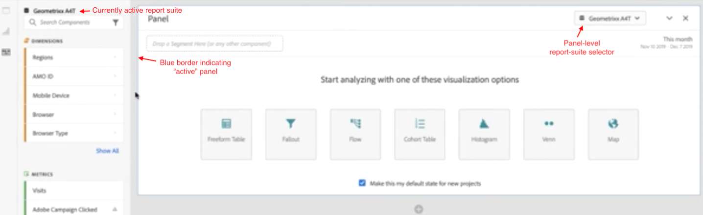
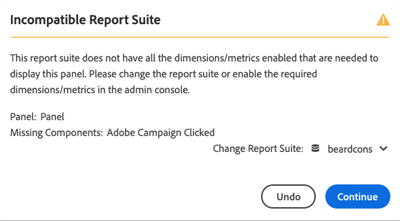

# Più suite di rapporti in Workspace

>[!IMPORTANT]
>Questa funzione è attualmente in fase di test beta e verrà rilasciata all&#39;inizio del 2020.

Ora puoi creare progetti in Analysis Workspace con dati provenienti da più suite di rapporti. Le suite di rapporti ora sono selezionate a livello di pannello, per cui potete scegliere una suite di rapporti diversa per ciascun pannello all’interno dello stesso progetto Workspace.

Questa funzionalità è utile, ad esempio, per

* Confronta i dati provenienti da due aree geografiche diverse e i dati risiedono in due suite di rapporti diverse. Puoi creare tabelle e visualizzazioni per confrontare i dati uno accanto all’altro.

* Crea un dashboard di metriche e visualizzazioni da segnalare ad altre organizzazioni. Ora puoi estrarre dati da varie suite di rapporti nello stesso progetto.

## Pannello attivo

Con questa funzione viene introdotto il concetto di &quot;pannello attivo&quot; e &quot;pannello inattivo&quot;. Il pannello attivo è riconoscibile dal bordo blu chiaro intorno ad esso. Facendo clic all’interno di un pannello, il pannello diventa attivo.

>[!IMPORTANT]
>Puoi trascinare e rilasciare componenti **solo nel pannello** attivo, anche se altri pannelli hanno la stessa suite di rapporti. Per modificare il pannello mentre si trascina o si rilascia, è possibile utilizzare un breve taglio: premere `shift` mentre si trascina per convertire un pannello inattivo in un pannello attivo.

| Attività | Pannello attivo | Pannello inattivo |
|---|---|---|
| Cambia suite di rapporti | Sì | No |
| Trascinare i componenti | Sì | No |
| Inserimento tramite trascinamento di visualizzazioni | Sì | No |

## Utilizzo di più suite di rapporti

1. Crea un nuovo progetto con 2 o più pannelli in Workspace.

1. Trascina i componenti (metriche, dimensioni, segmenti, intervalli di date) nel pannello. Assicurati che i pannelli contengano dati e visualizzazioni specifici della suite di rapporti.

   >[!NOTE]
   >A volte, durante il caricamento di un progetto (o il passaggio a una suite di rapporti) viene visualizzato un messaggio &quot;Suite di rapporti non compatibile&quot; in cui non tutti i componenti inclusi nel progetto sono inclusi nella suite di rapporti. Vengono elencati i componenti mancanti. Seguite [queste istruzioni](https://helpx.adobe.com/enterprise/using/manage-products-and-profiles.html#createproductprofiles) per impostare le autorizzazioni per le metriche/dimensioni richieste.

   

   Hai 3 opzioni per affrontare questa incompatibilità:
   * Continuate con alcuni componenti mancanti. Ciò non comporterà alcun dato per tali componenti e/o visualizzazioni vuote.
   * Annulla.
   * Cambia la suite di rapporti.

1. Modificate il pannello in un’altra suite di rapporti e notate come l’etichetta del componente (attualmente attiva suite di rapporti) e i componenti elencati si stanno aggiornando in base alla nuova suite di rapporti.

1. Utilizzate la scelta rapida da tastiera (`shift` durante il trascinamento) per ruotare un pannello inattivo su un pannello attivo.

1. (Facoltativo) Puoi anche andare ad altri sviluppatori di componenti Analytics e accertarti che ora visualizzino un&#39;etichetta della suite di rapporti che indica

   * Dove verrà creato un segmento: Generatore di [segmenti](https://docs.adobe.com/content/help/en/analytics/components/segmentation/segmentation-workflow/seg-build.html).
   * Dove verrà creata una metrica calcolata: Generatore [di metrica](https://docs.adobe.com/content/help/en/analytics/components/calculated-metrics/calcmetric-workflow/cm-build-metrics.html)calcolata.
   * Dove verrà generato un avviso: Generatore di [avvisi](https://docs.adobe.com/content/help/en/analytics/components/alerts/alert-builder.html).