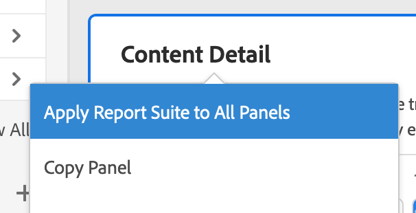
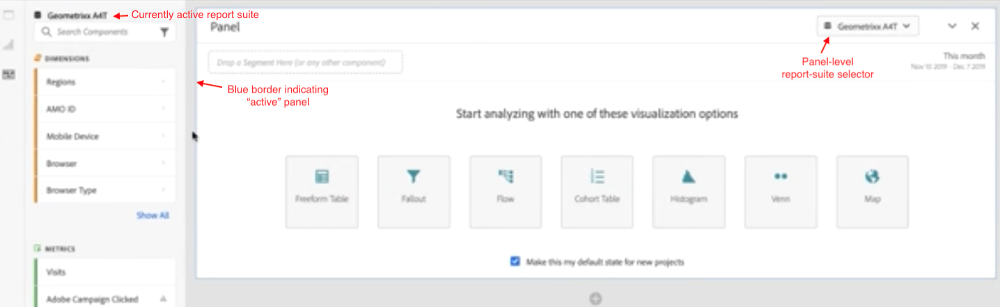
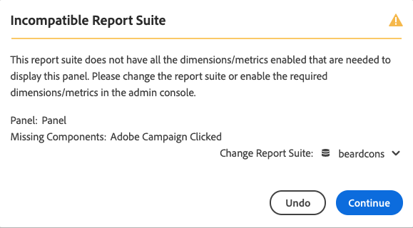

# Suite di rapporti multiple

Puoi creare progetti in Analysis Workspace con dati provenienti da più suite di rapporti. Le suite di rapporti vengono scelte a livello di pannello, in modo da poter scegliere una suite di rapporti diversa per ciascun pannello all’interno dello stesso progetto Workspace.

Questa funzionalità è utile per:

* Confrontare i dati provenienti da due aree geografiche diverse: i dati risiedono in due suite di rapporti diverse. Puoi creare tabelle e visualizzazioni per eseguire confronti affiancati dei dati.

* Creare un dashboard di metriche e visualizzazioni da segnalare ad altre organizzazioni. Puoi estrarre dati da varie suite di rapporti in nello stesso progetto.

>[!BEGINSHADEBOX]

Per un video demo, vedi  [Più suite di rapporti](https://experienceleague.adobe.com/en/docs/analytics-learn/tutorials/analysis-workspace/using-panels/multiple-report-suites-in-analysis-workspace){target="_blank"}.

>[!ENDSHADEBOX]

## Applica suite di rapporti a tutti i pannelli

Per applicare una suite di rapporti a tutti i pannelli contemporaneamente, fai clic con il pulsante destro del mouse sull’intestazione del pannello e seleziona **[!UICONTROL Apply Report Suite to All Panels]**.

## Pannello attivo

Il pannello attivo è riconoscibile dal bordo blu chiaro intorno ad esso. È sufficiente selezionare all’interno di un pannello per renderlo attivo.

>[!TIP]
>
>Puoi trascinare e rilasciare contenuti in qualsiasi pannello presente nella stessa suite di rapporti del pannello attivo. Trascinare un contenuto in un pannello inattivo della stessa suite di rapporti rende il pannello attivo.
>

## Utilizzare le suite multi-rapporto

1. Crea un nuovo progetto con 2 o più pannelli in Workspace.

1. Trascina i componenti (metriche, dimensioni, segmenti, intervalli di date) all’interno del pannello. Assicurati che i pannelli contengano dati e visualizzazioni specifici per la suite di rapporti.

   >[!NOTE]
   >
   >Talvolta durante il caricamento di un progetto (o il passaggio a una suite di rapporti) viene visualizzato un banner se non tutti i componenti inclusi nel progetto compaiono anche nella suite di rapporti. Verranno elencati i componenti mancanti. Segui [queste istruzioni](/help/admin/admin-console/permissions/product-profile.md) per impostare le autorizzazioni per le metriche/dimensioni richieste.
   >

   

   Hai 3 opzioni per risolvere l’incompatibilità:
   * Abilita le dimensioni/metriche richieste.
   * Modifica la suite di rapporti.
   * Continua con alcuni dei componenti mancanti. Non si otterrà alcun dato per tali componenti, e/o si otterranno visualizzazioni vuote.

1. Modifica il pannello in un’altra suite di rapporti e osserva come l’etichetta del componente (suite di rapporti attualmente attiva) e i componenti elencati vengono aggiornati in base alla nuova suite di rapporti.

1. Usa una combinazione di tasti (`shift` durante lo spostamento) per trasformare un pannello inattivo in attivo.

1. (Facoltativo) Puoi anche passare ad altri generatori di componenti Analytics e accertarti che ora visualizzino l’etichetta della suite di rapporti che indica

   * Dove verrà creato un segmento: [Generatore di segmenti](/help/components/segmentation/segmentation-workflow/seg-build.md).
   * Dove verrà creata una metrica calcolata: [Generatore di metrica calcolata](/help/components/calculated-metrics/workflow/c-build-metrics/cm-build-metrics.md).
   * Dove verrà generato un avviso: [Generatore di avvisi](/help/components/alerts/alert-builder.md).
